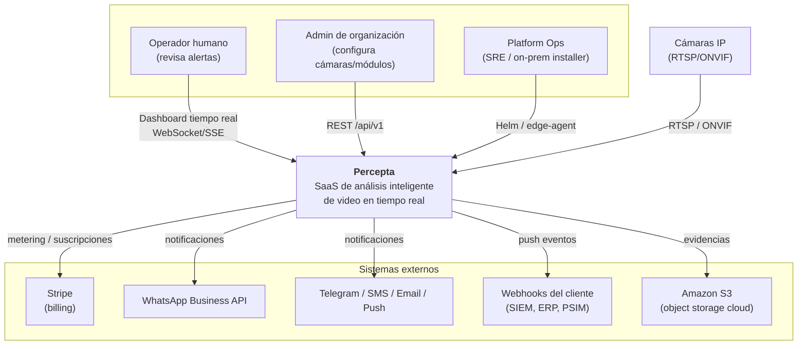
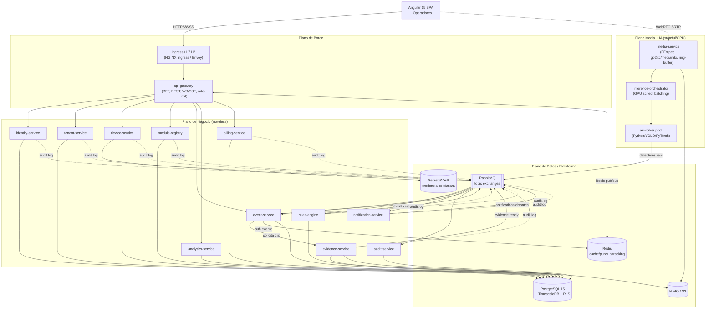
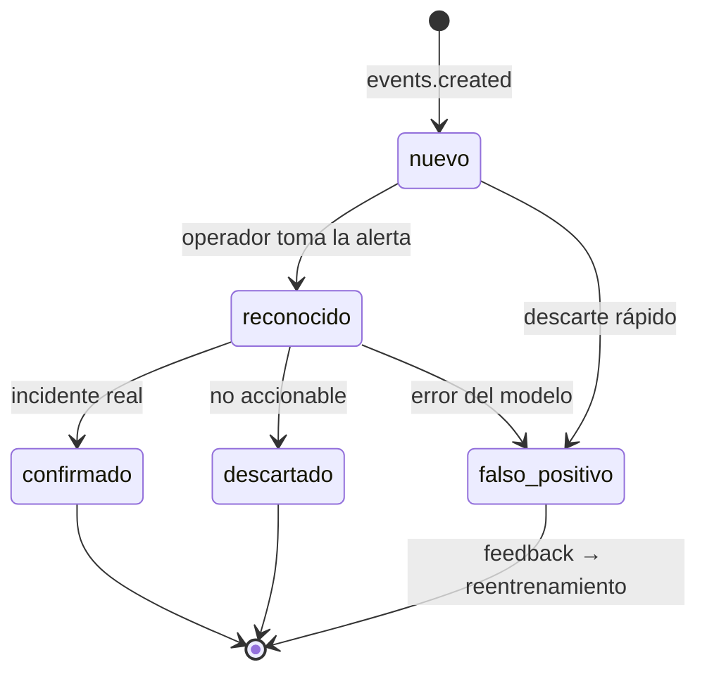
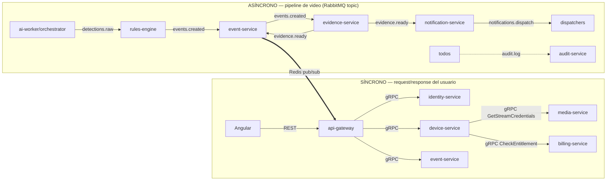
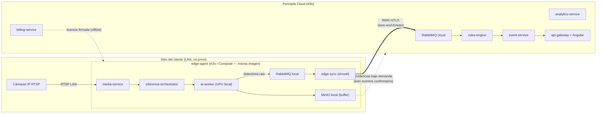
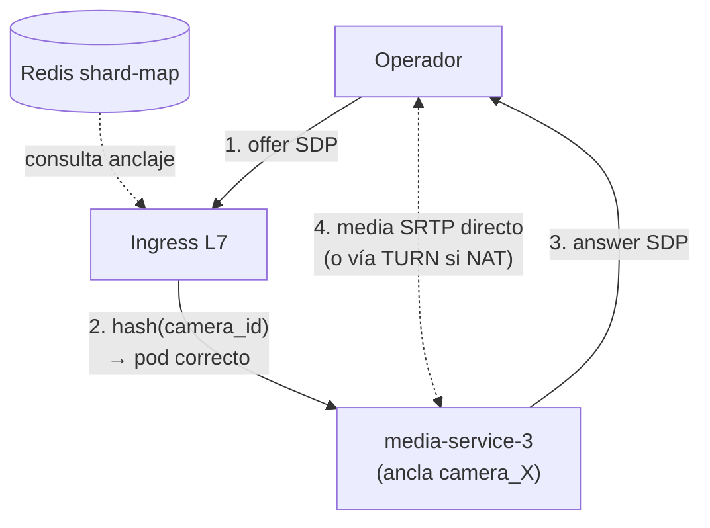
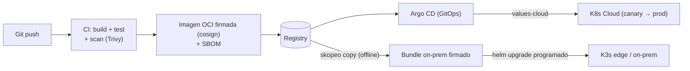
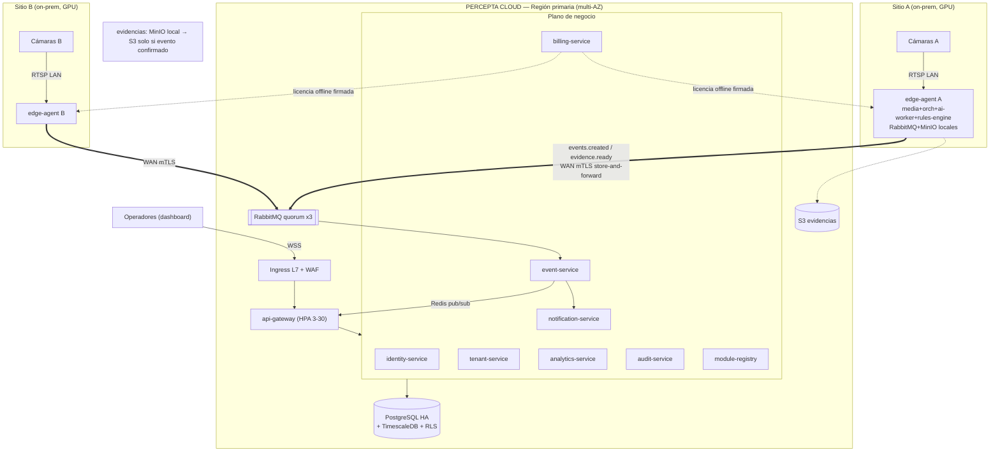

> Parte de la documentación de arquitectura de **Percepta** — Plataforma SaaS de Análisis Inteligente de Video con IA modular. Ver [índice](README.md).

## Arquitectura General, Microservicios, Escalabilidad, Balanceo de Carga, Alta Disponibilidad y Estrategia de Despliegue

Esta sección define la columna vertebral operativa de **Percepta**: cómo se descompone el sistema, cómo se comunican los servicios, dónde se ejecuta la inferencia (edge/cloud/híbrido), cómo escala cada pieza de forma independiente, cómo se balancea la carga (incluyendo el caso especial de video/WebRTC) y cómo se garantiza continuidad de servicio bajo fallos. Todas las decisiones se justifican con trade-offs y se apoyan estrictamente en los nombres de servicios/entidades del brief.

---

### 1. Visión general y diagramas C4

#### 1.1 Principios arquitectónicos derivados

| # | Principio | Consecuencia arquitectónica concreta |
|---|-----------|--------------------------------------|
| P1 | Núcleo estable + módulos plugin | El plano de IA (`ai-worker` + `module-registry`) está desacoplado del plano de negocio; instalar un módulo = publicar un `module.json`, no redeploy del core. |
| P2 | Multitenancy estricta | `organization_id` propaga por JWT → contexto → RLS en PostgreSQL. Ningún servicio confía en el `organization_id` del payload sin validarlo contra el token. |
| P3 | Config por cámara y módulo | `rules-engine` es data-driven: su comportamiento vive en `camera_module_configs.config (JSONB)`, no en código. |
| P4 | HA y tolerancia a fallos | Todo servicio es stateless o replicable; el estado vive en PostgreSQL/Redis/RabbitMQ/MinIO, no en el proceso. |
| P5 | Human-in-the-loop | El pipeline nunca "cierra el lazo" sobre personas: termina en un `event` con `confidence_score` y `status` que exige transición humana. |

**Regla de oro de estado:** los 15 microservicios son *stateless a nivel de proceso*. El único estado efímero permitido en memoria es el **tracking de objetos** (`inference-orchestrator`/`ai-worker`), que se respalda en Redis para poder reasignar un stream a otra réplica sin perder el ID de tracking.

#### 1.2 C4 Nivel 1 — Diagrama de Contexto



#### 1.3 C4 Nivel 2 — Diagrama de Contenedores

Agrupo los 15 microservicios en **cuatro planos** (control, negocio, media/IA, plataforma) para hacer legible el escalado y la topología. Los nombres son exactos.



**Trade-off clave del plano media:** `media-service`, `inference-orchestrator` y `ai-worker` son los únicos contenedores **con afinidad y estado**. Todo lo demás escala como ganado (cattle) trivialmente. Esta separación permite operar el plano de negocio 100% en cloud gestionado mientras el plano media/IA vive donde estén las cámaras (edge on-prem), que es el corazón del modelo híbrido (§4 y §8).

---

### 2. Descomposición detallada de microservicios

Para cada servicio: **responsabilidad · datos que posee · API síncrona expuesta · eventos que publica/consume · tecnología · patrón de escalado**. La regla de propiedad de datos es estricta: **cada tabla tiene un único servicio-dueño**; nadie más escribe en ella. Las lecturas cross-service se hacen vía API o vía proyecciones/eventos, nunca por acceso directo a la tabla ajena.

#### 2.1 Tabla maestra de servicios

| Servicio | Datos que posee (tablas) | Escalado | Estado |
|----------|--------------------------|----------|--------|
| **api-gateway** | — (stateless) | HPA por RPS/CPU | Stateless |
| **identity-service** | `users`, `roles`, `permissions`, `role_permissions`, `user_roles` | HPA por CPU | Stateless (+Redis sesiones) |
| **tenant-service** | `organizations`, `sites`, `zones` | HPA por CPU | Stateless |
| **device-service** | `cameras`, `streams` (+ credenciales en Vault) | HPA por CPU | Stateless |
| **media-service** | ring-buffer (RAM/disco efímero), clips en MinIO | Escalado por **shard de cámaras** (StatefulSet) | **Stateful (afín a cámara)** |
| **inference-orchestrator** | asignación frame→worker (Redis) | HPA + gestión de slots GPU | Semi-stateful (tracking en Redis) |
| **ai-worker** | — (modelos en volumen/registry) | **KEDA** por profundidad de cola + GPU | Stateless por frame |
| **module-registry** | `ai_modules` (catálogo, manifests) | HPA por CPU (baja carga) | Stateless |
| **rules-engine** | `camera_module_configs` (config) | KEDA por cola `detections.raw` | Stateless (config cacheada Redis) |
| **event-service** | `events` | KEDA por cola `events.created` | Stateless |
| **evidence-service** | `evidences` (metadatos; blobs en MinIO) | KEDA por cola de armado de clip | Stateless (I/O bound) |
| **notification-service** | `notification_channels`, `notifications` | KEDA por cola `notifications.dispatch` | Stateless |
| **analytics-service** | agregados/continuous aggregates (TimescaleDB) | HPA por CPU + jobs batch | Stateless |
| **billing-service** | `plans`, `subscriptions`, `licenses` | HPA (baja carga) | Stateless |
| **audit-service** | `audit_logs` (append-only) | KEDA por cola `audit.log` | Stateless |

#### 2.2 Fichas por servicio

**api-gateway** — *Backend-for-Frontend + borde de tiempo real*
- **Responsabilidad:** único punto de entrada público. Termina TLS de aplicación, valida JWT (firma + expiración + `organization_id`), aplica rate-limit por tenant, enruta REST `/api/v1/*` a servicios internos, y mantiene el fan-out de tiempo real hacia el dashboard.
- **API expuesta:** REST `/api/v1` (agrega/compone respuestas de varios servicios); canal `WebSocket /ws` y `SSE /api/v1/events/stream`.
- **Eventos:** *consume* de Redis pub/sub (canal `rt:org:{organization_id}:events`) y reemite por WS/SSE. No toca RabbitMQ directamente (desacople: el bus interno no se expone al borde).
- **Tecnología:** NestJS + `@nestjs/websockets` (adaptador `ws`), `@nestjs/throttler` respaldado en Redis para rate-limit distribuido.
- **Escalado:** HPA por RPS y conexiones WS activas. Sticky no obligatorio (el estado de suscripción WS se reconstruye desde Redis en cualquier réplica).

```typescript
// api-gateway: fan-out de eventos en tiempo real, aislado por tenant
@Injectable()
export class RealtimeGateway implements OnModuleInit {
  constructor(private readonly redis: RedisService, private readonly ws: WsRegistry) {}

  async onModuleInit() {
    // patrón por-tenant: nunca un canal global que cruce organizaciones (P2)
    await this.redis.psubscribe('rt:org:*:events', (channel, payload) => {
      const orgId = channel.split(':')[2];
      const event = JSON.parse(payload);
      // solo empuja a sockets cuyo JWT resolvió ese organization_id + permiso events:read
      this.ws.broadcastToOrg(orgId, 'event.created', event);
    });
  }
}
```

**identity-service** — *AuthN/AuthZ*
- **Responsabilidad:** ciclo de vida de `users`, emisión/rotación de JWT + refresh tokens, MFA (TOTP), RBAC (resuelve permisos efectivos vía `user_roles` → `role_permissions` → `permissions`).
- **Datos:** `users`, `roles`, `permissions`, `role_permissions`, `user_roles`.
- **API:** `POST /api/v1/auth/login`, `/auth/refresh`, `/auth/mfa/verify`, gRPC interno `IntrospectToken` y `CheckPermission(subject, permission, organization_id)` para que otros servicios validen sin round-trip HTTP.
- **Eventos:** publica `audit.log` (login, cambios de rol). No consume del bus.
- **Escalado:** HPA por CPU; el refresh-token allowlist/denylist vive en Redis (rotación y revocación instantánea).

**tenant-service** — *Jerarquía organizacional*
- **Responsabilidad:** CRUD de `organizations` → `sites` → `zones`. Fuente de verdad del árbol multitenant. Provisiona el `organization_id` que ancla la RLS.
- **API:** REST CRUD + gRPC `ResolveTenantContext(organization_id)` (devuelve sites/zones activas, cacheable).
- **Eventos:** publica `tenant.provisioned` (interno, dispara seed de `notification_channels` por defecto) y `audit.log`.
- **Escalado:** HPA por CPU (carga baja, muy cacheable en Redis con TTL corto).

**device-service** — *Inventario de cámaras y salud*
- **Responsabilidad:** CRUD de `cameras` y `streams`; **custodia de credenciales de cámara en Vault** (nunca en la tabla en claro); descubrimiento ONVIF; heartbeat/salud de cámara (online/offline/degradada).
- **Datos:** `cameras`, `streams`. Credenciales referenciadas por `vault_ref` (path lógico), resueltas solo por `media-service` en tiempo de conexión.
- **API:** REST CRUD; gRPC `GetStreamCredentials(stream_id)` (autorizado solo a `media-service`, mTLS + política); `ReportHealth`.
- **Eventos:** publica `device.health.changed` (interno); consume health-checks empujados por `media-service`.
- **Escalado:** HPA por CPU.

**media-service** — *Ingesta, transcodificación, WebRTC, ring-buffer*
- **Responsabilidad:** conecta al RTSP de cada cámara, mantiene el **ring-buffer** en memoria/disco efímero (10 s pre-evento), transcodifica con FFmpeg, sirve **vista en vivo por WebRTC** (go2rtc/mediamtx) y extrae frames para inferencia. Es el servicio **stateful crítico**: cada cámara está *anclada* a una réplica concreta (afinidad de stream, §6).
- **Datos:** ring-buffer efímero (no PostgreSQL); escribe clips a MinIO. Nunca escribe metadatos de evento (eso es de `event-service`/`evidence-service`).
- **API:** WebRTC signaling (`POST /api/v1/live/{camera_id}/offer` → SDP answer); gRPC `ExtractClip(camera_id, t_start, t_end)` usado por `evidence-service`.
- **Eventos:** publica `frame.ready` (por canal directo gRPC/shared-mem al orchestrator, no por RabbitMQ — ver §3.3) y `device.health.changed`.
- **Escalado:** **StatefulSet con sharding por consistent hashing de `camera_id`**; escala añadiendo réplicas y rebalanceando shards (§5.2). Se dimensiona por *ancho de banda de ingesta y número de cámaras ancladas*, no por CPU genérica.

**inference-orchestrator** — *Planificador de inferencia y GPU*
- **Responsabilidad:** recibe frames de `media-service`, hace **batching** por modelo, reparte a `ai-worker` según los `camera_module_configs` activos (qué módulos corre cada cámara), gestiona los *slots* de GPU (MPS/time-slicing), respalda el estado de tracking en Redis y aplica **muestreo adaptativo de FPS** bajo presión (degradación elegante, §7).
- **Datos:** tabla de asignación frame→worker y estado de tracking en Redis (efímero, recuperable).
- **API:** gRPC bidireccional con `ai-worker` (`InferStream`), gRPC con `media-service`.
- **Eventos:** **publica `detections.raw`** a RabbitMQ (con `confidence`, bounding boxes, `track_id`, `camera_id`, `organization_id`, `module_id`, timestamp UTC).
- **Escalado:** HPA por profundidad de la cola de frames + utilización de GPU (DCGM). Réplicas por nodo GPU.

**ai-worker** (Python) — *Ejecución de módulos/modelos*
- **Responsabilidad:** carga el/los modelos declarados por el `module.json`, ejecuta la inferencia (YOLO/PyTorch/TF/OpenCV) sobre batches, devuelve detecciones normalizadas. Un pool heterogéneo: distintos deployments por *clase de recurso* (GPU-heavy, CPU-light) según `resources` del manifest.
- **Datos:** ninguno persistente; pesos de modelo montados desde volumen/OCI artifact vía `module-registry`.
- **API:** gRPC `Infer(batch) -> detections` (servidor FastAPI+gRPC).
- **Eventos:** indirecto — sus salidas las publica el `inference-orchestrator` como `detections.raw`.
- **Escalado:** **KEDA** escalando por longitud de la cola de frames pendientes y `DCGM_FI_DEV_GPU_UTIL`; scale-to-zero para módulos raramente usados (ahorra GPU).

**module-registry** — *Catálogo de plugins*
- **Responsabilidad:** auto-descubre módulos por su `module.json`, valida el manifest y su **JSON Schema de configuración**, versiona, y publica el catálogo que el frontend usa para **renderizar el formulario de config dinámicamente**.
- **Datos:** `ai_modules` (id, categoría, versión, backend, `input_requirements`, `config_schema` JSONB, `event_types`, `resources`).
- **API:** REST `GET /api/v1/modules`, `GET /api/v1/modules/{id}/schema`; gRPC `ValidateConfig(module_id, config)` usado por `device-service`/`rules-engine` al asignar un módulo a una cámara.
- **Eventos:** publica `module.published` / `module.deprecated`.
- **Escalado:** HPA (carga baja); catálogo muy cacheable.

**rules-engine** — *Detección → evento (data-driven)*
- **Responsabilidad:** consume `detections.raw`, aplica la **config por cámara/módulo** (`camera_module_configs.config`): horarios activos, zonas/ROI/líneas, umbrales de confianza, **deduplicación y cooldown** por `track_id` para no inundar de eventos. Emite `events.created` solo cuando la regla se cumple.
- **Datos:** `camera_module_configs` (config); estado de dedup/cooldown en Redis.
- **API:** gRPC administrativo `ReloadConfig(camera_id)` (invalidación de cache tras un cambio de config).
- **Eventos:** consume `detections.raw`; publica `events.created`.
- **Escalado:** KEDA por profundidad de `detections.raw` (es el punto de mayor throughput asíncrono).

```typescript
// rules-engine: la lógica vive en datos, no en código (P3). Cooldown por track para dedup.
async handleDetection(det: RawDetection): Promise<void> {
  const cfg = await this.configCache.get(det.cameraId, det.moduleId); // camera_module_configs.config
  if (det.confidence < cfg.minConfidence) return;
  if (!this.withinSchedule(cfg.schedule, det.tsUtc)) return;
  if (cfg.roi && !this.insideRoi(det.bbox, cfg.roi)) return;

  const cooldownKey = `cd:${det.cameraId}:${det.moduleId}:${det.trackId}`;
  if (await this.redis.exists(cooldownKey)) return;           // dedup / anti-flood
  await this.redis.set(cooldownKey, 1, 'EX', cfg.cooldownSec ?? 30);

  await this.bus.publish('events.created', {
    organizationId: det.organizationId, cameraId: det.cameraId,
    moduleId: det.moduleId, eventType: det.eventType,
    confidence: det.confidence, bbox: det.bbox, tsUtc: det.tsUtc,
    // status inicial = 'nuevo' → exige revisión humana (P5)
  });
}
```

**event-service** — *Ciclo de vida del evento + workflow humano*
- **Responsabilidad:** persiste `events`, gestiona la máquina de estados de revisión humana (**nuevo → reconocido → confirmado / descartado / falso-positivo**), y empuja el evento en tiempo real a Redis pub/sub para el dashboard. Solicita a `evidence-service` el armado del clip.
- **Datos:** `events` (con `confidence_score`, `status`, `acknowledged_by`, timestamps de transición). Serie temporal en TimescaleDB (hypertable por `created_at`).
- **API:** REST `GET/PATCH /api/v1/events` (transiciones de estado, con validación RBAC y auditoría).
- **Eventos:** consume `events.created`; publica a Redis `rt:org:{id}:events`; consume `evidence.ready` para adjuntar la evidencia.
- **Escalado:** KEDA por cola `events.created` + HPA por RPS del workflow.



**evidence-service** — *Armado de clip pre/post-evento*
- **Responsabilidad:** al recibir un evento, pide a `media-service` el segmento del ring-buffer (**10 s antes / evento / 10 s después**), compone imagen clave + clip, sube a MinIO/S3 y registra metadatos.
- **Datos:** `evidences` (ruta MinIO, hash, retención). Blobs en MinIO/S3.
- **API:** gRPC interno; REST `GET /api/v1/evidences/{id}` (URL prefirmada, corta expiración).
- **Eventos:** consume `events.created` (o señal de `event-service`); publica `evidence.ready`.
- **Escalado:** KEDA por cola de armado; es I/O + FFmpeg-bound, se beneficia de scale-out amplio y de esperar el post-roll (10 s) antes de cerrar el clip.

**notification-service** — *Despacho multicanal*
- **Responsabilidad:** aplica reglas de envío y plantillas, despacha por Email/WhatsApp/Telegram/Push/SMS/Webhooks respetando `notification_channels` del tenant; reintentos con backoff y dead-letter.
- **Datos:** `notification_channels`, `notifications` (estado de entrega).
- **API:** REST CRUD de canales/plantillas; test de canal.
- **Eventos:** consume `notifications.dispatch` (o `events.created` + `evidence.ready` para enriquecer con la evidencia antes de enviar).
- **Escalado:** KEDA por cola; **rate-limit por proveedor** (WhatsApp/Telegram tienen cuotas) vía token-bucket en Redis.

**analytics-service** — *Agregaciones y KPIs*
- **Responsabilidad:** mapas de calor, KPIs, series temporales sobre `events` usando **TimescaleDB continuous aggregates** y `time_bucket`. Lecturas analíticas separadas del path transaccional.
- **Datos:** continuous aggregates / vistas materializadas (dueño de sus propias hypertables agregadas). Lee `events` mediante réplica de lectura, no compite con escritura.
- **API:** REST `GET /api/v1/analytics/*` (KPIs, heatmaps, series).
- **Escalado:** HPA por CPU + jobs de refresco batch.

**billing-service** — *Planes, suscripciones, metering, licencias on-prem*
- **Responsabilidad:** `plans`/`subscriptions`, integración Stripe, **metering** (cámaras activas, minutos de inferencia por módulo, GB de evidencia), y **licencias para on-premise** (JWT firmado con límites: nº de cámaras, módulos habilitados, expiración).
- **Datos:** `plans`, `subscriptions`, `licenses`.
- **API:** REST + webhook Stripe (`POST /api/v1/billing/webhook`); gRPC `CheckEntitlement(organization_id, feature)` consultado por `device-service`/`inference-orchestrator` (enforcement de límites del plan).
- **Eventos:** consume `metering.*` (agregado de uso); publica `subscription.changed`.
- **Escalado:** HPA (carga baja).

**audit-service** — *Auditoría inmutable cross-cutting*
- **Responsabilidad:** consume `audit.log` de todos los servicios y persiste un log **append-only** (inmutable, hash-encadenado opcional) de acciones sensibles.
- **Datos:** `audit_logs` (append-only, particionado por tiempo, RLS por `organization_id`).
- **API:** REST `GET /api/v1/audit` (solo lectura, RBAC estricto).
- **Eventos:** consume `audit.log`.
- **Escalado:** KEDA por cola.

---

### 3. Comunicación síncrona vs asíncrona

#### 3.1 Regla de decisión

| Dimensión | **Síncrona (REST/gRPC)** | **Asíncrona (RabbitMQ)** |
|-----------|--------------------------|--------------------------|
| Cuándo | El emisor **necesita la respuesta ya** para continuar y el fallo debe propagarse al usuario | Trabajo que puede diferirse, fan-out, buffering ante picos, desacople temporal |
| Acoplamiento | Temporal (ambos vivos) | Desacoplado (productor no conoce consumidores) |
| Ejemplos | login, CRUD del dashboard, `CheckPermission`, `GetStreamCredentials`, `CheckEntitlement`, WebRTC signaling | pipeline de detección → evento → evidencia → notificación → auditoría |
| Backpressure | Circuit breaker + timeout | Longitud de cola + KEDA + DLQ |
| Protocolo interno | **gRPC** (contrato Protobuf, HTTP/2, baja latencia) | AMQP topic exchanges |
| Protocolo de borde | **REST/JSON** (camelCase) + WS/SSE | — (el bus no se expone al borde) |

**Heurística:** *el plano de negoncio orientado a request del usuario es síncrono; el pipeline de datos de video es asíncrono de punta a punta.* Lo síncrono usa **gRPC entre servicios** (contratos fuertes, HTTP/2, streaming) y **REST solo en el borde** (`api-gateway`), donde el consumidor es el navegador.

#### 3.2 Diagrama de comunicación (síncrono vs asíncrono)



#### 3.3 Caso especial: frames de video (ni REST ni RabbitMQ)

Los **frames crudos NO pasan por RabbitMQ** (serían GB/s por tenant; el broker moriría). El transporte `media-service → inference-orchestrator → ai-worker` usa **gRPC streaming** con frames por referencia (shared memory / zero-copy en el mismo nodo edge, o gRPC con payload comprimido entre nodos). RabbitMQ recibe únicamente **detecciones** (`detections.raw`), que son JSON pequeños. Esta es una decisión de diseño deliberada: el bus transporta *metadatos de eventos*, no *pixels*.

```protobuf
// contrato gRPC orchestrator <-> ai-worker (frames por referencia, no por bus)
service Inference {
  rpc InferStream(stream FrameRef) returns (stream Detection);
}
message FrameRef {
  string camera_id = 1;
  string organization_id = 2;
  string module_id = 3;
  string shm_handle = 4;      // handle a shared memory (misma máquina edge)
  bytes  jpeg = 5;            // fallback comprimido (cross-node)
  int64  ts_unix_ms = 6;
}
```

#### 3.4 Fiabilidad del bus

- **Mensajes persistentes + publisher confirms** en todos los exchanges de negocio (`events.created`, `evidence.ready`, `notifications.dispatch`, `audit.log`). `detections.raw` puede ser *transient* con TTL corto (si se pierde un frame perdemos una detección, aceptable; el video es efímero).
- **Idempotencia:** cada mensaje lleva `message_id` (UUID) y los consumidores desduplican en Redis (`SETNX processed:{message_id}`). Esencial porque RabbitMQ garantiza *at-least-once*.
- **Dead Letter Exchange (DLX)** por cola con reintentos limitados y backoff; los mensajes venenosos van a `*.dlq` para inspección manual.
- **Quorum queues** (Raft) para colas de negocio → sobreviven a caída de un nodo del clúster RabbitMQ.

```yaml
# Política RabbitMQ: quorum + DLX para colas de negocio
rabbitmqctl set_policy business-ha "^(events|evidence|notifications|audit)\." \
  '{"queue-mode":"lazy","dead-letter-exchange":"dlx","delivery-limit":5,
    "queue-type":"quorum"}' --apply-to queues
```

---

### 4. Topología de inferencia: cloud vs edge vs híbrido

#### 4.1 Los tres modos y cuándo usar cada uno

| Modo | Dónde corre el plano media/IA | Cuándo | Trade-off |
|------|-------------------------------|--------|-----------|
| **Cloud** | Todo en K8s cloud; RTSP de cámaras sube por VPN/túnel | Pocas cámaras, sin GPU on-prem, ancho de banda de subida holgado | Simple de operar; **coste de egress de video y latencia** de subir todos los frames |
| **Edge** | Plano media/IA en un `edge-agent` on-prem; plano de negocio también local (air-gapped) | Instalaciones sensibles/sin internet, muchas cámaras, baja latencia | Máxima privacidad/latencia; **operación distribuida**, updates más complejos |
| **Híbrido** (recomendado por defecto) | media/IA en el **edge-agent** (junto a las cámaras); negocio/analytics/billing en cloud | El caso general SaaS multiempresa | Balance óptimo: video nunca sale de la LAN salvo evidencias; control plane centralizado |

**Justificación del híbrido como default:** subir 100 cámaras 1080p@15fps a la nube ≈ 400–800 Mbps sostenidos por sitio y coste de egress prohibitivo, además de latencia añadida. En híbrido, **la inferencia ocurre junto a la cámara** y solo las **detecciones (JSON) + evidencias puntuales** cruzan a la nube. Esto también satisface *privacidad por diseño* (P5): los pixels de personas no abandonan la LAN salvo cuando un operador confirma un evento.

#### 4.2 edge-agent para on-prem

El **edge-agent** es un bundle desplegable (K3s o Docker Compose) que empaqueta el subconjunto del plano media/IA con **las mismas imágenes** que en cloud (§8), más un componente de sincronización:

- Contiene: `media-service`, `inference-orchestrator`, `ai-worker`, un RabbitMQ local (o embebido), Redis local, MinIO local (buffer de evidencias), y un **edge-sync** que reenvía `events.created`/`evidence.ready` al cloud vía **shovel de RabbitMQ** (store-and-forward) cuando hay conectividad.
- **Store-and-forward:** si el enlace WAN cae, los eventos y evidencias se acumulan localmente y se drenan al reconectar → *tolerancia a particiones de red* sin perder alertas.
- **Licencia on-prem** (`licenses`) firmada por `billing-service` limita nº de cámaras/módulos; el edge-agent valida la licencia offline (JWT con clave pública embebida).



**Variante de despliegue del rules-engine en híbrido:** el `rules-engine` puede correr *en el edge* (evalúa reglas localmente → menos tráfico WAN, alertas aunque el WAN esté caído) o *en cloud* (config centralizada). Recomendación: **rules-engine en el edge** para que las alertas sobrevivan a cortes de WAN; el cloud recibe ya `events.created`.

#### 4.3 Colocación de GPU

- **GPU en el nodo edge**, físicamente junto a `ai-worker`. `inference-orchestrator` y `ai-worker` deben ser **co-residentes en el mismo nodo GPU** (afinidad de pod) para usar shared-memory zero-copy y evitar copiar frames por red.
- **Multiplexación de GPU:** NVIDIA **MPS** (Multi-Process Service) o **time-slicing** para que varios `ai-worker` de distintos módulos compartan una GPU; **MIG** (Multi-Instance GPU) en A100/H100 para aislar tenants con SLA garantizado.
- **Node pools por clase de GPU** en cloud (T4 para módulos ligeros, A10/A100 para pesados); `nodeSelector`/`taints+tolerations` para colocar cada `ai-worker` en el pool correcto según `resources` del `module.json`.

```yaml
# ai-worker: afinidad a nodo GPU + tolerancia + request de GPU compartida (time-slicing)
spec:
  nodeSelector: { percepta.io/gpu-class: "t4" }
  tolerations:
    - { key: "nvidia.com/gpu", operator: "Exists", effect: "NoSchedule" }
  containers:
    - name: ai-worker
      resources:
        limits: { nvidia.com/gpu: 1 }   # 1 slice (time-slicing configurado en el device plugin)
      env:
        - { name: CUDA_MPS_ACTIVE_THREAD_PERCENTAGE, value: "25" }
```

---

### 5. Escalabilidad horizontal

#### 5.1 Escalado por servicio (resumen de disparadores)

| Servicio | Métrica de escalado | Mecanismo | Min/Max típico |
|----------|--------------------|-----------|----------------|
| api-gateway | RPS + conexiones WS | HPA | 3 / 30 |
| identity/tenant/device/module-registry/billing | CPU | HPA | 2 / 10 |
| media-service | cámaras ancladas / ancho de banda | Sharding manual+auto (StatefulSet) | 1 / N por sitio |
| inference-orchestrator | profundidad cola frames + GPU util | HPA (custom metrics) | 1 / n_nodos_gpu |
| ai-worker | longitud cola frames + `DCGM_GPU_UTIL` | **KEDA** (scale-to-zero) | 0 / M |
| rules-engine | profundidad `detections.raw` | **KEDA** | 2 / 20 |
| event-service | profundidad `events.created` + RPS | KEDA + HPA | 2 / 15 |
| evidence-service | profundidad cola clips | KEDA | 2 / 20 |
| notification-service | profundidad `notifications.dispatch` | KEDA | 2 / 15 |
| analytics-service | CPU + jobs batch | HPA | 2 / 8 |
| audit-service | profundidad `audit.log` | KEDA | 1 / 5 |

#### 5.2 Sharding de streams por cámara

`media-service` es stateful: cada cámara está anclada a una réplica. Se usa **consistent hashing** de `camera_id` sobre el anillo de réplicas para que, al escalar, solo se remapee una fracción de cámaras.

```
shard = consistent_hash(camera_id) mod N_replicas
```

- El mapeo `camera_id → pod` vive en Redis (`shard:camera:{id} = pod-3`), publicado por un **controller de asignación**. Al añadir una réplica (`media-service-4`), el controller **rebalancea** solo las cámaras que caen en el nuevo segmento del anillo, minimizando reconexiones RTSP.
- **Draining ordenado:** antes de terminar un pod (scale-down), sus cámaras se reasignan y el ring-buffer relevante para clips en vuelo se persiste; un `preStop` hook espera el drenado.
- **Recuperación:** si un pod muere, sus cámaras se redistribuyen entre los vivos; el estado de tracking se reconstruye desde Redis (perdemos a lo sumo unos segundos de continuidad de tracking, aceptable).

#### 5.3 Autoscaling por profundidad de cola (KEDA) y GPU

**KEDA por profundidad de cola RabbitMQ** — así el `rules-engine` y los `ai-worker` reaccionan al backlog real, no a CPU (que es mala señal para trabajo I/O/GPU-bound):

```yaml
apiVersion: keda.sh/v1alpha1
kind: ScaledObject
metadata: { name: rules-engine-scaler }
spec:
  scaleTargetRef: { name: rules-engine }
  minReplicaCount: 2
  maxReplicaCount: 20
  pollingInterval: 5
  cooldownPeriod: 60
  triggers:
    - type: rabbitmq
      metadata:
        protocol: amqp
        queueName: detections.raw.q
        mode: QueueLength
        value: "500"           # escala +1 réplica por cada 500 mensajes en cola
      authenticationRef: { name: rabbitmq-auth }
```

**KEDA + Prometheus (DCGM) por utilización de GPU** para `ai-worker`, combinando backlog y saturación de GPU (scale-to-zero cuando el módulo no tiene tráfico → ahorro de GPU cara):

```yaml
apiVersion: keda.sh/v1alpha1
kind: ScaledObject
metadata: { name: ai-worker-yolo-scaler }
spec:
  scaleTargetRef: { name: ai-worker-yolo }
  minReplicaCount: 0            # scale-to-zero para módulos ociosos
  maxReplicaCount: 12
  triggers:
    - type: rabbitmq
      metadata: { queueName: frames.yolo.q, mode: QueueLength, value: "200" }
    - type: prometheus
      metadata:
        serverAddress: http://prometheus:9090
        query: avg(DCGM_FI_DEV_GPU_UTIL{module="yolo"})
        threshold: "70"        # mantén GPU bajo 70% util media
```

**Trade-off scale-to-zero:** ahorra GPU pero introduce *cold-start* (cargar pesos de modelo ~1–5 s). Mitigación: `minReplicaCount: 1` para módulos críticos/latency-sensitive; scale-to-zero solo para módulos de baja frecuencia.

---

### 6. Balanceo de carga

Cuatro planos de balanceo, cada uno con estrategia distinta:

| Plano | Componente | Algoritmo | Nota clave |
|-------|-----------|-----------|------------|
| **Ingress (L7)** | NGINX Ingress / Envoy | round-robin + TLS termination | Rate-limit global, WAF, HTTP/2 |
| **Gateway → servicios** | Service mesh (Istio/Linkerd) o K8s Service | least-request / EWMA | mTLS interno, retries, circuit breaking |
| **Interno gRPC** | mesh sidecar | least-request (L7, consciente de HTTP/2) | Crítico: L4 balancearía mal gRPC (multiplex sobre 1 conexión) |
| **Media / WebRTC** | LB con **afinidad de sesión** | consistent hash por `camera_id` / cliente | No round-robin: la señalización y el media deben ir al pod que ancla la cámara |

#### 6.1 Por qué gRPC necesita balanceo L7

gRPC multiplexa muchas llamadas sobre **una sola conexión HTTP/2 persistente**. Un LB L4 (round-robin de conexiones TCP) enviaría todas las RPC de un cliente a un único backend → desbalance. Por eso los servicios síncronos van tras un **service mesh** que hace balanceo *per-request* a nivel HTTP/2 (least-request), no per-connection.

#### 6.2 Media/WebRTC: afinidad obligatoria

- **WebRTC signaling:** el `POST /live/{camera_id}/offer` debe llegar al pod de `media-service` que **ancla esa cámara** (donde vive el ring-buffer y la sesión RTSP). Se enruta por *header-based / hash routing* del `camera_id` (el ingress consulta el mapa de shard en Redis, o se usa un Service headless + client-side routing).
- **Media plane (SRTP/ICE):** una vez negociado, el media fluye **directo pod↔navegador** (o vía TURN si hay NAT), no re-balanceado.
- **TURN/STUN:** `coturn` desplegado para atravesar NAT del cliente; en on-prem el media WebRTC es LAN-directo (sin TURN).



---

### 7. Alta disponibilidad y tolerancia a fallos

#### 7.1 Matriz de resiliencia por dependencia

| Dependencia | Réplicas / HA | Health check | Estrategia de fallo |
|-------------|---------------|--------------|---------------------|
| PostgreSQL 15 | Primary + ≥2 réplicas (Patroni/CloudNativePG); sync replication | `pg_isready` + lag | Failover automático (Patroni), promoción de réplica |
| TimescaleDB | Misma instancia (extensión) + réplicas de lectura para analytics | idem | Analytics tolera datos ligeramente atrasados |
| Redis | Sentinel / Cluster, ≥3 nodos | `PING` | Failover Sentinel; datos son cache/efímeros (reconstruibles) |
| RabbitMQ | Clúster 3 nodos, **quorum queues** | AMQP heartbeat | Sobrevive a caída de 1 nodo sin perder mensajes persistentes |
| MinIO | Erasure coding (≥4 drives), multi-node | HTTP `/minio/health/live` | Tolera pérdida de N/2 drives |
| ai-worker | Pool KEDA, réplicas | gRPC health + liveness | Ver §7.4 |
| media-service | Sharding + re-anclaje | liveness + RTSP alive | Re-shard de cámaras al pod vivo |

#### 7.2 Health checks y probes

Cada servicio expone `livenessProbe`, `readinessProbe` y `startupProbe`. **readiness** valida dependencias críticas (¿puedo conectar a PostgreSQL/RabbitMQ?) para no recibir tráfico si no puedo servirlo.

```yaml
livenessProbe:  { httpGet: { path: /health/live,  port: 3000 }, periodSeconds: 10, failureThreshold: 3 }
readinessProbe: { httpGet: { path: /health/ready, port: 3000 }, periodSeconds: 5,  failureThreshold: 2 }
startupProbe:   { httpGet: { path: /health/live,  port: 3000 }, failureThreshold: 30, periodSeconds: 2 }
```

#### 7.3 Circuit breakers, reintentos, backpressure

- **Circuit breaker** en llamadas síncronas gRPC (mesh) y en clientes salientes (`notification-service` → WhatsApp/Stripe). Estados closed/open/half-open; si un proveedor externo falla, se abre el circuito y las notificaciones se encolan/degradan en vez de bloquear el hilo.
- **Reintentos con backoff exponencial + jitter**, solo en operaciones **idempotentes** (nunca reintentar un POST no idempotente sin clave de idempotencia).
- **Backpressure asíncrono:** la profundidad de cola *es* la señal de backpressure. Si `detections.raw` crece, KEDA escala `rules-engine`; si no da abasto (límite de réplicas), `inference-orchestrator` aplica **degradación elegante** (§7.5).

```typescript
// notification-service: circuit breaker + retry idempotente hacia proveedor externo
const breaker = new CircuitBreaker(sendWhatsApp, {
  timeout: 5000, errorThresholdPercentage: 50, resetTimeout: 30000,
});
breaker.fallback((msg) => this.bus.publish('notifications.dispatch',   // re-encola, no pierde la alerta
  { ...msg, deferredUntil: Date.now() + 60000 }));
```

#### 7.4 ¿Qué pasa si cae un ai-worker?

1. `inference-orchestrator` detecta el fallo del gRPC stream (health check / stream error).
2. Los frames en vuelo para ese worker se **reencolan** al pool (o se descartan si son más viejos que el `max_frame_age` — un frame de hace 3 s ya no sirve; preferimos frescos).
3. KEDA ya está reescalando por el backlog; K8s reprograma el pod muerto.
4. El **estado de tracking** de las cámaras afectadas se recupera desde Redis, así que los `track_id` se mantienen y no generamos alertas duplicadas espurias.
5. **No se pierden eventos ya emitidos:** solo se pierde inferencia de unos frames. El video es un flujo continuo; el siguiente frame vuelve a detectar. Aceptable por diseño (a diferencia de un evento, que sí es persistente y no se puede perder).

#### 7.5 Degradación elegante bajo saturación

Cuando la GPU/cola satura y no se puede escalar más:
- **Reducir FPS de muestreo** por cámara (de 15 → 5 fps) priorizando cámaras/módulos por criticidad (config en `camera_module_configs`).
- **Priorización por módulo:** módulos de seguridad crítica mantienen FPS; módulos analíticos (conteo, heatmap) bajan primero.
- **Drop de frames viejos** (`max_frame_age`) en vez de acumular latencia.
- Todo esto emite una **alerta operativa interna** (`system.degraded`) para que Ops lo vea — nunca degrada silenciosamente.

#### 7.6 ¿Qué pasa si cae RabbitMQ?

- **Clúster de 3 nodos con quorum queues:** la caída de 1 nodo no interrumpe el servicio; la de 2 (pérdida de quórum) sí.
- Los **productores** (`ai-worker`/`orchestrator`) hacen buffer local acotado + publisher confirms; si el broker no confirma, aplican backpressure hacia el sampling de frames (degradación).
- En **híbrido/edge**, cada sitio tiene su RabbitMQ local; la caída del RabbitMQ cloud **no detiene** la detección local — `edge-sync` (shovel) acumula y drena al recuperar (store-and-forward, §4.2).
- Mensajes de negocio son **persistentes** → sobreviven a reinicio del broker.

#### 7.7 DR y backup

| Activo | Estrategia | RPO / RTO objetivo |
|--------|-----------|--------------------|
| PostgreSQL/TimescaleDB | WAL archiving + PITR a MinIO/S3; snapshots diarios; réplica cross-AZ (y cross-region para SaaS) | RPO ≤ 5 min / RTO ≤ 30 min |
| MinIO/S3 (evidencias) | Versioning + replicación cross-region; lifecycle a cold storage según retención de `evidences` | RPO ≈ 0 / RTO ≤ 1 h |
| Config (`camera_module_configs`, manifests) | GitOps (Argo CD): la config declarativa vive en Git | RPO = último commit |
| RabbitMQ | Definiciones (exchanges/policies) en IaC; mensajes en vuelo no son DR-críticos (regenerables) | — |
| Secrets/Vault | Backup cifrado + unseal keys en custodia | RTO ≤ 30 min |

**Multi-AZ por defecto** (pod anti-affinity para repartir réplicas entre zonas); **multi-region activo-pasivo** para el plano de negocio del SaaS. El plano media/IA es intrínsecamente regional (vive donde las cámaras).

```yaml
# anti-affinity: no dos réplicas del mismo servicio en el mismo nodo/zona
affinity:
  podAntiAffinity:
    preferredDuringSchedulingIgnoredDuringExecution:
      - weight: 100
        podAffinityTerm:
          labelSelector: { matchLabels: { app: event-service } }
          topologyKey: topology.kubernetes.io/zone
```

---

### 8. Estrategia de despliegue: on-premise / cloud / híbrido con la MISMA imagen

#### 8.1 Principio "build once, run anywhere"

**Una sola imagen OCI por servicio**, versionada y firmada (cosign). La diferencia entre cloud/edge/on-prem es **exclusivamente de configuración** (Helm values / env), nunca de código ni de imagen. Esto elimina la deriva entre entornos y hace que un módulo probado en cloud se comporte igual en el edge.

| Aspecto | Cloud (SaaS) | On-prem (air-gapped) | Híbrido |
|---------|--------------|---------------------|---------|
| Orquestador | K8s gestionado (EKS/GKE/AKS) | **K3s** (single/multi-node) o Compose | K3s en edge + K8s en cloud |
| Imágenes | Registry cloud | **Mirror local** del registry (pre-cargado en instalador) | Ambos |
| Plano de negocio | Completo en cloud | Completo local (subset) | En cloud |
| Plano media/IA | En cloud (o VPN a cámaras) | Local | **En edge-agent** |
| Storage evidencias | S3 | MinIO local | MinIO local + push a S3 |
| Base de datos | RDS/Cloud SQL HA | PostgreSQL local + Patroni | Cloud (negocio) |
| Licencia | Suscripción Stripe (`subscriptions`) | **Licencia firmada offline** (`licenses`) | Ambos |
| Config | GitOps (Argo CD) | Helm values empaquetados | GitOps + edge-sync |
| Updates | CD continuo | Bundle firmado + `helm upgrade` manual/programado | CD cloud + OTA edge |

#### 8.2 Empaquetado

- **Helm umbrella chart** con `values-cloud.yaml`, `values-edge.yaml`, `values-onprem.yaml`. El mismo chart, distintos valores (réplicas, storage class, endpoints, feature flags como `edgeSync.enabled`).
- **Config 12-factor:** todo por env/ConfigMap/Secret. Ninguna diferencia de entorno compilada en la imagen.
- **On-prem installer:** un tarball con las imágenes pre-cargadas (`docker save`/`skopeo copy`), el chart, y un script que levanta K3s + carga imágenes al mirror local (para entornos sin internet).

```yaml
# values-edge.yaml — solo el subset media/IA + edge-sync; negocio apunta a cloud
global:
  deploymentMode: edge
  organizationId: "org-uuid-del-cliente"
  cloudEndpoint: "https://api.percepta.io"
services:
  media-service:       { enabled: true, replicas: 2 }
  inference-orchestrator: { enabled: true, gpu: true }
  ai-worker:           { enabled: true, gpuClass: "local-rtx" }
  rules-engine:        { enabled: true }         # reglas locales → alertas sin WAN
  event-service:       { enabled: false }        # vive en cloud
  analytics-service:   { enabled: false }
  billing-service:     { enabled: false }
edgeSync:
  enabled: true
  shovel: { dest: "amqps://cloud-rabbit.percepta.io", storeAndForward: true }
license:
  mode: offline
  publicKeyRef: "percepta-license-pubkey"
```

```yaml
# values-cloud.yaml — plano de negocio completo, media/IA opcional
global:
  deploymentMode: cloud
services:
  api-gateway:   { enabled: true, replicas: 3, autoscaling: { min: 3, max: 30 } }
  event-service: { enabled: true, autoscaling: { min: 2, max: 15 } }
  rules-engine:  { enabled: true }
  analytics-service: { enabled: true }
  billing-service:   { enabled: true, stripe: { enabled: true } }
  media-service:     { enabled: false }   # cámaras viven en el edge del cliente
edgeSync: { enabled: false }
license:  { mode: subscription }
```

#### 8.3 CI/CD y promoción



- **Cloud:** despliegue continuo con **canary/blue-green** (Argo Rollouts), health-gated.
- **Edge/on-prem:** actualizaciones **OTA controladas** (bundle firmado, ventana de mantenimiento, rollback automático si health falla). El edge valida firma antes de aplicar (cadena de suministro segura).
- **Migraciones de DB:** versionadas (por servicio, cada uno dueño de su esquema), aplicadas con `initContainer`/job pre-deploy, compatibles hacia atrás (expand/contract) para permitir rolling updates sin downtime.

#### 8.4 Diagrama de topología híbrida completa (multi-sitio)



---

### 9. Resumen de decisiones y trade-offs

| Decisión | Alternativa descartada | Por qué |
|----------|------------------------|---------|
| Frames por gRPC/shared-mem, no por RabbitMQ | Todo por el bus | El bus moriría con GB/s de pixels; el bus transporta *metadatos* (`detections.raw`), no video |
| Inferencia en el edge (híbrido default) | Todo en cloud | Coste de egress + latencia + privacidad (pixels no salen de la LAN) |
| KEDA por profundidad de cola/GPU | HPA por CPU | CPU es mala señal para trabajo I/O y GPU-bound; la cola/GPU refleja la carga real |
| media-service stateful con sharding | Stateless con storage compartido | El ring-buffer y la sesión RTSP son inherentemente afines a la cámara |
| gRPC interno + REST solo en borde | REST en todo | gRPC da contratos fuertes y HTTP/2 de baja latencia; REST/JSON solo donde el cliente es el navegador |
| Misma imagen + Helm values por entorno | Builds separados por entorno | Elimina deriva; un módulo probado en cloud se comporta igual en edge |
| rules-engine en el edge (híbrido) | rules-engine solo en cloud | Las alertas sobreviven a cortes de WAN (store-and-forward) |
| Quorum queues + mensajes persistentes | Colas clásicas transient | Un evento/alerta nunca debe perderse (P5); un frame sí puede |
| Un servicio = un dueño de tablas | DB compartida entre servicios | Desacople, escalado independiente, sin coupling de esquema |
| Human-in-the-loop terminal | Cierre automático del lazo | Requisito no negociable (P5): toda detección es alerta con `confidence_score` que exige transición humana |

Esta arquitectura cumple los cinco principios del brief: núcleo estable con IA como plugins (P1), multitenancy por `organization_id` + RLS de punta a punta (P2), comportamiento data-driven por `camera_module_configs` (P3), HA/tolerancia a fallos en cada plano con degradación elegante (P4), y un pipeline que siempre termina en una alerta para revisión humana, con el video procesado junto a la cámara por privacidad (P5).

---

⬅ [Anterior](00-vision-general-y-decisiones.md) · [Índice](README.md) · [Siguiente ➡](02-modelo-de-datos.md)
