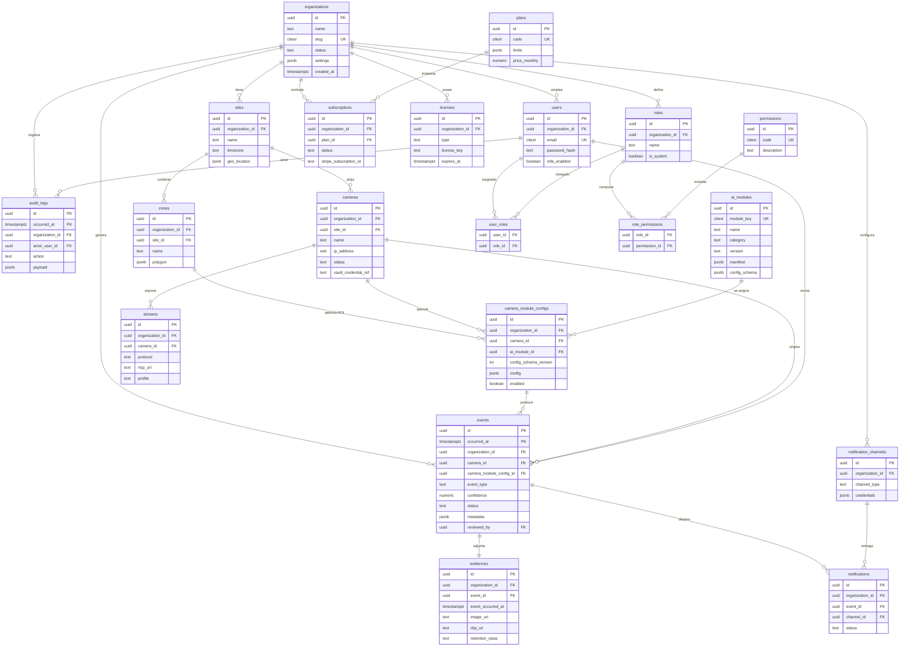

> Parte de la documentación de arquitectura de **Percepta** — Plataforma SaaS de Análisis Inteligente de Video con IA modular. Ver [índice](README.md).

## Diseño de Base de Datos y Modelo Entidad-Relación

Esta sección define la capa de persistencia de **Percepta**. El diseño parte de una premisa dura: un único cluster PostgreSQL 15 (con TimescaleDB) sirve a `identity-service`, `tenant-service`, `device-service`, `event-service`, `analytics-service`, `billing-service` y `audit-service`, cada uno como **dueño lógico** de su conjunto de tablas (schema-per-service dentro de la misma instancia, o instancias separadas en despliegues grandes). La multitenancy y la flexibilidad por módulo son los dos ejes que gobiernan cada decisión.

---

### 1. Estrategia de Multitenancy en PostgreSQL

#### 1.1 Decisión: *shared-database / shared-schema* + `organization_id` + Row-Level Security

El modelo **por defecto** para cloud multiempresa es una sola base, un solo schema por servicio, con `organization_id UUID NOT NULL` en **toda** tabla de negocio y **RLS forzado**. Es el punto óptimo entre densidad de recursos, simplicidad operativa (una migración, un backup, un pool de conexiones) y aislamiento suficiente cuando la política RLS es correcta y no se puede evadir.

| Estrategia | Aislamiento | Coste operativo | Escala nº tenants | Onboarding | Cuándo en Percepta |
|---|---|---|---|---|---|
| **Shared schema + RLS** (elegida) | Lógico (fuerte si RLS `FORCE`) | Bajo: 1 migración, 1 backup | Miles | Instantáneo (INSERT en `organizations`) | **Default cloud SaaS** |
| **Schema-per-tenant** | Medio-alto (separación namespace) | Medio: N schemas, migración fan-out | Cientos (degrada el catálogo) | Segundos (crear schema) | Tenants *enterprise*, aislamiento contractual |
| **Database-per-tenant** | Alto (físico) | Alto: N clusters/DBs | Decenas-cientos | Provisioning pesado | **On-premise** y licencias dedicadas |

**Regla de enrutamiento (política de plataforma):**
- Plan `starter`/`pro` → shared-schema + RLS.
- Plan `enterprise` con SLA de aislamiento → schema-per-tenant en el mismo cluster.
- **On-premise** (`licenses.type = 'on_prem'`) → database-per-tenant, una instancia por organización; el mismo DDL, sin la columna `organization_id` como discriminador de seguridad (aunque se conserva por consistencia de esquema y para futura consolidación).

#### 1.2 Implementación de RLS

Cada request autenticado en `api-gateway` propaga el `organization_id` extraído del JWT hacia el pool de PostgreSQL vía una variable de sesión **antes** de ejecutar cualquier query (patrón *set-then-query* en un interceptor NestJS + transacción):

```sql
-- Rol de aplicación: NO es superusuario y NO es dueño de las tablas,
-- de modo que BYPASSRLS no aplica y las políticas se fuerzan siempre.
CREATE ROLE percepta_app LOGIN PASSWORD '***' NOSUPERUSER NOBYPASSRLS;

-- En cada tabla multitenant:
ALTER TABLE cameras ENABLE ROW LEVEL SECURITY;
ALTER TABLE cameras FORCE ROW LEVEL SECURITY;   -- aplica incluso al owner

CREATE POLICY tenant_isolation ON cameras
  USING      (organization_id = current_setting('app.current_org')::uuid)
  WITH CHECK (organization_id = current_setting('app.current_org')::uuid);
```

```typescript
// Interceptor NestJS (pseudo) — se ejecuta por cada transacción del request
await queryRunner.query(
  `SELECT set_config('app.current_org', $1, true)`,  // true = local a la transacción
  [req.user.organizationId],
);
```

Puntos críticos de seguridad, no negociables:
- `FORCE ROW LEVEL SECURITY` para que ni el owner de la tabla evada la política.
- El rol de aplicación es `NOBYPASSRLS`; las migraciones y jobs de mantenimiento usan un rol distinto y auditado.
- `set_config(..., true)` liga la variable a la **transacción**, evitando fuga de contexto entre requests que reutilizan la misma conexión del pool (PgBouncer en modo *transaction*).
- Índices **siempre** con `organization_id` como primera columna en accesos multitenant (ver §5), porque el planner filtra por la política y necesita el índice compuesto para no degradar a *seq scan*.
- `audit-service` escribe con un rol *append-only* (ver §3) y sus lecturas también pasan por RLS.

#### 1.3 Opción schema-per-tenant (enterprise / on-prem grande)

Un `provisioning-job` (invocado por `billing-service` al activar un plan enterprise) crea `tenant_<org_short_id>` clonando una *plantilla* versionada. Las migraciones se aplican con fan-out controlado (herramienta tipo `sqitch`/`flyway` iterando schemas, con checkpoint por schema). Trade-off asumido: **el catálogo de PostgreSQL crece** (miles de tablas degradan `pg_dump`, autovacuum y el planner), por eso se limita a **cientos** de tenants por instancia y se acota a clientes que pagan el aislamiento.

---

### 2. Diagrama Entidad-Relación



---

### 3. DDL Representativo

Convenciones aplicadas: PK `UUID` (`gen_random_uuid()` de `pgcrypto`), FKs explícitas, `timestamptz` en UTC, `citext` para identificadores case-insensitive (email, slug), `CHECK` para enums estables, y `organization_id` denormalizado en toda tabla hoja para que RLS y los índices multitenant no dependan de joins.

```sql
CREATE EXTENSION IF NOT EXISTS pgcrypto;
CREATE EXTENSION IF NOT EXISTS citext;
CREATE EXTENSION IF NOT EXISTS timescaledb;

-- ============================ TENANT CORE ============================
CREATE TABLE organizations (
  id            uuid PRIMARY KEY DEFAULT gen_random_uuid(),
  name          text        NOT NULL,
  slug          citext      NOT NULL UNIQUE,
  status        text        NOT NULL DEFAULT 'active'
                            CHECK (status IN ('active','suspended','trial','closed')),
  settings      jsonb       NOT NULL DEFAULT '{}'::jsonb,
  created_at    timestamptz NOT NULL DEFAULT now(),
  updated_at    timestamptz NOT NULL DEFAULT now()
);

CREATE TABLE sites (
  id               uuid PRIMARY KEY DEFAULT gen_random_uuid(),
  organization_id  uuid NOT NULL REFERENCES organizations(id) ON DELETE CASCADE,
  name             text NOT NULL,
  timezone         text NOT NULL DEFAULT 'UTC',
  geo_location     point,
  address          jsonb NOT NULL DEFAULT '{}'::jsonb,
  created_at       timestamptz NOT NULL DEFAULT now(),
  UNIQUE (organization_id, name)
);

CREATE TABLE zones (
  id               uuid PRIMARY KEY DEFAULT gen_random_uuid(),
  organization_id  uuid NOT NULL REFERENCES organizations(id) ON DELETE CASCADE,
  site_id          uuid NOT NULL REFERENCES sites(id) ON DELETE CASCADE,
  name             text NOT NULL,
  -- polígono normalizado 0..1 relativo al frame; el módulo lo mapea a píxeles
  polygon          jsonb NOT NULL,   -- {"type":"polygon","points":[[x,y],...]}
  created_at       timestamptz NOT NULL DEFAULT now(),
  UNIQUE (organization_id, site_id, name)
);

-- ============================ DEVICES ============================
CREATE TABLE cameras (
  id                    uuid PRIMARY KEY DEFAULT gen_random_uuid(),
  organization_id       uuid NOT NULL REFERENCES organizations(id) ON DELETE CASCADE,
  site_id               uuid NOT NULL REFERENCES sites(id) ON DELETE RESTRICT,
  name                  text NOT NULL,
  ip_address            inet,
  vendor                text,
  model                 text,
  status                text NOT NULL DEFAULT 'unknown'
                        CHECK (status IN ('online','offline','degraded','unknown','disabled')),
  -- NO se guardan credenciales aquí: solo una referencia al vault
  vault_credential_ref  text NOT NULL,
  last_heartbeat_at     timestamptz,
  capabilities          jsonb NOT NULL DEFAULT '{}'::jsonb,  -- fps/res soportadas, PTZ, etc.
  created_at            timestamptz NOT NULL DEFAULT now(),
  updated_at            timestamptz NOT NULL DEFAULT now(),
  UNIQUE (organization_id, site_id, name)
);

CREATE TABLE streams (
  id               uuid PRIMARY KEY DEFAULT gen_random_uuid(),
  organization_id  uuid NOT NULL REFERENCES organizations(id) ON DELETE CASCADE,
  camera_id        uuid NOT NULL REFERENCES cameras(id) ON DELETE CASCADE,
  protocol         text NOT NULL DEFAULT 'rtsp' CHECK (protocol IN ('rtsp','webrtc','hls')),
  profile          text NOT NULL DEFAULT 'main' CHECK (profile IN ('main','sub','analytics')),
  rtsp_url         text,                 -- sin credenciales embebidas
  resolution       text,                 -- '1920x1080'
  fps              int  CHECK (fps > 0 AND fps <= 120),
  codec            text,
  is_active        boolean NOT NULL DEFAULT true,
  created_at       timestamptz NOT NULL DEFAULT now(),
  UNIQUE (camera_id, profile)
);

-- ============================ MODULE CATALOG ============================
-- Catálogo GLOBAL (no multitenant): lo alimenta module-registry desde manifests.
CREATE TABLE ai_modules (
  id             uuid PRIMARY KEY DEFAULT gen_random_uuid(),
  module_key     citext NOT NULL,          -- 'people-counting'
  name           text   NOT NULL,
  category       text   NOT NULL,          -- 'safety','retail','security','traffic'
  version        text   NOT NULL,          -- semver
  model_backend  text   NOT NULL,          -- 'yolov8','pytorch','tensorflow'
  manifest       jsonb  NOT NULL,          -- module.json completo
  config_schema  jsonb  NOT NULL,          -- JSON Schema (Draft 2020-12)
  event_types    text[] NOT NULL,          -- tipos de evento que emite
  resources      jsonb  NOT NULL DEFAULT '{}'::jsonb,  -- {"gpu":true,"min_fps":10}
  status         text   NOT NULL DEFAULT 'published'
                 CHECK (status IN ('draft','published','deprecated')),
  created_at     timestamptz NOT NULL DEFAULT now(),
  UNIQUE (module_key, version)
);

-- Asignación módulo <-> cámara con config validada por JSON Schema (ver §6).
CREATE TABLE camera_module_configs (
  id                     uuid PRIMARY KEY DEFAULT gen_random_uuid(),
  organization_id        uuid NOT NULL REFERENCES organizations(id) ON DELETE CASCADE,
  camera_id              uuid NOT NULL REFERENCES cameras(id) ON DELETE CASCADE,
  ai_module_id           uuid NOT NULL REFERENCES ai_modules(id) ON DELETE RESTRICT,
  config_schema_version  int  NOT NULL,          -- versión del JSON Schema usada al guardar
  config                 jsonb NOT NULL DEFAULT '{}'::jsonb,
  enabled                boolean NOT NULL DEFAULT true,
  priority               int NOT NULL DEFAULT 100,   -- orden de scheduling en el worker
  created_at             timestamptz NOT NULL DEFAULT now(),
  updated_at             timestamptz NOT NULL DEFAULT now(),
  -- una cámara no repite el mismo módulo (usar varias instancias => versionar module_key)
  UNIQUE (camera_id, ai_module_id)
);

-- ============================ IDENTITY / RBAC ============================
CREATE TABLE users (
  id               uuid PRIMARY KEY DEFAULT gen_random_uuid(),
  organization_id  uuid NOT NULL REFERENCES organizations(id) ON DELETE CASCADE,
  email            citext NOT NULL,
  password_hash    text   NOT NULL,          -- argon2id
  full_name        text,
  mfa_enabled      boolean NOT NULL DEFAULT false,
  mfa_secret_ref   text,                      -- referencia al vault, no el secreto
  status           text NOT NULL DEFAULT 'active'
                   CHECK (status IN ('active','invited','disabled')),
  last_login_at    timestamptz,
  created_at       timestamptz NOT NULL DEFAULT now(),
  UNIQUE (organization_id, email)     -- email único por tenant, no global
);

CREATE TABLE roles (
  id               uuid PRIMARY KEY DEFAULT gen_random_uuid(),
  organization_id  uuid NOT NULL REFERENCES organizations(id) ON DELETE CASCADE,
  name             text NOT NULL,        -- 'admin','operator','viewer', o custom
  is_system        boolean NOT NULL DEFAULT false,
  created_at       timestamptz NOT NULL DEFAULT now(),
  UNIQUE (organization_id, name)
);

-- Permisos: catálogo GLOBAL, códigos estables usados por api-gateway.
CREATE TABLE permissions (
  id           uuid PRIMARY KEY DEFAULT gen_random_uuid(),
  code         citext NOT NULL UNIQUE,   -- 'events:confirm','cameras:write'
  description  text NOT NULL
);

CREATE TABLE role_permissions (
  role_id        uuid NOT NULL REFERENCES roles(id) ON DELETE CASCADE,
  permission_id  uuid NOT NULL REFERENCES permissions(id) ON DELETE CASCADE,
  PRIMARY KEY (role_id, permission_id)
);

CREATE TABLE user_roles (
  user_id  uuid NOT NULL REFERENCES users(id) ON DELETE CASCADE,
  role_id  uuid NOT NULL REFERENCES roles(id) ON DELETE CASCADE,
  PRIMARY KEY (user_id, role_id)
);

-- ============================ BILLING ============================
CREATE TABLE plans (
  id             uuid PRIMARY KEY DEFAULT gen_random_uuid(),
  code           citext NOT NULL UNIQUE,   -- 'starter','pro','enterprise'
  name           text NOT NULL,
  limits         jsonb NOT NULL DEFAULT '{}'::jsonb,   -- {"max_cameras":50,"max_modules_per_cam":3}
  price_monthly  numeric(12,2) NOT NULL DEFAULT 0,
  stripe_price_id text,
  is_active      boolean NOT NULL DEFAULT true
);

CREATE TABLE subscriptions (
  id                      uuid PRIMARY KEY DEFAULT gen_random_uuid(),
  organization_id         uuid NOT NULL REFERENCES organizations(id) ON DELETE CASCADE,
  plan_id                 uuid NOT NULL REFERENCES plans(id) ON DELETE RESTRICT,
  status                  text NOT NULL
                          CHECK (status IN ('trialing','active','past_due','canceled')),
  stripe_subscription_id  text,
  current_period_end      timestamptz,
  created_at              timestamptz NOT NULL DEFAULT now(),
  UNIQUE (organization_id) WHERE status IN ('trialing','active','past_due')  -- 1 sub activa
);

CREATE TABLE licenses (
  id               uuid PRIMARY KEY DEFAULT gen_random_uuid(),
  organization_id  uuid NOT NULL REFERENCES organizations(id) ON DELETE CASCADE,
  type             text NOT NULL CHECK (type IN ('cloud','on_prem','hybrid')),
  license_key      text NOT NULL UNIQUE,
  seats_cameras    int,
  signature        text NOT NULL,       -- firma criptográfica verificable offline
  issued_at        timestamptz NOT NULL DEFAULT now(),
  expires_at       timestamptz
);

-- ============================ NOTIFICATIONS ============================
CREATE TABLE notification_channels (
  id               uuid PRIMARY KEY DEFAULT gen_random_uuid(),
  organization_id  uuid NOT NULL REFERENCES organizations(id) ON DELETE CASCADE,
  channel_type     text NOT NULL
                   CHECK (channel_type IN ('email','whatsapp','telegram','push','sms','webhook')),
  name             text NOT NULL,
  credentials      jsonb NOT NULL DEFAULT '{}'::jsonb,  -- tokens/refs al vault
  config           jsonb NOT NULL DEFAULT '{}'::jsonb,  -- plantillas, destinatarios
  is_active        boolean NOT NULL DEFAULT true,
  created_at       timestamptz NOT NULL DEFAULT now(),
  UNIQUE (organization_id, channel_type, name)
);

-- events y audit_logs se definen como hypertables en §4 (llevan la columna de tiempo en la PK).

CREATE TABLE evidences (
  id                 uuid NOT NULL DEFAULT gen_random_uuid(),
  organization_id    uuid NOT NULL REFERENCES organizations(id) ON DELETE CASCADE,
  event_id           uuid NOT NULL,
  event_occurred_at  timestamptz NOT NULL,   -- desnormalizado para FK compuesta al hypertable
  image_uri          text,        -- s3://bucket/org/.../frame.jpg
  clip_uri           text,        -- s3://bucket/org/.../clip.mp4  (10s pre + evento + 10s post)
  thumbnail_uri      text,
  bytes              bigint,
  retention_class    text NOT NULL DEFAULT 'standard'
                     CHECK (retention_class IN ('standard','extended','legal_hold')),
  storage_tier       text NOT NULL DEFAULT 'hot'
                     CHECK (storage_tier IN ('hot','warm','cold','deleted')),
  expires_at         timestamptz,
  created_at         timestamptz NOT NULL DEFAULT now(),
  PRIMARY KEY (id),
  FOREIGN KEY (event_id, event_occurred_at)
      REFERENCES events(id, occurred_at) ON DELETE CASCADE
);

CREATE TABLE notifications (
  id               uuid PRIMARY KEY DEFAULT gen_random_uuid(),
  organization_id  uuid NOT NULL REFERENCES organizations(id) ON DELETE CASCADE,
  event_id         uuid NOT NULL,
  channel_id       uuid NOT NULL REFERENCES notification_channels(id) ON DELETE CASCADE,
  status           text NOT NULL DEFAULT 'queued'
                   CHECK (status IN ('queued','sent','delivered','failed','skipped')),
  attempts         int NOT NULL DEFAULT 0,
  provider_ref     text,              -- id del mensaje en WhatsApp/Telegram/etc.
  error            text,
  dispatched_at    timestamptz,
  created_at       timestamptz NOT NULL DEFAULT now()
);
```

> **Nota sobre `evidences` ↔ `events`:** al ser `events` un hypertable con PK compuesta `(id, occurred_at)`, cualquier FK debe incluir la columna de particionado. Por eso `evidences` desnormaliza `event_occurred_at`. `evidence-service` lo recibe en el mensaje `events.created` del bus, así que no hay coste de lookup.

**Auditoría inmutable (`audit-service`).** `audit_logs` es *append-only* a nivel de base: el rol que lo escribe solo tiene `INSERT`, y un trigger bloquea `UPDATE`/`DELETE`. Es también hypertable (§4).

```sql
CREATE OR REPLACE FUNCTION deny_mutation() RETURNS trigger AS $$
BEGIN RAISE EXCEPTION 'audit_logs is append-only'; END;
$$ LANGUAGE plpgsql;

CREATE TRIGGER audit_no_update BEFORE UPDATE OR DELETE ON audit_logs
  FOR EACH ROW EXECUTE FUNCTION deny_mutation();

REVOKE UPDATE, DELETE ON audit_logs FROM percepta_app;
```

---

### 4. TimescaleDB: hypertables, continuous aggregates, retención y compresión

Dos flujos de datos son series temporales de alto volumen: **eventos** (una alerta por detección que supera reglas) y **métricas** (conteos, ocupación, aforo por minuto que `analytics-service` produce). Ambos van a hypertables.

#### 4.1 Hypertable `events`

```sql
CREATE TABLE events (
  id                       uuid NOT NULL DEFAULT gen_random_uuid(),
  occurred_at              timestamptz NOT NULL DEFAULT now(),
  organization_id          uuid NOT NULL,
  camera_id                uuid NOT NULL,
  camera_module_config_id  uuid NOT NULL,
  event_type               text NOT NULL,         -- p.ej. 'zone_intrusion','ppe_missing'
  confidence               numeric(5,4) NOT NULL CHECK (confidence BETWEEN 0 AND 1),
  status                   text NOT NULL DEFAULT 'new'
                           CHECK (status IN ('new','acknowledged','confirmed','dismissed','false_positive')),
  severity                 text NOT NULL DEFAULT 'info'
                           CHECK (severity IN ('info','low','medium','high','critical')),
  metadata                 jsonb NOT NULL DEFAULT '{}'::jsonb,  -- bounding boxes, track_id, clase, etc.
  dedup_key                text,                  -- para cooldown/deduplicación del rules-engine
  reviewed_by              uuid,                  -- users.id (revisión humana)
  reviewed_at              timestamptz,
  -- La PK DEBE incluir la columna de particionado del hypertable:
  PRIMARY KEY (id, occurred_at)
);

SELECT create_hypertable('events', 'occurred_at',
                         chunk_time_interval => INTERVAL '1 day');

-- Particionado por espacio (hash) sobre organization_id: reparte tenants
-- grandes entre chunks y mejora paralelismo. 4 particiones como punto de partida.
SELECT add_dimension('events', 'organization_id', number_partitions => 4);

ALTER TABLE events ENABLE ROW LEVEL SECURITY;
ALTER TABLE events FORCE ROW LEVEL SECURITY;
CREATE POLICY tenant_isolation ON events
  USING (organization_id = current_setting('app.current_org')::uuid);
```

El campo `dedup_key` materializa el **cooldown** del `rules-engine`: por ejemplo `md5(camera_id||event_type||floor(epoch/30))` evita crear 300 eventos idénticos cuando una persona permanece en una zona; se persiste solo el primero de la ventana y se cuentan las reincidencias en `metadata.recurrence`.

#### 4.2 Hypertable de métricas / series

```sql
CREATE TABLE metric_samples (
  time             timestamptz NOT NULL,
  organization_id  uuid NOT NULL,
  camera_id        uuid NOT NULL,
  metric_key       text NOT NULL,     -- 'people_count','occupancy','queue_length','dwell_time'
  value            double precision NOT NULL,
  dims             jsonb NOT NULL DEFAULT '{}'::jsonb  -- {"zone_id":"...","class":"person"}
);

SELECT create_hypertable('metric_samples', 'time',
                         chunk_time_interval => INTERVAL '1 day');
CREATE INDEX ON metric_samples (organization_id, camera_id, metric_key, time DESC);
```

#### 4.3 Continuous aggregates (rollups para dashboards y KPIs)

`analytics-service` no consulta la hypertable cruda para paneles; usa vistas materializadas incrementales que Timescale refresca sola.

```sql
-- Ocupación / conteo por cámara y hora
CREATE MATERIALIZED VIEW metric_hourly
WITH (timescaledb.continuous) AS
SELECT time_bucket('1 hour', time) AS bucket,
       organization_id, camera_id, metric_key,
       avg(value) AS avg_value,
       max(value) AS max_value,
       count(*)   AS samples
FROM metric_samples
GROUP BY bucket, organization_id, camera_id, metric_key
WITH NO DATA;

SELECT add_continuous_aggregate_policy('metric_hourly',
  start_offset      => INTERVAL '3 days',
  end_offset        => INTERVAL '1 hour',
  schedule_interval => INTERVAL '30 minutes');

-- Eventos por tipo y día (para KPIs, tasas de falso positivo, SLA de revisión)
CREATE MATERIALIZED VIEW events_daily
WITH (timescaledb.continuous) AS
SELECT time_bucket('1 day', occurred_at) AS day,
       organization_id, camera_id, event_type,
       count(*)                                                   AS total,
       count(*) FILTER (WHERE status = 'confirmed')               AS confirmed,
       count(*) FILTER (WHERE status = 'false_positive')          AS false_positives,
       avg(confidence)                                            AS avg_confidence
FROM events
GROUP BY day, organization_id, camera_id, event_type
WITH NO DATA;

SELECT add_continuous_aggregate_policy('events_daily',
  start_offset      => INTERVAL '30 days',
  end_offset        => INTERVAL '1 hour',
  schedule_interval => INTERVAL '1 hour');
```

Los **mapas de calor** de `analytics-service` se calculan sobre un continuous aggregate espacial adicional que bucketiza `metadata->'bbox'` normalizado en una grilla NxM por cámara (agregación por `time_bucket` + celda), evitando recorrer eventos individuales en el frontend.

#### 4.4 Compresión y retención

```sql
-- Compresión columnar de eventos con > 7 días: 8-15x menos espacio.
ALTER TABLE events SET (
  timescaledb.compress,
  timescaledb.compress_segmentby = 'organization_id, camera_id, event_type',
  timescaledb.compress_orderby   = 'occurred_at DESC'
);
SELECT add_compression_policy('events', INTERVAL '7 days');

-- Métricas crudas: comprimir a los 2 días, retener 90; el detalle histórico
-- vive en los continuous aggregates (que se retienen mucho más).
ALTER TABLE metric_samples SET (
  timescaledb.compress,
  timescaledb.compress_segmentby = 'organization_id, camera_id, metric_key');
SELECT add_compression_policy('metric_samples', INTERVAL '2 days');

-- Retención por tabla (alineada a plan; en enterprise se sobreescribe por tenant):
SELECT add_retention_policy('metric_samples', INTERVAL '90 days');
SELECT add_retention_policy('events',         INTERVAL '400 days');
SELECT add_retention_policy('metric_hourly',  INTERVAL '2 years');   -- el rollup dura más que el crudo
SELECT add_retention_policy('audit_logs',     INTERVAL '7 years');   -- cumplimiento
```

Trade-off consciente: `compress_segmentby` sobre `event_type`/`camera_id` optimiza los filtros del dashboard; una vez comprimido, un chunk es de solo lectura, así que la **revisión humana** (updates a `status`/`reviewed_by`) solo ocurre en la ventana caliente (< 7 días), coherente con el flujo operativo real donde las alertas se atienden en minutos u horas, no semanas.

---

### 5. Particionado, índices y estrategia de retención de evidencias

#### 5.1 Índices clave

```sql
-- Multitenant: organization_id SIEMPRE primero (RLS + selectividad).
CREATE INDEX ix_cameras_org_site      ON cameras (organization_id, site_id);
CREATE INDEX ix_streams_org_camera    ON streams (organization_id, camera_id);
CREATE INDEX ix_cmc_org_camera        ON camera_module_configs (organization_id, camera_id) WHERE enabled;

-- Bandeja de revisión: eventos "nuevos" ordenados por tiempo, por tenant.
CREATE INDEX ix_events_review
  ON events (organization_id, status, occurred_at DESC)
  WHERE status IN ('new','acknowledged');

CREATE INDEX ix_events_camera_time
  ON events (organization_id, camera_id, occurred_at DESC);

-- GIN sobre JSONB de configuración de módulo (búsquedas por clave de config):
CREATE INDEX ix_cmc_config_gin
  ON camera_module_configs USING gin (config jsonb_path_ops);

-- GIN sobre metadata de evento (filtrar por clase, track_id, atributos):
CREATE INDEX ix_events_metadata_gin
  ON events USING gin (metadata jsonb_path_ops);

-- Ejemplo de expresión indexable derivada de JSONB (clase detectada):
CREATE INDEX ix_events_object_class
  ON events (organization_id, (metadata->>'object_class'), occurred_at DESC);

-- Manifest / config_schema del catálogo, para búsquedas del module-registry:
CREATE INDEX ix_ai_modules_manifest_gin ON ai_modules USING gin (manifest jsonb_path_ops);
```

Elección de `jsonb_path_ops` frente a `jsonb_ops`: índices GIN más pequeños y rápidos para el operador de contención `@>`, que es el patrón dominante (`metadata @> '{"object_class":"person"}'`). Se sacrifica el soporte de operadores de existencia de clave `?`, poco usado aquí.

#### 5.2 Particionado

- **Hypertables** (`events`, `metric_samples`, `audit_logs`): particionado por tiempo (chunks de 1 día) + espacio por `organization_id` (hash) donde el volumen lo justifica. Esto habilita *chunk exclusion* (el planner ignora chunks fuera de rango) y borrado de retención O(1) por *drop chunk* en lugar de `DELETE` masivo.
- **Tablas operativas** (`cameras`, `camera_module_configs`, etc.): sin particionado; su cardinalidad es la de dispositivos (miles), no de eventos (millones/día). El aislamiento es lógico vía RLS.

#### 5.3 Retención de evidencias (imágenes + clips)

La evidencia binaria vive en **MinIO/S3**, no en PostgreSQL; la tabla `evidences` solo guarda URIs y metadatos de ciclo de vida. Estrategia por niveles, gobernada por `evidence-service` y `analytics-service`:

| `retention_class` | Hot (S3 Standard) | Warm (IA) | Cold (Glacier) | Borrado |
|---|---|---|---|---|
| `standard` | 0–30 días | 30–90 días | — | 90 días |
| `extended` (evento confirmado) | 0–90 días | 90–365 días | 1–2 años | 2 años |
| `legal_hold` | indefinido | — | — | nunca (hasta liberar hold) |

- El *tiering* físico se implementa con **S3/MinIO Object Lifecycle Rules** por prefijo (`s3://evidence/{org_id}/{yyyy}/{mm}/...`), evitando lógica de mover objetos en la aplicación.
- Un job de `evidence-service` sincroniza `storage_tier`/`expires_at` en la fila con el estado real del objeto y **nunca hace hard-delete** por su cuenta: encola una tarea de borrado que respeta `legal_hold` y la retención del plan (`plans.limits.evidence_retention_days`).
- Cuando un evento pasa a `confirmed`, `event-service` publica en el bus y `evidence-service` **promueve** la evidencia a `extended`; si pasa a `false_positive`, se degrada a `standard` (borrado temprano) para no acumular basura.
- Coherencia con retención de la DB: la política `add_retention_policy('events', '400 days')` va **alineada** con la clase `extended` para que un evento y su evidencia caduquen de forma consistente; los `legal_hold` se excluyen del drop mediante una tabla `legal_holds(event_id, ...)` que `event-service` consulta antes de permitir la caída del chunk (en la práctica, esos eventos se copian a un almacén de largo plazo antes de expirar el chunk).

---

### 6. Configuración flexible por módulo/cámara sin tocar el esquema

Éste es el mecanismo que hace a Percepta *módulos-como-plugins*: **una sola tabla** (`camera_module_configs`) modela la configuración de cualquier módulo presente o futuro, sin migraciones. Tres piezas colaboran:

1. **`ai_modules.config_schema`** — cada módulo declara su formulario como **JSON Schema (Draft 2020-12)** en su `module.json`. `module-registry` lo persiste versionado (`ai_modules.version` + `camera_module_configs.config_schema_version`).
2. **`camera_module_configs.config` (JSONB)** — la instancia concreta de esa configuración para una cámara.
3. **Validación en doble frontera** — el frontend Angular renderiza el formulario dinámicamente desde el JSON Schema (json-schema-form) y **valida en cliente**; `device-service`/`module-registry` **revalida en servidor** con `ajv` contra el schema de la versión declarada antes de hacer `INSERT/UPDATE`. La base garantiza integridad estructural mínima con un `CHECK` de tipo, pero la validación semántica completa (rangos, enums, requeridos) es de la capa de aplicación, porque el schema es dinámico.

**Versionado del schema.** Al guardar, se sella `config_schema_version` con la versión vigente. Si el módulo publica una versión nueva del schema, las configs viejas siguen validando contra **su** versión; `module-registry` provee migradores (`config vN → vN+1`) opcionales que `device-service` aplica de forma perezosa al editar. Esto evita romper miles de cámaras al actualizar un plugin.

**Trigger de refuerzo mínimo en DB** (garantía de que `config_schema_version` existe en el catálogo, sin duplicar la validación completa):

```sql
ALTER TABLE camera_module_configs
  ADD CONSTRAINT config_is_object CHECK (jsonb_typeof(config) = 'object');
```

#### 6.1 Ejemplos de `config_schema` (en `ai_modules`) y filas de `camera_module_configs`

**Módulo A — `people-counting` (conteo/aforo por línea).** `config_schema` (extracto):

```json
{
  "$schema": "https://json-schema.org/draft/2020-12/schema",
  "type": "object",
  "required": ["counting_lines", "confidence_threshold"],
  "properties": {
    "counting_lines": {
      "type": "array", "minItems": 1,
      "items": {
        "type": "object",
        "required": ["name", "a", "b", "direction"],
        "properties": {
          "name": { "type": "string" },
          "a": { "$ref": "#/$defs/point" },
          "b": { "$ref": "#/$defs/point" },
          "direction": { "enum": ["in", "out", "both"] }
        }
      }
    },
    "confidence_threshold": { "type": "number", "minimum": 0, "maximum": 1, "default": 0.5 },
    "target_classes": { "type": "array", "items": { "enum": ["person"] }, "default": ["person"] }
  },
  "$defs": { "point": { "type": "array", "items": { "type": "number" }, "minItems": 2, "maxItems": 2 } }
}
```

Fila en `camera_module_configs`:

```json
{
  "id": "6d2f...-A",
  "organization_id": "11111111-1111-1111-1111-111111111111",
  "camera_id": "cam-entrada-principal",
  "ai_module_id": "mod-people-counting-2.3.0",
  "config_schema_version": 3,
  "enabled": true,
  "priority": 50,
  "config": {
    "counting_lines": [
      { "name": "puerta_norte", "a": [0.10, 0.80], "b": [0.90, 0.80], "direction": "both" }
    ],
    "confidence_threshold": 0.55,
    "target_classes": ["person"]
  }
}
```

**Módulo B — `ppe-detection` (EPP: casco/chaleco) con zonas y horario.** Fila:

```json
{
  "id": "6d2f...-B",
  "organization_id": "11111111-1111-1111-1111-111111111111",
  "camera_id": "cam-nave-3",
  "ai_module_id": "mod-ppe-detection-1.4.2",
  "config_schema_version": 1,
  "enabled": true,
  "priority": 10,
  "config": {
    "required_ppe": ["helmet", "hi_vis_vest"],
    "roi_zones": ["zone-area-carga"],
    "confidence_threshold": 0.62,
    "min_violation_seconds": 3,
    "active_schedule": {
      "timezone": "America/Argentina/Buenos_Aires",
      "windows": [ { "days": ["mon","tue","wed","thu","fri"], "from": "07:00", "to": "19:00" } ]
    },
    "cooldown_seconds": 30,
    "severity": "high"
  }
}
```

**Módulo C — `intrusion-detection` (perímetro nocturno con polígono).** Fila:

```json
{
  "id": "6d2f...-C",
  "organization_id": "11111111-1111-1111-1111-111111111111",
  "camera_id": "cam-perimetro-este",
  "ai_module_id": "mod-intrusion-detection-3.0.1",
  "config_schema_version": 2,
  "enabled": true,
  "priority": 5,
  "config": {
    "roi_zones": ["zone-perimetro"],
    "target_classes": ["person", "vehicle"],
    "confidence_threshold": 0.70,
    "min_dwell_seconds": 2,
    "active_schedule": {
      "timezone": "America/Argentina/Buenos_Aires",
      "windows": [ { "days": ["*"], "from": "20:00", "to": "06:00" } ]
    },
    "sensitivity": "high",
    "cooldown_seconds": 20,
    "notify_channels": ["telegram-guardia", "whatsapp-supervisor"]
  }
}
```

Obsérvese cómo `rules-engine` consume campos comunes (`confidence_threshold`, `roi_zones`, `active_schedule`, `cooldown_seconds`) de forma **agnóstica al módulo**: son convenciones del contrato de config, no columnas. Los `roi_zones` referencian por nombre/id a filas de `zones`, y los `notify_channels` a `notification_channels`, uniendo el JSONB flexible con el modelo relacional sin acoplar el esquema al módulo. Añadir un cuarto módulo (p.ej. `fall-detection` o `license-plate-recognition`) es publicar un `module.json` con su JSON Schema: **cero cambios de DDL**, cero migraciones, cero despliegues del core.

---

**Resumen de decisiones y trade-offs:**
- RLS `FORCE` + `organization_id` denormalizado como línea base; schema/DB-per-tenant reservado a enterprise y on-prem, aceptando su coste operativo a cambio de aislamiento contractual.
- `events`, `metric_samples` y `audit_logs` como hypertables con PK compuesta que incluye el tiempo; FKs a `events` desnormalizan `occurred_at` (impuesto por TimescaleDB, resuelto sin coste vía el bus).
- Continuous aggregates para todo panel/KPI/heatmap; compresión columnar tras la ventana de revisión humana; retención por *drop chunk* alineada con el tiering de evidencias en S3/MinIO.
- GIN `jsonb_path_ops` sobre `config` y `metadata`; índices multitenant siempre liderados por `organization_id`.
- Config por módulo/cámara modelada con **JSONB validado por JSON Schema versionado**, garantizando extensibilidad de plugins sin tocar el esquema y sin romper configuraciones existentes al actualizar módulos.

---

⬅ [Anterior](01-arquitectura-general-y-microservicios.md) · [Índice](README.md) · [Siguiente ➡](03-apis-seguridad-y-auditoria.md)
