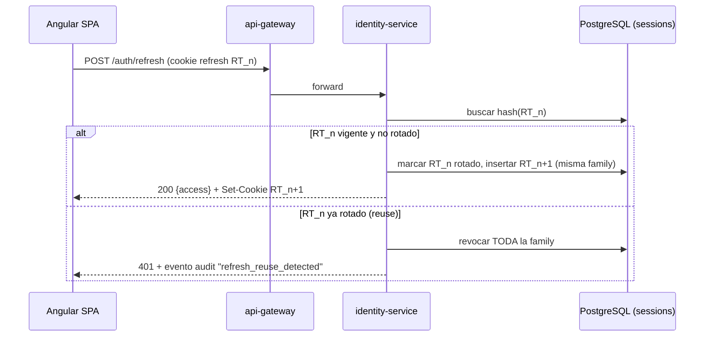
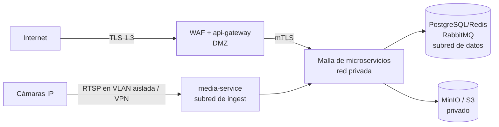

> Parte de la documentación de arquitectura de **Percepta** — Plataforma SaaS de Análisis Inteligente de Video con IA modular. Ver [índice](README.md).

## APIs REST, Autenticación, Autorización (RBAC), Seguridad y Auditoría

Esta sección define el contrato de superficie pública de **Percepta** (expuesto por `api-gateway` como BFF) y los mecanismos transversales de identidad, autorización, hardening y trazabilidad. Todo el diseño parte de las decisiones compartidas: DB `snake_case`, JSON de API `camelCase`, servicios `kebab-case`, REST versionado en `/api/v1`, IDs UUID, timestamps UTC ISO-8601, multitenancy por `organization_id` + RLS y el principio **human-in-the-loop** (los eventos son alertas con `confidence`, nunca decisiones automáticas).

Un principio arquitectónico rige toda la sección: **defensa en profundidad**. La autorización se verifica en tres capas independientes que deben coincidir — (1) validación de JWT y `scope` en `api-gateway`, (2) guards RBAC en cada microservicio NestJS, (3) Row-Level Security en PostgreSQL. Ninguna capa confía en que la anterior filtró correctamente.

---

### (a) Diseño de la API REST versionada

#### Convenciones transversales

| Aspecto | Decisión | Justificación / trade-off |
|---|---|---|
| **Versionado** | Prefijo de URI `/api/v1`. Cambios incompatibles → `/api/v2`. Nunca se rompe `v1` en caliente. | URI-versioning es explícito y cacheable en el borde; se descarta header-versioning por opacidad para clientes móviles/webhooks de terceros. |
| **Formato** | JSON `camelCase` en request/response. `Content-Type: application/json; charset=utf-8`. | El mapeo `snake_case`↔`camelCase` se hace en la capa de serialización (class-transformer) del gateway/servicios. |
| **Identificadores** | UUID v7 (ordenables por tiempo) en rutas: `/cameras/{cameraId}`. | UUID v7 mantiene localidad de índice B-Tree en PostgreSQL vs. v4 (evita fragmentación de índice en tablas de alto volumen como `events`). |
| **Paginación** | **Keyset (cursor)** por defecto para colecciones de alto volumen (`events`, `notifications`, `audit_logs`); offset opcional para catálogos pequeños. | Keyset garantiza latencia estable y sin duplicados/saltos ante inserciones concurrentes (crítico en `events`, que se llena en tiempo real). |
| **Filtrado** | Query params tipados: `?status=new&cameraId=..&from=..&to=..&moduleId=..`. Rangos temporales con `from`/`to` ISO-8601. | Whitelist estricta de campos filtrables por recurso (previene enumeración e inyección). |
| **Ordenamiento** | `?sort=-occurredAt,confidence` (prefijo `-` = descendente). Solo campos indexados. | |
| **Errores** | RFC 7807 (`application/problem+json`) extendido con `traceId`. | Estándar; el `traceId` correlaciona con `audit-service` y logs distribuidos. |
| **Idempotencia** | Header `Idempotency-Key` (UUID) obligatorio en `POST` con efectos externos (asignar módulo, disparar test de canal, crear suscripción Stripe). Redis guarda la respuesta 24 h. | Evita doble-asignación de módulos o doble-cobro ante reintentos de red del SPA. |
| **Concurrencia** | ETag + `If-Match` en `PATCH` de recursos con estado disputable (`events`, `camera_module_configs`). | Previene lost-update cuando dos operadores tocan el mismo evento. |
| **Rate-limit** | Headers `RateLimit-Limit`, `RateLimit-Remaining`, `RateLimit-Reset` (draft IETF). | Cliente puede backoff proactivo. |
| **Real-time** | Lo *push* (nuevas alertas) va por WebSocket/SSE (`event-service`→Redis pub/sub→`api-gateway`), **no** por polling REST. REST es para consultas históricas y CRUD. | Separa el plano de comando (REST) del plano de eventos (WS). |

#### Envelope estándar de colección

```json
{
  "data": [ /* recursos */ ],
  "pagination": {
    "nextCursor": "eyJvY2N1cnJlZEF0IjoiMjAyNi0wNy0zMFQxMDoxNTowMFoiLCJpZCI6Ii4uLiJ9",
    "prevCursor": null,
    "limit": 50,
    "hasMore": true
  },
  "meta": { "totalApprox": 12840 }
}
```

`totalApprox` proviene de `reltuples` de PostgreSQL (estimado) para no forzar `COUNT(*)` sobre tablas TimescaleDB de decenas de millones de filas.

#### Formato de error (RFC 7807)

```json
{
  "type": "https://errors.percepta.io/validation/module-config-schema",
  "title": "La configuración del módulo no valida contra su JSON Schema",
  "status": 422,
  "detail": "El campo 'zones[0].points' requiere al menos 3 vértices.",
  "instance": "/api/v1/cameras/018f.../module-configs",
  "traceId": "01J9K2QF7X8...",
  "errors": [
    { "pointer": "/config/zones/0/points", "code": "MIN_ITEMS", "expected": 3, "actual": 2 }
  ]
}
```

Tabla de códigos HTTP canónicos: `400` (malformado), `401` (sin/inválido token), `403` (autenticado pero sin permiso o fuera de scope), `404` (no existe **o** RLS lo oculta — se devuelve 404 y no 403 para no filtrar existencia cross-tenant), `409` (conflicto de estado / ETag), `422` (validación semántica, p.ej. JSON Schema del módulo), `429` (rate-limit), `503` (servicio IA saturado / circuit breaker abierto).

#### Tabla de endpoints principales por dominio

> Convención de permisos: `recurso:accion`. El scope (`organization`/`site`) se resuelve además contra el JWT y RLS (ver sección d).

**Auth & Identidad** (`identity-service`)

| Método | Ruta | Descripción | Permiso |
|---|---|---|---|
| POST | `/api/v1/auth/login` | Credenciales → access+refresh (o `mfaRequired`) | público |
| POST | `/api/v1/auth/mfa/verify` | Verifica TOTP/WebAuthn, emite tokens finales | público (con `mfaToken`) |
| POST | `/api/v1/auth/refresh` | Rota refresh → nuevo par de tokens | público (cookie) |
| POST | `/api/v1/auth/logout` | Revoca refresh de la sesión | autenticado |
| GET | `/api/v1/auth/sessions` | Lista sesiones activas del usuario | autenticado |
| DELETE | `/api/v1/auth/sessions/{sid}` | Revoca sesión remota | autenticado |
| POST | `/api/v1/auth/mfa/enroll` | Inicia enrolamiento TOTP/WebAuthn | autenticado |

**Users / Roles / Permissions** (`identity-service`)

| Método | Ruta | Descripción | Permiso |
|---|---|---|---|
| GET | `/api/v1/users` | Lista usuarios (scoped a org/site) | `users:read` |
| POST | `/api/v1/users` | Invita/crea usuario | `users:create` |
| PATCH | `/api/v1/users/{userId}` | Actualiza usuario | `users:update` |
| POST | `/api/v1/users/{userId}/roles` | Asigna rol con scope | `users:assign-role` |
| DELETE | `/api/v1/users/{userId}/roles/{roleId}` | Revoca rol | `users:assign-role` |
| GET | `/api/v1/roles` | Roles del sistema + custom | `roles:read` |
| POST | `/api/v1/roles` | Crea rol custom (permisos ⊆ del creador) | `roles:create` |
| GET | `/api/v1/permissions` | Catálogo de permisos | `roles:read` |

**Tenancy** (`tenant-service`)

| Método | Ruta | Descripción | Permiso |
|---|---|---|---|
| GET/POST | `/api/v1/organizations` | Lista/crea empresas | `organizations:read` / `organizations:create` *(platform)* |
| GET/PATCH/DELETE | `/api/v1/organizations/{orgId}` | Detalle/edición | `organizations:*` |
| GET/POST | `/api/v1/sites` | Sucursales de la org | `sites:read` / `sites:create` |
| GET/PATCH/DELETE | `/api/v1/sites/{siteId}` | Detalle/edición | `sites:*` |
| GET/POST | `/api/v1/sites/{siteId}/zones` | Zonas/sectores | `zones:read` / `zones:create` |

**Dispositivos** (`device-service` + `media-service`)

| Método | Ruta | Descripción | Permiso |
|---|---|---|---|
| GET/POST | `/api/v1/cameras` | Lista/alta de cámaras | `cameras:read` / `cameras:create` |
| GET/PATCH/DELETE | `/api/v1/cameras/{cameraId}` | Detalle/edición (credenciales RTSP nunca en respuesta) | `cameras:*` |
| POST | `/api/v1/cameras/{cameraId}/test-connection` | Prueba RTSP/ONVIF | `cameras:manage` |
| GET | `/api/v1/cameras/{cameraId}/health` | Salud/estado (FPS, uptime, última keyframe) | `cameras:read` |
| POST | `/api/v1/cameras/{cameraId}/live-session` | Negocia sesión WebRTC (SDP offer→answer) | `streams:view` |

**Catálogo de módulos** (`module-registry`)

| Método | Ruta | Descripción | Permiso |
|---|---|---|---|
| GET | `/api/v1/modules` | Catálogo de `ai_modules` disponibles | `modules:read` |
| GET | `/api/v1/modules/{moduleId}` | Manifest + metadata | `modules:read` |
| GET | `/api/v1/modules/{moduleId}/config-schema` | JSON Schema para render dinámico del form | `modules:read` |
| POST | `/api/v1/modules` | Publica/registra módulo-plugin (manifest) | `modules:publish` *(platform)* |

**Asignación módulo↔cámara** (`device-service` / `rules-engine`)

| Método | Ruta | Descripción | Permiso |
|---|---|---|---|
| GET | `/api/v1/cameras/{cameraId}/module-configs` | Módulos asignados a la cámara | `camera-module-configs:read` |
| POST | `/api/v1/cameras/{cameraId}/module-configs` | Asigna módulo + config (valida contra JSON Schema) | `camera-module-configs:create` |
| PATCH | `/api/v1/camera-module-configs/{configId}` | Edita config (zonas, umbrales, horarios) | `camera-module-configs:update` |
| POST | `/api/v1/camera-module-configs/{configId}/enable` | Activa/desactiva | `camera-module-configs:update` |
| DELETE | `/api/v1/camera-module-configs/{configId}` | Quita módulo de la cámara | `camera-module-configs:delete` |

**Eventos / Evidencias** (`event-service` / `evidence-service`)

| Método | Ruta | Descripción | Permiso |
|---|---|---|---|
| GET | `/api/v1/events` | Lista/filtra alertas (keyset) | `events:read` |
| GET | `/api/v1/events/{eventId}` | Detalle de alerta + confidence | `events:read` |
| POST | `/api/v1/events/{eventId}/acknowledge` | Operador toma la alerta (`new`→`acknowledged`) | `events:acknowledge` |
| POST | `/api/v1/events/{eventId}/resolve` | Cierre humano: `confirmed`/`dismissed`/`false_positive` | `events:resolve` |
| GET | `/api/v1/evidences/{evidenceId}` | Metadata de evidencia | `evidences:read` |
| GET | `/api/v1/evidences/{evidenceId}/download` | URL firmada (MinIO/S3) TTL corto | `evidences:download` |

**Notificaciones** (`notification-service`)

| Método | Ruta | Descripción | Permiso |
|---|---|---|---|
| GET/POST | `/api/v1/notification-channels` | Canales (Email, WhatsApp, Telegram, Push, SMS, Webhook) | `notification-channels:read/create` |
| PATCH/DELETE | `/api/v1/notification-channels/{channelId}` | Editar/borrar | `notification-channels:update/delete` |
| POST | `/api/v1/notification-channels/{channelId}/test` | Envío de prueba (idempotente) | `notification-channels:update` |
| GET | `/api/v1/notifications` | Log de despachos | `notifications:read` |

**Billing** (`billing-service`)

| Método | Ruta | Descripción | Permiso |
|---|---|---|---|
| GET | `/api/v1/billing/plans` | Planes SaaS disponibles | `billing:read` |
| GET | `/api/v1/billing/subscription` | Suscripción de la org | `billing:read` |
| POST | `/api/v1/billing/subscription` | Alta/cambio de plan (Stripe) | `billing:manage` |
| GET | `/api/v1/billing/usage` | Metering (cámaras activas, módulos, GB evidencia) | `billing:read` |
| POST | `/api/v1/billing/licenses` | Emite/valida licencia on-prem | `billing:manage` |
| POST | `/api/v1/webhooks/stripe` | Webhook Stripe (firma verificada, sin JWT) | firma HMAC |

---

### (b) Ejemplos de request/response

#### 1. Asignar un módulo a una cámara

`POST /api/v1/cameras/018f6b2a-9c1e-7a44-b8d1-2f3e/module-configs`

```http
Authorization: Bearer eyJhbGc...
Idempotency-Key: 4d9a1c22-77b0-4f6e-8a11-9c2e5f1b3a44
If-Match: none
Content-Type: application/json
```
```json
{
  "moduleId": "018f5a01-perimeter-intrusion-v2",
  "enabled": true,
  "config": {
    "confidenceThreshold": 0.72,
    "schedule": { "timezone": "America/Argentina/Buenos_Aires",
      "windows": [{ "days": ["MON","TUE","WED","THU","FRI"], "from": "20:00", "to": "07:00" }] },
    "zones": [
      { "name": "Playa de carga", "type": "polygon",
        "points": [[0.12,0.30],[0.55,0.28],[0.60,0.72],[0.10,0.75]] }
    ],
    "cooldownSeconds": 45,
    "targetClasses": ["person"]
  }
}
```

El servicio valida `config` contra el **JSON Schema** declarado en el manifest del módulo (`config-schema`). Respuesta:

```http
HTTP/1.1 201 Created
Location: /api/v1/camera-module-configs/018f6b31-2a...
ETag: "v1-3f9a2c"
```
```json
{
  "data": {
    "id": "018f6b31-2a44-7c90-a1b2-c3d4e5f6a7b8",
    "cameraId": "018f6b2a-9c1e-7a44-b8d1-2f3e",
    "moduleId": "018f5a01-perimeter-intrusion-v2",
    "enabled": true,
    "config": { "confidenceThreshold": 0.72, "cooldownSeconds": 45,
      "zones": [ /* … */ ], "schedule": { /* … */ }, "targetClasses": ["person"] },
    "resourceEstimate": { "gpuFraction": 0.25, "targetFps": 8 },
    "createdBy": "018f2200-...-operatorX",
    "createdAt": "2026-07-30T13:41:07.412Z",
    "updatedAt": "2026-07-30T13:41:07.412Z"
  }
}
```
> Efecto colateral: `device-service` publica en RabbitMQ para que `inference-orchestrator` recargue el pipeline de esa cámara **sin reiniciar el core** (principio de plugins en caliente).

#### 2. Listar eventos (keyset + filtros)

`GET /api/v1/events?siteId=018f..&status=new&moduleId=018f5a01-perimeter-intrusion-v2&from=2026-07-30T00:00:00Z&sort=-occurredAt&limit=2`

```json
{
  "data": [
    {
      "id": "018f6c10-e2...",
      "organizationId": "018f0001-...",
      "siteId": "018f0aa2-...",
      "cameraId": "018f6b2a-9c1e-7a44-b8d1-2f3e",
      "moduleId": "018f5a01-perimeter-intrusion-v2",
      "type": "perimeter.intrusion",
      "status": "new",
      "confidence": 0.88,
      "severity": "high",
      "occurredAt": "2026-07-30T02:14:55.008Z",
      "zoneName": "Playa de carga",
      "evidenceId": "018f6c11-...",
      "thumbnailUrl": "https://cdn.percepta.io/ev/018f6c11/thumb.jpg?X-Amz-Signature=…",
      "reviewedBy": null
    },
    { "id": "018f6c0f-a1...", "confidence": 0.79, "status": "new", "occurredAt": "2026-07-30T02:09:11.200Z", "…": "…" }
  ],
  "pagination": { "nextCursor": "eyJvY2N1cnJlZEF0IjoiMjAyNi0wNy0zMFQwMjowOToxMS4yMDBaIiwiaWQiOiIwMThmNmMwZi1hMSJ9", "limit": 2, "hasMore": true },
  "meta": { "totalApprox": 37 }
}
```

#### 3. Actualizar estado de un evento (cierre human-in-the-loop)

`POST /api/v1/events/018f6c10-e2.../resolve`

```http
Authorization: Bearer eyJhbGc...
If-Match: "v3-9c1a2f"
```
```json
{ "resolution": "confirmed", "note": "Intrusión real confirmada por cámara 3; se notificó a guardia.", "tags": ["incidente-real","turno-noche"] }
```
```json
{
  "data": {
    "id": "018f6c10-e2...",
    "status": "confirmed",
    "confidence": 0.88,
    "review": {
      "acknowledgedBy": "018f2200-...-operatorX",
      "acknowledgedAt": "2026-07-30T02:15:30.100Z",
      "resolvedBy": "018f2200-...-operatorX",
      "resolvedAt": "2026-07-30T02:17:02.554Z",
      "resolution": "confirmed",
      "note": "Intrusión real confirmada por cámara 3; se notificó a guardia."
    }
  }
}
```
> Toda transición de estado emite a `audit.log` y a `events.created`/actualización para el dashboard en tiempo real. Las resoluciones `false_positive` retroalimentan el dataset de reentrenamiento (con consentimiento/anonimización, ver sección g). El estado **nunca** se cierra automáticamente: no hay endpoint que un servicio de IA pueda invocar para `resolve`.

---

### (c) Autenticación: JWT + refresh, MFA, sesiones

#### Estrategia de tokens

- **Access token**: JWT firmado con **EdDSA (Ed25519)** (o RS256 según HSM disponible), TTL **15 min**, stateless. Verificado en el borde por `api-gateway` usando la JWKS pública de `identity-service` (rotación de claves con `kid`).
- **Refresh token**: **opaco** (256 bits aleatorios, no JWT), TTL **30 días** (deslizante), persistido *hasheado* (SHA-256) en tabla `sessions` de `identity-service`. Su opacidad permite revocación inmediata sin listas negras de JWT.

Trade-off: JWT stateless para access (escala sin round-trip a DB en cada request) + refresh opaco stateful (revocación real). Es el balance estándar para SaaS multitenant.

#### Claims del access token

```json
{
  "iss": "https://identity.percepta.io",
  "sub": "018f2200-...-operatorX",
  "aud": "percepta-api",
  "iat": 1785500000, "exp": 1785500900,
  "sid": "018f6d00-session-uuid",
  "org": "018f0001-...",
  "sites": ["018f0aa2-...", "018f0ab7-..."],
  "roles": ["operator"],
  "scope": "events:read events:acknowledge events:resolve streams:view cameras:read",
  "amr": ["pwd","otp"],
  "mfa": true,
  "ver": 2
}
```
- `org` + `sites` alimentan directamente las variables de sesión de RLS en PostgreSQL (ver d).
- `scope` es la **unión aplanada** de permisos derivados de los roles (resueltos en login para evitar joins por request). `ver` invalida tokens ante cambios de permisos (bump del `permissions_version` del usuario).
- `amr`/`mfa` permiten a endpoints sensibles exigir MFA reciente (step-up).

#### Rotación y reuse-detection del refresh token

Rotación obligatoria: cada `/auth/refresh` invalida el refresh usado y emite uno nuevo. Se guarda una cadena (`token_family`). Si un refresh **ya rotado** se reutiliza (señal de robo), se revoca **toda la familia** y se fuerza re-login + alerta de seguridad.



#### Almacenamiento en el cliente

- **Refresh token** → cookie `HttpOnly; Secure; SameSite=Strict; Path=/api/v1/auth`. Nunca accesible a JS (mitiga XSS-exfiltration).
- **Access token** → memoria del SPA (variable RxJS `BehaviorSubject`), **no** `localStorage`. Se re-obtiene vía `/auth/refresh` al recargar.
- CSRF: como el refresh viaja en cookie, `/auth/refresh` y `/auth/logout` exigen header anti-CSRF (double-submit token) además de `SameSite=Strict`.

#### MFA

- **TOTP** (RFC 6238) y **WebAuthn/FIDO2** (passkeys) como segundo factor; SMS/email OTP solo como fallback (marcado como factor débil).
- Enrolamiento en `/auth/mfa/enroll`; secreto TOTP cifrado en reposo (envelope encryption, ver e). Códigos de recuperación de un solo uso (hasheados).
- **Step-up auth**: acciones críticas (`billing:manage`, `roles:create`, borrado de cámaras, exportar auditoría) exigen `amr` con MFA en los últimos N minutos; si no, el guard responde `403` con `type: step-up-required` y el SPA reabre el desafío MFA.
- MFA **obligatorio** por política para roles `platform_super_admin`, `org_admin`, `auditor`.

#### Sesiones

Tabla `sessions` (parte de `identity-service`): una fila por dispositivo/refresh-family, con `user_id`, `token_family`, `ip`, `user_agent`, `mfa_level`, `created_at`, `last_used_at`, `revoked_at`. El usuario puede listar y revocar sesiones remotas (`/auth/sessions`). Revocar sesión = revocar family + añadir `sid` a una **denylist de sesiones en Redis** con TTL = TTL del access (15 min), que `api-gateway` consulta para invalidar el access aún válido.

---

### (d) Modelo RBAC

#### Roles del sistema

| Rol (código) | Alcance (scope) | Descripción | MFA |
|---|---|---|---|
| `platform_super_admin` | **cross-tenant** (plataforma) | Opera Percepta: publica módulos, gestiona planes, soporte. **No** ve evidencias de clientes salvo grant explícito auditado (break-glass). | Obligatorio |
| `org_admin` | `organization` | Administra toda la empresa: sites, cámaras, usuarios, roles custom, billing, canales. | Obligatorio |
| `site_admin` | `organization` + `site[]` | Administra una o varias sucursales: cámaras, asignación de módulos, operadores de su site. | Recomendado |
| `operator` | `organization` + `site[]` | Núcleo del human-in-the-loop: ve alertas, `acknowledge`/`resolve`, vista en vivo. No configura módulos ni usuarios. | Opcional |
| `analyst` | `organization` + `site[]` | Solo lectura de eventos, analytics, mapas de calor, KPIs. Sin acciones. | Opcional |
| `auditor` | `organization` (o platform) | Solo lectura de `audit_logs` y metadata; **no** ve contenido de evidencias. Segregación de funciones. | Obligatorio |
| `billing_manager` | `organization` | Gestiona suscripción, ve metering. Sin acceso operativo. | Recomendado |

Roles **custom** por organización: `org_admin` puede componer roles a partir del catálogo de `permissions`, con la restricción **least-privilege escalation** — el conjunto de permisos de un rol creado nunca puede exceder los del creador.

#### Permisos granulares (`recurso:accion`) — extracto del catálogo

| Permiso | SuperAdmin | OrgAdmin | SiteAdmin | Operator | Analyst | Auditor |
|---|:--:|:--:|:--:|:--:|:--:|:--:|
| `organizations:*` | ✅ | ❌ | ❌ | ❌ | ❌ | ❌ |
| `sites:read` | ✅ | ✅ | ✅ | ✅ | ✅ | ✅ |
| `sites:create/update/delete` | ✅ | ✅ | ❌ | ❌ | ❌ | ❌ |
| `cameras:read` | ✅ | ✅ | ✅ | ✅ | ✅ | ❌ |
| `cameras:create/update/delete/manage` | ✅ | ✅ | ✅ | ❌ | ❌ | ❌ |
| `modules:read` | ✅ | ✅ | ✅ | ✅ | ✅ | ❌ |
| `modules:publish` | ✅ | ❌ | ❌ | ❌ | ❌ | ❌ |
| `camera-module-configs:read` | ✅ | ✅ | ✅ | ✅ | ✅ | ❌ |
| `camera-module-configs:create/update/delete` | ✅ | ✅ | ✅ | ❌ | ❌ | ❌ |
| `streams:view` (WebRTC en vivo) | ✅ | ✅ | ✅ | ✅ | ❌ | ❌ |
| `events:read` | ✅ | ✅ | ✅ | ✅ | ✅ | ❌ |
| `events:acknowledge` | ❌ | ✅ | ✅ | ✅ | ❌ | ❌ |
| `events:resolve` | ❌ | ✅ | ✅ | ✅ | ❌ | ❌ |
| `evidences:read` | ⚠️ break-glass | ✅ | ✅ | ✅ | ❌ | ❌ |
| `evidences:download` | ⚠️ break-glass | ✅ | ✅ | ✅ | ❌ | ❌ |
| `notification-channels:*` | ✅ | ✅ | ✅ | ❌ | ❌ | ❌ |
| `users:*` / `roles:*` | ✅ | ✅ | parcial (su site) | ❌ | ❌ | ❌ |
| `billing:read/manage` | ✅ | ✅ | ❌ | ❌ | ❌ | ❌ |
| `audit:read` | ✅ | ✅ (su org) | ❌ | ❌ | ❌ | ✅ |
| `audit:export` | ✅ | ✅ (step-up) | ❌ | ❌ | ❌ | ✅ (step-up) |

Modelo de datos RBAC (entidades compartidas): `roles`, `permissions`, `role_permissions`, `user_roles`. La asignación `user_roles` incluye **scope**: `(user_id, role_id, organization_id, site_id NULL)` — un `site_id NULL` significa "toda la organización"; con `site_id` poblado, el rol aplica solo a esa sucursal.

#### Resolución de autorización — defensa en profundidad

**Capa 1 — `api-gateway`**: valida firma/exp del JWT, denylist de sesión en Redis, rate-limit, y un primer chequeo grueso de `scope`.

**Capa 2 — Guard NestJS por microservicio**: decorador declarativo + guard que cruza permiso y scope contra los claims.

```typescript
// @RequirePermission define metadata; PermissionsGuard la evalúa
@Controller('cameras/:cameraId/module-configs')
export class CameraModuleConfigController {
  @Post()
  @RequirePermission('camera-module-configs:create', { scope: 'site' })
  assign(@Param('cameraId') cameraId: string, @Body() dto: AssignModuleDto,
         @AuthUser() user: AuthContext) { /* … */ }
}

@Injectable()
export class PermissionsGuard implements CanActivate {
  constructor(private reflector: Reflector, private scopeResolver: ScopeResolver) {}
  async canActivate(ctx: ExecutionContext): Promise<boolean> {
    const req = ctx.switchToHttp().getRequest();
    const meta = this.reflector.get<PermMeta>(PERM_KEY, ctx.getHandler());
    const user: AuthContext = req.authUser; // inyectado desde el JWT verificado

    // 1) ¿posee el permiso?
    if (!user.scope.includes(meta.permission)) throw new ForbiddenException(meta.permission);

    // 2) ¿el recurso cae dentro de su org/site? (evita IDOR)
    if (meta.scope === 'site') {
      const siteId = await this.scopeResolver.siteOfCamera(req.params.cameraId);
      const allowed = user.orgId && (user.sites.length === 0 /* org-wide */ || user.sites.includes(siteId));
      if (!allowed) throw new NotFoundException(); // 404, no filtra existencia
    }

    // 3) step-up para acciones críticas
    if (meta.stepUp && !user.mfaRecent) throw new StepUpRequiredException();
    return true;
  }
}
```

**Capa 3 — RLS en PostgreSQL** (última barrera; incluso un bug en el guard o SQL crudo no puede cruzar tenants). Cada request abre la transacción seteando variables de sesión desde el JWT; las políticas RLS las consumen:

```sql
-- Activación de RLS y política de tenant en tablas núcleo
ALTER TABLE events ENABLE ROW LEVEL SECURITY;
ALTER TABLE events FORCE ROW LEVEL SECURITY;

CREATE POLICY tenant_isolation ON events
  USING (organization_id = current_setting('app.current_org')::uuid);

-- Restricción adicional por sucursal cuando el rol es site-scoped
CREATE POLICY site_scope ON events
  USING (
    current_setting('app.current_sites', true) IS NULL
    OR current_setting('app.current_sites') = ''            -- org-wide
    OR site_id = ANY (string_to_array(current_setting('app.current_sites'), ',')::uuid[])
  );

-- El platform_super_admin usa un rol de DB distinto con BYPASSRLS solo para
-- operaciones de plataforma auditadas; nunca para leer evidencias de clientes.
```

```typescript
// Middleware transaccional que inyecta el contexto RLS por request
await dataSource.query(`SELECT set_config('app.current_org', $1, true)`, [user.orgId]);
await dataSource.query(`SELECT set_config('app.current_sites', $1, true)`, [user.sites.join(',')]);
```

Trade-off asumido: RLS añade coste por transacción y exige disciplina de `set_config` en pool de conexiones (se usa `SET LOCAL` dentro de la transacción para no contaminar conexiones reutilizadas). El beneficio — imposibilidad estructural de fuga cross-tenant — es innegociable para un SaaS de video con datos sensibles.

---

### (e) Seguridad

#### Cifrado en tránsito y en reposo

| Plano | Mecanismo |
|---|---|
| Cliente ↔ gateway | TLS 1.3 obligatorio; HSTS `max-age` largo; cifrado moderno; cert auto-rotado (cert-manager en K8s). |
| Interno (service-mesh) | **mTLS** entre microservicios (Istio/Linkerd) — identidad de servicio por certificado, no por red confiable (zero-trust interno). |
| gRPC `inference-orchestrator` ↔ `ai-worker` | mTLS + auth por token de servicio. |
| PostgreSQL / Redis / RabbitMQ | TLS en todas las conexiones; auth SCRAM. |
| Reposo (DB, MinIO/S3) | Cifrado transparente a nivel de volumen/bucket (SSE-KMS / LUKS). Campos ultra-sensibles (credenciales RTSP, secretos TOTP, tokens de canales) con **envelope encryption** por columna (KMS DEK/KEK), no solo cifrado de disco. |
| Evidencias en MinIO/S3 | SSE-KMS con clave por organización; buckets **privados**; acceso solo por URL firmada de TTL corto. |

#### Gestión de secretos y credenciales RTSP (vault)

Las credenciales de cámara (usuario/password RTSP/ONVIF) son el activo más sensible: comprometen el acceso físico al video en vivo.

- Se almacenan en **HashiCorp Vault** (o AWS Secrets Manager) bajo el path `secret/{orgId}/cameras/{cameraId}`, **nunca** en columnas legibles de `cameras`.
- `device-service` guarda en DB solo una **referencia** (`credential_ref`) al secreto en Vault; la contraseña jamás vuelve por la API (write-only: se envía al crear/actualizar, nunca se devuelve).
- `media-service` obtiene la credencial *just-in-time* con un token de Vault de corta vida (AppRole por servicio) para construir la URL RTSP; la URL con credenciales vive solo en memoria del proceso FFmpeg y jamás se loguea (los logs redactan `rtsp://user:***@`).
- Rotación de credenciales soportada sin downtime: nueva versión en Vault → `media-service` reconecta.
- Secretos de plataforma (claves JWT, KMS keys, DB creds) via Vault + K8s CSI Secret Store, con rotación y **sin secretos en variables de entorno planas** ni en imágenes.

#### Aislamiento de red y protección del gateway



- **Segmentación**: `api-gateway` en DMZ; el resto sin IP pública. NetworkPolicies de K8s deniegan-por-defecto; solo se abren flujos explícitos (p.ej. solo `inference-orchestrator`→`ai-worker`).
- **Cámaras**: idealmente en VLAN dedicada / detrás de VPN; `media-service` es el único que las alcanza. Nunca se expone RTSP a Internet.
- **Gateway**: WAF (reglas OWASP CRS), rate-limit por IP + por usuario + por endpoint (token-bucket en Redis), tamaño máximo de payload, timeouts, y **circuit breaker** hacia `inference-orchestrator` (si la IA se satura, se degrada con `503` en vez de colapsar).
- Rate-limit diferenciado: login `/auth/*` con límite agresivo + backoff exponencial + captcha tras N fallos (protección de fuerza bruta y credential stuffing).

#### OWASP API Security Top 10 — controles mapeados

| Riesgo | Control en Percepta |
|---|---|
| **BOLA/IDOR** (API1) | Guard capa 2 verifica pertenencia del recurso a org/site + RLS capa 3. Nunca se confía en IDs del cliente. |
| **Broken Auth** (API2) | JWT corto + refresh rotativo con reuse-detection + MFA + denylist de sesión. |
| **BOPLA / property-level** (API3) | DTOs con whitelist (`class-validator`, `forbidNonWhitelisted`); campos como `organizationId`, `createdBy`, `status` son server-set, nunca aceptados del cliente. |
| **Unrestricted resource** (API4) | Paginación obligatoria, límites de `limit`, rate-limit, cuotas por plan (billing). |
| **BFLA / function-level** (API5) | RBAC declarativo por endpoint; deny-by-default. |
| **Mass assignment / SSRF** (API7) | Webhooks salientes con allowlist de destinos; validación de URLs de canales; sin fetch a URLs provistas por el usuario sin allowlist. |
| **Security misconfiguration** (API8) | Headers seguros (CSP, X-Content-Type-Options, Referrer-Policy), CORS restrictivo, sin verbos/errores verbosos. |
| **Injection** | ORM parametrizado (TypeORM/Prisma); JSONB de `config` validado por JSON Schema; sin SQL crudo con concatenación. |

#### Protección de streams / WebRTC

- **Vista en vivo** vía WebRTC (go2rtc/mediamtx): la negociación SDP pasa por `/cameras/{id}/live-session` protegido por `streams:view` + scope. Se emite un **token efímero de streaming** (TTL ~60 s, ligado a `sid` y `cameraId`) que el SFU/relay valida antes de abrir el media.
- Media cifrado por **DTLS-SRTP** (obligatorio en WebRTC). TURN con credenciales de corta vida.
- El SPA **no** recibe la URL RTSP cruda; siempre consume el stream transcodificado/relay, aislando las cámaras.
- Autorización continua: si la sesión se revoca, el relay corta el media (no basta con el chequeo inicial).

---

### (f) Auditoría (`audit-service`)

#### Qué se registra

Toda acción con efecto sobre estado, seguridad o datos sensibles: login/logout, refresh, fallos de auth, cambios de permisos/roles, altas/bajas de cámaras y módulos, cambios de `camera_module_configs`, transiciones de `events` (acknowledge/resolve), **acceso y descarga de evidencias** (quién vio qué video — clave para privacidad), cambios de billing, y accesos break-glass del `platform_super_admin`. Las lecturas rutinarias no se auditan salvo las de datos sensibles (evidencias, exportaciones, auditoría misma).

Patrón: cross-cutting vía bus. Cada servicio publica en el exchange topic `audit.log`; `audit-service` consume y persiste. Así la auditoría no está en el camino crítico de la request (asíncrona) y ningún servicio puede "olvidar" auditar sin dejar traza (los cambios de estado de negocio emiten en la misma transacción lógica — outbox pattern para no perder eventos ante fallo).

#### Formato de `audit_logs`

```jsonc
{
  "id": "018f6e00-...",                    // UUID v7
  "occurredAt": "2026-07-30T02:17:02.554Z",
  "actor": {
    "userId": "018f2200-...-operatorX",
    "roles": ["operator"], "sessionId": "018f6d00-...",
    "ip": "203.0.113.44", "userAgent": "Mozilla/5.0 …", "amr": ["pwd","otp"]
  },
  "action": "events.resolve",              // dominio.acción
  "resource": { "type": "event", "id": "018f6c10-e2...", "organizationId": "018f0001-...", "siteId": "018f0aa2-..." },
  "outcome": "success",                    // success | denied | error
  "changes": {                             // diff antes/después (datos sensibles enmascarados)
    "status": { "from": "acknowledged", "to": "confirmed" },
    "resolution": { "from": null, "to": "confirmed" }
  },
  "requestId": "01J9K2QF7X8...",           // == traceId de la request REST
  "prevHash": "3f9a…c21",                  // hash del registro anterior (cadena)
  "hash": "b74e…901"                       // SHA-256(payload || prevHash)
}
```

#### Inmutabilidad

- Tabla `audit_logs` **append-only**: rol de DB del `audit-service` con `INSERT`/`SELECT` únicamente (sin `UPDATE`/`DELETE`); trigger `BEFORE UPDATE/DELETE` que lanza excepción como red de seguridad.
- **Hash-chaining**: cada fila encadena `prevHash`→`hash` (estilo ledger). Un proceso periódico verifica la integridad de la cadena y firma un checkpoint (root hash) que se archiva en almacenamiento WORM (S3 Object Lock). Cualquier manipulación rompe la cadena y es detectable.
- Sobre TimescaleDB (hypertable particionada por tiempo) para retención y consultas eficientes por rango.

#### Correlación por request-id

`api-gateway` genera un `requestId` (ULID/UUID v7) por request entrante, lo propaga como header `X-Request-Id` (y como `traceId` de OpenTelemetry) a todos los microservicios y al bus. Aparece en logs, en el envelope de error RFC 7807 y en `audit_logs`, permitiendo reconstruir el recorrido completo de una acción — desde el click del operador hasta el evento de auditoría — con un solo identificador.

#### Exportación

`GET /api/v1/audit/export` (permiso `audit:export`, con **step-up MFA**): genera exportación firmada (CSV/JSON-lines o SIEM syslog/CEF) por rango temporal y filtros, entregada como URL firmada de TTL corto. Soporta streaming a SIEM externo (Splunk/Elastic) vía webhook de solo-salida. La propia exportación se audita.

---

### (g) Privacidad y cumplimiento (GDPR y afines)

El sistema procesa video de personas → categoría de alto riesgo. Controles by-design:

| Principio | Implementación en Percepta |
|---|---|
| **Minimización** | Se retienen **eventos + evidencias** (recorte 10 s pre / evento / 10 s post), no grabación continua indiscriminada. Los `ai_workers` procesan frames en memoria; el frame crudo no se persiste salvo que dispare evento. Opción de **anonimización** (blur de rostros/matrículas) en evidencias según política de la org. |
| **Human-in-the-loop / no decisión automática** | Reafirmado a nivel API: no existe endpoint que permita a un servicio automatizar acciones sobre personas; toda alerta lleva `confidence` y requiere `acknowledge`/`resolve` humano. Cumple el requisito GDPR Art. 22 (no decisiones automatizadas con efecto significativo). |
| **Retención** | Política configurable por organización y por tipo de dato: p.ej. evidencias 30–90 días, eventos 1 año, `audit_logs` según normativa (a menudo mayor). Jobs de expiración automáticos (lifecycle en S3/MinIO + TimescaleDB retention policies). |
| **Control de acceso a evidencias** | `evidences:read`/`download` restringidos a Operator/Admin del site; cada acceso y descarga se audita (quién, cuándo, qué evidencia). El `platform_super_admin` **no** accede a evidencias de clientes salvo break-glass explícito, temporal y auditado. |
| **Derechos del interesado (DSAR)** | Endpoints/procedimientos de soporte para acceso, rectificación y **borrado** (right to erasure): localización de eventos/evidencias por criterios y purga verificable, coherente con la cadena de auditoría (se registra la solicitud y su ejecución, no el contenido borrado). |
| **Consentimiento / señalización** | La plataforma provee metadata para que la org cumpla su deber de señalización de videovigilancia; el uso de datos para reentrenamiento (feedback de `false_positive`) requiere flag de consentimiento por organización y anonimización previa. |
| **Residencia de datos** | Despliegue multi-región y **on-premise** (licencias via `billing-service`) para clientes con requisitos de soberanía de datos; el cifrado por-org y RLS soportan segregación estricta. |
| **DPA y subencargados** | Contratos de tratamiento; los canales de `notification-service` (WhatsApp, Telegram) se documentan como subencargados y su uso es opt-in por org. |

---

### Diagrama del flujo de autenticación y autorización (login → access/refresh → recurso con guard + RLS)

```mermaid
sequenceDiagram
  autonumber
  participant SPA as Angular SPA
  participant GW as api-gateway
  participant ID as identity-service
  participant SVC as microservicio (p.ej. event-service)
  participant DB as PostgreSQL (RLS)

  Note over SPA,ID: 1) LOGIN
  SPA->>GW: POST /api/v1/auth/login {email, password}
  GW->>ID: reenvía
  ID->>DB: verifica credenciales (hash argon2id)
  alt MFA habilitado
    ID-->>SPA: 200 {mfaRequired:true, mfaToken}
    SPA->>GW: POST /auth/mfa/verify {mfaToken, otp}
    GW->>ID: reenvía
  end
  ID->>DB: crea sesión (session/refresh-family)
  ID-->>SPA: 200 {accessToken(15m)} + Set-Cookie refresh(HttpOnly,30d)
  Note right of ID: access JWT lleva org, sites[], scope, sid, mfa

  Note over SPA,DB: 2) ACCESO A RECURSO
  SPA->>GW: GET /api/v1/events (Bearer access)
  GW->>GW: verifica firma/exp + denylist sesión (Redis) + rate-limit
  GW->>SVC: reenvía + X-Request-Id + claims
  SVC->>SVC: PermissionsGuard: ¿events:read? ¿site en scope? ¿step-up?
  alt permiso o scope inválido
    SVC-->>SPA: 403 / 404 (problem+json + traceId)
  else autorizado
    SVC->>DB: BEGIN; SET LOCAL app.current_org / app.current_sites
    DB->>DB: RLS filtra por organization_id + site_id
    DB-->>SVC: filas del tenant únicamente
    SVC-->>SPA: 200 {data, pagination}
    SVC--)GW: publica audit.log (async)
  end

  Note over SPA,ID: 3) RENOVACIÓN
  SPA->>GW: POST /auth/refresh (cookie refresh)
  GW->>ID: reenvía
  ID->>DB: rota refresh (reuse-detection sobre family)
  ID-->>SPA: 200 {nuevo access} + Set-Cookie nuevo refresh
```

---

**Decisiones clave y trade-offs (resumen):** JWT stateless de vida corta para escalar el plano de lectura sin round-trip por request, compensado con refresh opaco stateful para revocación real; triple verificación de autorización (gateway → guard NestJS → RLS) aceptando el coste de `set_config` por transacción a cambio de imposibilidad estructural de fuga cross-tenant; credenciales RTSP en Vault con acceso just-in-time y write-only por API; auditoría asíncrona por bus con hash-chaining append-only para trazabilidad forense sin penalizar la latencia de las operaciones; y, transversalmente, el diseño de la API impide por construcción cualquier decisión automática sobre personas, manteniendo al operador humano como autoridad final sobre toda alerta.

---

⬅ [Anterior](02-modelo-de-datos.md) · [Índice](README.md) · [Siguiente ➡](04-pipeline-de-video-e-ia.md)
