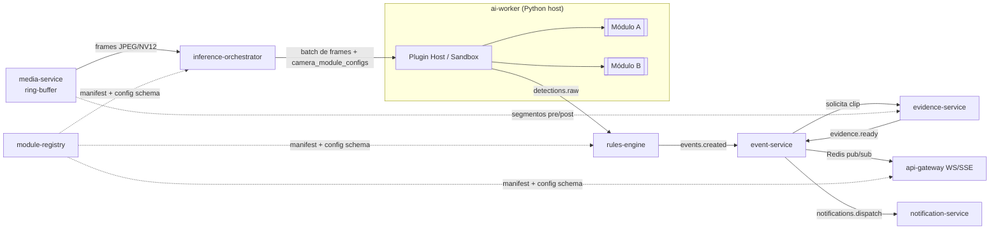
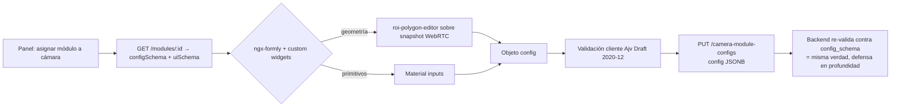
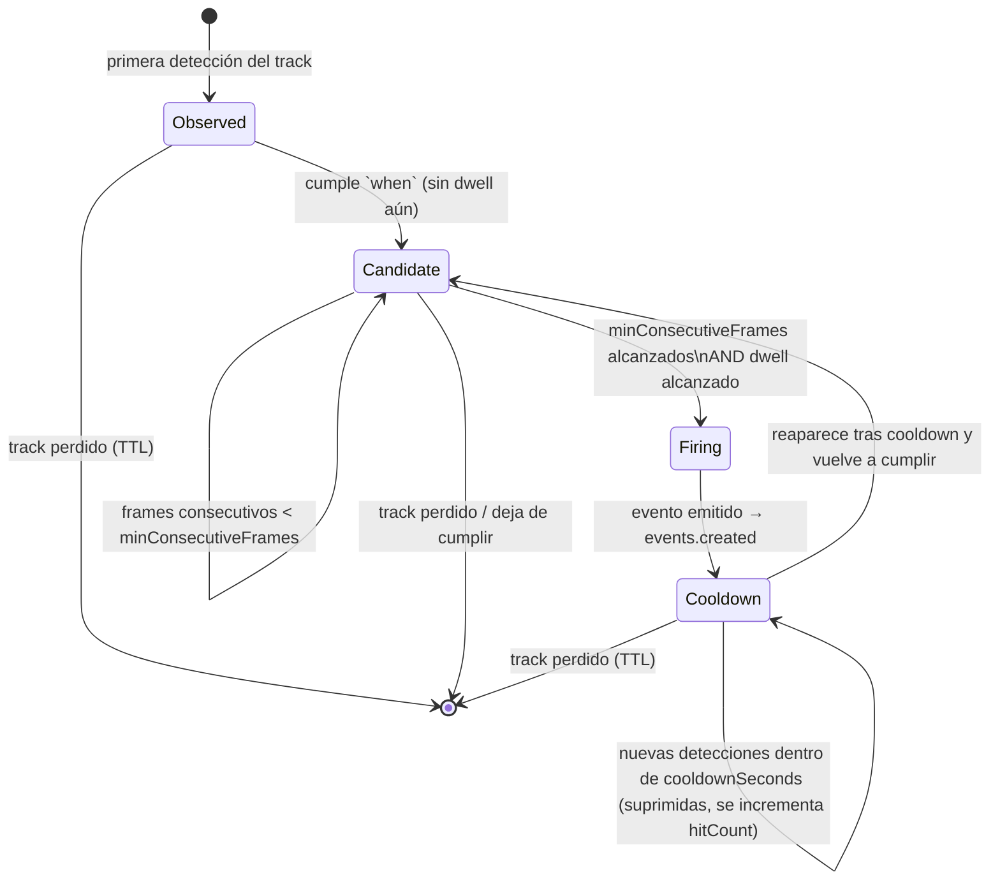
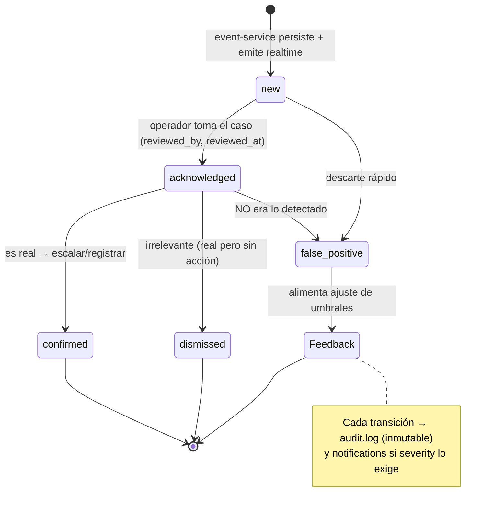

> Parte de la documentación de arquitectura de **Percepta** — Plataforma SaaS de Análisis Inteligente de Video con IA modular. Ver [índice](README.md).
> ⚠️ **Ante cualquier conflicto de contrato (nombres de columna, enums, firmas, esquemas), manda [CONTRACTS.md](CONTRACTS.md)** — este documento describe la arquitectura y el *porqué*; los detalles congelados para implementación viven allí.

## Sistema de Módulos de IA (Plugins), Motor de Reglas, Pipeline de Eventos y Evidencias

> Esta es la pieza central de Percepta: convierte píxeles en **alertas asistivas para operadores humanos**. Todo lo que sigue está diseñado sobre un principio no negociable: el core es estable e ignorante de la lógica de cada módulo; los módulos son **plugins instalables** con un contrato explícito; y **ninguna detección dispara una acción sobre personas** — siempre genera un evento que un humano revisa y confirma.

### 0. Mapa de responsabilidades y frontera de contratos

El sistema se descompone en cinco contratos versionados e independientes. Mantenerlos desacoplados es lo que permite instalar un módulo nuevo "sin tocar el core".

| Contrato | Productor | Consumidor | Formato | Estabilidad |
|---|---|---|---|---|
| **Manifest** (`module.json`) | Autor del módulo | `module-registry`, frontend | JSON validado por meta-schema | SemVer del schema de manifest |
| **Runtime Interface** (`PerceptaModule`) | `ai-worker` (host) | Módulo (plugin) | Python ABC + gRPC contract | SemVer de la API de plugin |
| **Detection** | `ai-worker` | `rules-engine` | Avro/JSON en `detections.raw` | Schema Registry versionado |
| **Config Schema** (JSON Schema del módulo) | Autor del módulo | `rules-engine`, frontend | Draft 2020-12 | Por versión de módulo |
| **Event** | `event-service` | dashboard, `notification-service`, `analytics-service` | JSON camelCase `/api/v1` | SemVer de API pública |



---

### (a) Arquitectura de plugins

#### a.1 Contrato de ejecución: la interfaz `PerceptaModule`

Todo módulo implementa una **Abstract Base Class** en Python. El `ai-worker` es el *host*: gestiona el modelo, GPU, batching y ciclo de vida; el módulo aporta **solo la lógica específica** (pre-proceso, post-proceso, mapeo a detecciones). Esto evita que cada autor reimplemente batching/telemetría y estandariza la telemetría de recursos.

```python
# percepta_sdk/contract.py  — versión de contrato: plugin-api 1.x (SemVer)
from abc import ABC, abstractmethod
from dataclasses import dataclass, field
from typing import Optional
import numpy as np

PLUGIN_API_VERSION = "1.4.0"   # el host rechaza módulos que declaren major distinto

@dataclass(frozen=True)
class Frame:
    camera_id: str
    frame_id: str                # UUID monotónico por cámara
    ts_utc: str                  # ISO-8601 UTC del PTS del frame
    image: np.ndarray            # HxWx3 BGR (el host garantiza el color space)
    width: int
    height: int
    seq: int                     # nº de frame en el stream, para correlación temporal

@dataclass
class BBox:
    x: float; y: float; w: float; h: float   # normalizado 0..1 (resolución-independiente)

@dataclass
class Detection:
    label: str                   # clase del modelo, p.ej. "person", "helmet", "fire"
    confidence: float            # 0..1 crudo del modelo (NUNCA umbralizado por el módulo)
    bbox: Optional[BBox] = None
    track_id: Optional[str] = None            # si el módulo hace tracking (ByteTrack/BoT-SORT)
    keypoints: Optional[list] = None
    attributes: dict = field(default_factory=dict)  # p.ej. {"line_crossing":"in"}

@dataclass
class InferenceResult:
    detections: list[Detection]
    latency_ms: float
    model_meta: dict = field(default_factory=dict)  # versión de pesos, device, batch_size

@dataclass
class ModuleContext:
    """Config resuelta para (camera_id, module) desde camera_module_configs.
    El host la inyecta ya validada contra el JSON Schema del módulo."""
    camera_id: str
    organization_id: str
    config: dict                 # JSONB validado
    rois: list                   # geometrías declaradas por el usuario (zonas/líneas)

class PerceptaModule(ABC):
    api_version: str = PLUGIN_API_VERSION

    @abstractmethod
    def load(self, model_dir: str, device: str) -> None:
        """Carga pesos a GPU/CPU una sola vez por worker. Idempotente."""

    @abstractmethod
    def warmup(self, sample: Frame) -> None:
        """Inferencia dummy para fijar shapes/CUDA graphs."""

    @abstractmethod
    def infer(self, frames: list[Frame], ctx: ModuleContext) -> list[InferenceResult]:
        """Recibe un BATCH (el host decide el tamaño). Devuelve un result por frame.
        REGLA DE ORO: devuelve detecciones CRUDAS con confianza real.
        NO aplica horarios, zonas ni umbrales de negocio — eso es del rules-engine."""

    @abstractmethod
    def health(self) -> dict:
        """{'status':'ok','gpu_mem_mb':...,'fps':...} para inference-orchestrator."""

    def release(self) -> None:
        """Libera VRAM al descargar el módulo (hot-unload)."""
```

**Decisión de diseño / trade-off clave:** la separación *módulo = detección cruda* vs *rules-engine = lógica de negocio* es deliberada.

- **Pro:** un mismo módulo (`intrusion-detector`) sirve a horarios/zonas/umbrales arbitrarios sin recompilar; el operador cambia config en caliente; los umbrales de FP se ajustan sin tocar el modelo.
- **Contra:** el bus `detections.raw` transporta más volumen (todas las detecciones, no solo las que "pasan"). Se mitiga con: (1) un *pre-filtro de confianza mínimo estructural* configurable en el manifest (`min_confidence_floor`, p.ej. 0.25) para no inundar el bus con ruido; (2) batching y compresión; (3) muestreo adaptativo de FPS en `inference-orchestrator`.

#### a.2 Estructura de carpeta de un módulo

```
intrusion-detector/
├── module.json                 # MANIFEST (fuente de verdad para registry + frontend)
├── module.py                   # class IntrusionDetector(PerceptaModule)
├── requirements.txt            # deps extra que el base-image no traiga
├── config.schema.json          # JSON Schema de configuración (referenciado desde manifest)
├── ui.schema.json              # hints de UI para el form-renderer (widgets ROI/línea)
├── models/
│   ├── yolov8m-person.onnx     # pesos (o referencia OCI a un layer de modelo)
│   └── weights.sha256
├── i18n/
│   ├── es.json                 # etiquetas de eventos y campos de config localizados
│   └── en.json
├── tests/
│   ├── golden/                 # frames + detecciones esperadas (contract tests)
│   └── test_contract.py
├── CHANGELOG.md
└── LICENSE
```

`module.py` + `models/` es todo lo que el host carga. `module.json`, `config.schema.json` y `ui.schema.json` es todo lo que `module-registry` y el frontend consumen. Ningún archivo del core cambia.

#### a.3 Manifest `module.json` — ejemplo real y completo

```json
{
  "$schema": "https://percepta.io/schemas/module-manifest/v1.json",
  "id": "com.percepta.intrusion-detector",
  "name": "Detección de Intrusión Perimetral",
  "category": "security.perimeter",
  "version": "2.3.1",
  "pluginApiVersion": "^1.4",
  "vendor": { "name": "Percepta Labs", "signingKeyId": "percepta-labs-2026" },
  "description": "Detecta presencia de personas en zonas restringidas y cruces de línea perimetral con tracking multi-frame.",
  "model": {
    "backend": "onnxruntime",
    "framework": "ultralytics-yolov8",
    "task": "detection+tracking",
    "tracker": "bytetrack",
    "artifacts": [
      { "path": "models/yolov8m-person.onnx", "sha256": "9f3c...a1", "sizeMb": 98 }
    ]
  },
  "inputs": {
    "colorSpace": "BGR",
    "minResolution": { "width": 640, "height": 384 },
    "geometry": {
      "roi":  { "supported": true,  "multiple": true,  "required": false },
      "zone": { "supported": true,  "multiple": true,  "required": true,
                "kind": "polygon", "label": "Zona restringida" },
      "line": { "supported": true,  "multiple": true,  "required": false,
                "kind": "directed", "label": "Línea de cruce (dirección in/out)" }
    }
  },
  "resources": {
    "device": ["cuda", "cpu"],
    "gpuMemMb": 1200,
    "targetFps": 12,
    "maxBatch": 8,
    "cpuCores": 2,
    "minConfidenceFloor": 0.30
  },
  "configSchemaRef": "config.schema.json",
  "uiSchemaRef": "ui.schema.json",
  "eventTypes": [
    {
      "type": "intrusion.zone_breach",
      "severityDefault": "high",
      "label": { "es": "Intrusión en zona restringida", "en": "Zone breach" },
      "emits": ["snapshot", "clip"]
    },
    {
      "type": "intrusion.line_crossing",
      "severityDefault": "medium",
      "label": { "es": "Cruce de línea perimetral", "en": "Line crossing" },
      "emits": ["snapshot"]
    }
  ],
  "compatibility": {
    "minCoreVersion": "1.8.0",
    "requiredCapabilities": ["ring-buffer", "gpu-scheduler"]
  },
  "permissions": ["read:frames", "emit:detections"],
  "license": "commercial",
  "checksum": "sha256:4d2b...e7"
}
```

`config.schema.json` (extracto — es lo que renderiza el formulario y valida `camera_module_configs.config`):

```json
{
  "$schema": "https://json-schema.org/draft/2020-12/schema",
  "type": "object",
  "properties": {
    "confidenceThreshold": {
      "type": "number", "minimum": 0.3, "maximum": 0.99, "default": 0.55,
      "title": "Umbral de confianza"
    },
    "dwellSeconds": {
      "type": "integer", "minimum": 0, "maximum": 300, "default": 3,
      "title": "Permanencia mínima antes de alertar (s)"
    },
    "schedule": {
      "type": "object", "title": "Horario activo",
      "properties": {
        "timezone": { "type": "string", "default": "America/Argentina/Cordoba" },
        "windows": {
          "type": "array",
          "items": {
            "type": "object",
            "properties": {
              "days": { "type": "array", "items": { "enum":
                ["mon","tue","wed","thu","fri","sat","sun"] } },
              "from": { "type": "string", "pattern": "^\\d{2}:\\d{2}$" },
              "to":   { "type": "string", "pattern": "^\\d{2}:\\d{2}$" }
            }, "required": ["days","from","to"]
          }
        }
      }
    },
    "zones": {
      "type": "array", "title": "Zonas restringidas", "minItems": 1,
      "items": { "$ref": "#/$defs/polygon" }
    },
    "authorizedPersons": {
      "type": "array", "title": "Personas autorizadas (allowlist)",
      "items": { "type": "string", "description": "user_id o face_ref opcional" }
    },
    "cooldownSeconds": {
      "type": "integer", "default": 30, "title": "Enfriamiento entre alertas del mismo track"
    }
  },
  "required": ["confidenceThreshold", "zones"],
  "$defs": {
    "polygon": {
      "type": "object",
      "properties": {
        "name": { "type": "string" },
        "points": {
          "type": "array", "minItems": 3,
          "items": { "type": "array", "prefixItems":
            [ {"type":"number","minimum":0,"maximum":1},
              {"type":"number","minimum":0,"maximum":1} ] }
        }
      }, "required": ["points"]
    }
  }
}
```

---

### (b) Descubrimiento, registro automático, versionado y empaquetado

#### b.1 Fuentes de instalación

`module-registry` acepta tres orígenes, unificados tras un mismo pipeline de validación:

| Origen | Cómo se entrega | Uso típico |
|---|---|---|
| **Carpeta / bundle firmado** (`.pmod` = tar+manifest+firma) | Upload desde panel admin o watch-folder en on-premise | Desarrollo, air-gapped |
| **Imagen Docker del worker** con módulos horneados | Referencia a registry OCI (`ghcr.io/...`) | Producción cloud, reproducibilidad total |
| **OCI Artifact** (módulo como artefacto OCI, no imagen) | `oras push` — el módulo se descarga a un volumen y se carga dinámicamente | Marketplace, actualización sin re-desplegar el worker |

#### b.2 Pipeline de validación y publicación

```mermaid
sequenceDiagram
  autonumber
  participant Admin as Admin (panel)
  participant REG as module-registry
  participant VAL as Validador
  participant OCI as OCI/MinIO
  participant DB as PostgreSQL (ai_modules)
  participant ORCH as inference-orchestrator

  Admin->>REG: POST /api/v1/modules (bundle .pmod | ref OCI)
  REG->>VAL: validar manifest + firma + checksums
  VAL->>VAL: 1) manifest vs meta-schema
  VAL->>VAL: 2) verificar firma vendor (cosign/PGP)
  VAL->>VAL: 3) sha256 de artifacts
  VAL->>VAL: 4) config.schema.json compila (Draft 2020-12)
  VAL->>VAL: 5) pluginApiVersion satisfecha por el host
  VAL->>VAL: 6) contract-tests golden (sandbox efímero, sin red)
  alt Válido
    VAL->>OCI: push artifacts (pesos, bundle) — content-addressed
    VAL->>DB: INSERT ai_modules (status='available', version, manifest JSONB)
    REG-->>Admin: 201 {moduleId, version, status:'available'}
    REG->>ORCH: NOTIFY module_published (invalidar caché de capacidades)
  else Inválido
    VAL-->>Admin: 422 {errores: [...]}  (nada se publica; core intacto)
  end
```

**El módulo queda "asignable" sin tocar el core** porque:
1. `module-registry` solo hace `INSERT` en `ai_modules` + publica el manifest/schemas en su API.
2. El frontend descubre el nuevo módulo vía `GET /api/v1/modules?status=available` y renderiza su formulario desde el JSON Schema (sección c) — **cero código de UI por módulo**.
3. `inference-orchestrator` consulta la tabla de capacidades y programa el módulo en workers que satisfagan `resources` (GPU/FPS). Si el módulo llegó como OCI Artifact, el worker lo descarga en caliente vía `load()`; si vino horneado en imagen, ya está presente.

DDL relevante (extiende el modelo compartido `ai_modules`):

```sql
CREATE TABLE ai_modules (
  id             UUID PRIMARY KEY DEFAULT gen_random_uuid(),
  module_key     TEXT NOT NULL,              -- "com.percepta.intrusion-detector"
  version        TEXT NOT NULL,              -- SemVer "2.3.1"
  category       TEXT NOT NULL,
  manifest       JSONB NOT NULL,             -- module.json completo
  config_schema  JSONB NOT NULL,             -- config.schema.json resuelto
  ui_schema      JSONB,
  event_types    JSONB NOT NULL,
  resources      JSONB NOT NULL,
  artifact_ref   TEXT NOT NULL,              -- OCI digest / MinIO path (content-addressed)
  signature      TEXT NOT NULL,
  status         TEXT NOT NULL DEFAULT 'pending'
                 CHECK (status IN ('pending','available','deprecated','revoked')),
  min_core_version TEXT NOT NULL,
  created_at     TIMESTAMPTZ NOT NULL DEFAULT now(),
  UNIQUE (module_key, version)
);
-- Catálogo global (no multi-tenant): los módulos son compartidos; su ASIGNACIÓN sí es por tenant.

CREATE TABLE camera_module_configs (
  id               UUID PRIMARY KEY DEFAULT gen_random_uuid(),
  organization_id  UUID NOT NULL,            -- RLS
  camera_id        UUID NOT NULL REFERENCES cameras(id),
  ai_module_id     UUID NOT NULL REFERENCES ai_modules(id),
  module_version   TEXT NOT NULL,            -- pin explícito (reproducibilidad)
  config           JSONB NOT NULL,           -- validado contra ai_modules.config_schema
  enabled          BOOLEAN NOT NULL DEFAULT true,
  updated_by       UUID NOT NULL,
  updated_at       TIMESTAMPTZ NOT NULL DEFAULT now(),
  UNIQUE (camera_id, ai_module_id)
);
ALTER TABLE camera_module_configs ENABLE ROW LEVEL SECURITY;
CREATE POLICY tenant_isolation ON camera_module_configs
  USING (organization_id = current_setting('app.current_org')::uuid);
```

#### b.3 Versionado y compatibilidad

- **Manifest schema**: SemVer propio (`$schema` versionado). Un major nuevo del meta-schema convive con anteriores (el validador soporta N-1).
- **`pluginApiVersion`**: el módulo declara `^1.4`; el host rechaza en `load()` si su `PLUGIN_API_VERSION` tiene major distinto. Cambios *minor* del host son retro-compatibles.
- **Versión del módulo**: `camera_module_configs.module_version` fija (pin) la versión. Actualizar de `2.3.1` → `2.4.0` es una operación explícita con **migración de config**: si `config.schema.json` cambió, `module-registry` corre un *config migrator* (transform declarativo `2.3.1→2.4.0.jsonata`) y marca las asignaciones que requieran revisión humana. Nunca se auto-migra un *major*.
- **Deprecación/revocación**: `status='deprecated'` bloquea nuevas asignaciones pero mantiene las existentes; `revoked` (p.ej. CVE en pesos) fuerza a `inference-orchestrator` a descargar el módulo y a `event-service` a marcar eventos afectados.

#### b.4 Empaquetado: imagen horneada vs carga dinámica — trade-offs

| Estrategia | Pro | Contra | Cuándo |
|---|---|---|---|
| **Imagen Docker horneada** (worker + módulos) | Reproducibilidad total, arranque rápido, sin red en runtime, ideal air-gapped | Cada módulo nuevo = build+redeploy del worker; imágenes grandes | On-premise crítico, cloud con GitOps |
| **Carga dinámica** (OCI Artifact + `load()` en caliente) | Marketplace real, instalar/actualizar sin redeploy, workers genéricos | Superficie de seguridad mayor (código de terceros), cold-start al descargar pesos, hay que aislar (sandbox) | SaaS multi-tenant con catálogo amplio |

Percepta soporta **ambas** y las combina: imagen base con SDK + runtimes (ONNX/PyTorch) horneados, y módulos de terceros como **OCI Artifacts** cargados dinámicamente dentro de un **sandbox** (proceso separado, sin red salvo gRPC al host, cgroups de GPU/CPU, seccomp). Esto acota el riesgo del `permissions` declarado en el manifest.

---

### (c) Generación del formulario de configuración desde el JSON Schema

El frontend Angular **no tiene código por módulo**. Un componente `<module-config-form>` toma `config_schema` + `ui_schema` de `GET /api/v1/modules/{id}` y renderiza con un *JSON-Schema form renderer* (basado en `@ngx-formly` sobre Angular Material). El `ui.schema.json` mapea propiedades a **widgets custom** cuando el tipo primitivo no basta (geometría sobre un snapshot de la cámara).

```json
// ui.schema.json (extracto)
{
  "confidenceThreshold": { "widget": "mat-slider", "step": 0.01 },
  "schedule":            { "widget": "weekly-schedule-picker" },
  "zones":               { "widget": "roi-polygon-editor",
                           "snapshotSource": "camera",     // pide frame vivo a media-service
                           "geometry": "polygon", "multiple": true },
  "authorizedPersons":   { "widget": "person-allowlist" },
  "cooldownSeconds":     { "widget": "mat-input", "suffix": "s" }
}
```

Flujo de renderizado:



Puntos de diseño:
- **Doble validación** (Ajv en cliente + validación server-side contra el mismo `config_schema`): el cliente da UX inmediata, el server es la autoridad (nunca se confía en el navegador).
- **Widgets geométricos** dibujan sobre un **snapshot en vivo** (obtenido vía `media-service` WebRTC still). Las coordenadas se guardan **normalizadas 0..1** → independientes de resolución/reencuadre.
- **i18n**: labels y descripciones se resuelven de `i18n/es.json`/`en.json` del módulo; el schema solo lleva claves.
- **Defaults + `required`** provienen del schema; el `schedule`/`zones` usan widgets compuestos pero producen JSON conforme al schema, garantizando que `rules-engine` los entienda sin acoplamiento.

---

### (d) Motor de reglas (`rules-engine`)

El `rules-engine` es un servicio con estado (Redis para tracking/cooldown) que consume `detections.raw`, aplica la **config por (cámara, módulo)** y emite `events.created`. Es **stateful pero horizontalmente escalable**: el particionado del bus se hace por `camera_id` (routing key) → todas las detecciones de una cámara caen siempre en la misma instancia (sticky), garantizando coherencia de las máquinas de estado por track sin locks distribuidos.

#### d.1 Estructura de una regla (DSL declarativo)

Una regla es la **config JSONB** ya validada, interpretada por evaluadores compilables. No es Turing-completa a propósito (seguridad, análisis estático, portabilidad UI↔engine). Un *DSL avanzado* opcional permite combinaciones lógicas:

```yaml
# Regla resuelta para (camera=cam_A17, module=intrusion-detector) — vista canónica interna
rule:
  ruleId: "rl_9c2..."
  cameraId: "cam_A17"
  moduleKey: "com.percepta.intrusion-detector"
  emits: "intrusion.zone_breach"
  when:
    all:
      - detection.label: { equals: "person" }
      - detection.confidence: { gte: 0.55 }          # confidenceThreshold
      - geometry.inside:                              # centro-bajo del bbox dentro de zona
          point: "bbox.bottomCenter"
          zone: "zones[*]"
      - track.dwellSeconds: { gte: 3 }                # permanencia mínima
      - time.now: { withinSchedule: "schedule" }      # horario/días + timezone
      - detection.trackId: { notIn: "authorizedPersons" }
  dedup:
    key: ["cameraId", "moduleKey", "track.trackId", "zone.name"]
    cooldownSeconds: 30
  correlation:
    minConsecutiveFrames: 4       # multi-frame: exige N frames que satisfagan `when`
    windowSeconds: 2
  severity: "high"
```

#### d.2 Evaluación: predicados soportados

| Dimensión | Predicado | Fuente de config |
|---|---|---|
| Confianza | `confidence gte/lte` | `confidenceThreshold` |
| Zonas/polígonos | `geometry.inside(point, polygon)` (ray-casting), `overlapRatio gte` | `zones[]` |
| Líneas de conteo | `line.crossed(track.path, line, direction)` | `lines[]` (in/out) |
| Horarios/días | `time.withinSchedule` (respeta `timezone` DST-aware) | `schedule.windows` |
| Permanencia/dwell | `track.dwellSeconds gte` | `dwellSeconds` |
| Permanencia ausente/loitering | `track.dwellSeconds gte` + zona | config |
| Personas autorizadas | `trackId/faceRef notIn allowlist` | `authorizedPersons` |
| Umbral temporal | `event.rateInWindow lte` | `cooldownSeconds` |
| Combinación | `all` / `any` / `not` | DSL |

#### d.3 Máquina de estados por *track*

Cada `track_id` (provisto por el módulo si hace tracking, o sintetizado por IoU-matching en el engine si no) tiene una FSM en Redis con TTL. Esto evita alertas por parpadeo y sostiene `dwell`, `correlation` y `cooldown`.



Estado en Redis (por track):

```
track:{camera_id}:{module}:{track_id} = HASH {
  state, firstSeenTs, lastSeenTs, consecutiveHits, dwellStartTs,
  lastEventTs, hitCount, lastZone
}   TTL = trackGraceSeconds (p.ej. 5s sin verse → expira)
```

#### d.4 Deduplicación, cooldown y correlación multi-frame

- **Dedup key**: `sha1(cameraId|moduleKey|trackId|zone)` → una alerta por sujeto+zona, no una por frame.
- **Cooldown**: tras emitir, se suprimen repeticiones del **mismo track** durante `cooldownSeconds`; se cuenta `hitCount` para reflejar persistencia en el evento (el operador ve "sujeto presente 47 s" en vez de 560 alertas).
- **Correlación multi-frame**: `minConsecutiveFrames` dentro de `windowSeconds` elimina falsos positivos por un frame ruidoso (reflejo, insecto, compresión). Es el principal control de calidad antes de molestar a un humano.
- **Anti-tormenta a nivel cámara**: circuit-breaker — si una cámara supera *X eventos/min* (misconfig, cámara movida), `rules-engine` degrada a modo "agregado" (un evento resumen cada minuto) y emite `audit.log` para revisión.

#### d.5 Pseudocódigo del hot-path de evaluación

```python
def on_detection_batch(det: DetectionRaw, cfg: ResolvedConfig):
    tr = redis.track(det.camera_id, cfg.module_key, det.track_id)
    now = det.ts_utc

    if not passes_static(det, cfg):          # confianza, label, zona, horario, allowlist
        tr.touch(now); return                # actualiza lastSeen; no avanza estado

    tr.consecutiveHits += 1
    tr.dwellStartTs = tr.dwellStartTs or now

    fires = (tr.consecutiveHits >= cfg.correlation.minConsecutiveFrames
             and dwell(now, tr.dwellStartTs) >= cfg.dwellSeconds)

    if not fires:
        tr.state = "candidate"; tr.save(); return

    if tr.state == "cooldown" and (now - tr.lastEventTs) < cfg.cooldownSeconds:
        tr.hitCount += 1; tr.save(); return          # suprimido por cooldown

    event = build_event(det, cfg, tr)                # enriquecimiento (sección e)
    publish("events.created", event)                 # exchange topic
    tr.state = "cooldown"; tr.lastEventTs = now; tr.save()
```

---

### (e) Pipeline de eventos: de `detections.raw` al evento persistido

#### e.1 Enriquecimiento y persistencia

`event-service` consume `events.created`, **enriquece** con contexto de tenant/topología y persiste en `events` (Timescale hypertable por `ts`). Idempotencia por `dedupKey` (misma clave que el rules-engine) con `INSERT ... ON CONFLICT DO NOTHING` para tolerar reintentos del bus (at-least-once).

Enriquecimiento aportado (el rules-engine no conoce topología):
- `organization_id`, `site_id`, `zone_id`, nombre legible de cámara.
- Metadatos de módulo/versión, `severity`, `confidence`.
- Referencia a evidencia (se rellena async cuando llega `evidence.ready`).
- `snapshotUrl` provisional (frame anotado inmediato) para que el dashboard muestre algo en < 1 s.

```sql
CREATE TABLE events (
  id               UUID DEFAULT gen_random_uuid(),
  ts               TIMESTAMPTZ NOT NULL,       -- clave de particionado (hypertable)
  organization_id  UUID NOT NULL,
  site_id          UUID NOT NULL,
  camera_id        UUID NOT NULL,
  zone_id          UUID,
  ai_module_id     UUID NOT NULL,
  module_version   TEXT NOT NULL,
  event_type       TEXT NOT NULL,              -- "intrusion.zone_breach"
  confidence       REAL NOT NULL,              -- score del modelo (visible al operador)
  severity         TEXT NOT NULL,
  status           TEXT NOT NULL DEFAULT 'new'
                   CHECK (status IN ('new','acknowledged','confirmed','dismissed','false_positive')),
  dedup_key        TEXT NOT NULL,
  hit_count        INT NOT NULL DEFAULT 1,
  track_id         TEXT,
  payload          JSONB NOT NULL,             -- bboxes, zona, línea, atributos
  evidence_id      UUID,                       -- FK diferida a evidences
  reviewed_by      UUID,
  reviewed_at      TIMESTAMPTZ,
  review_note      TEXT,
  PRIMARY KEY (id, ts),
  UNIQUE (dedup_key, ts)
);
SELECT create_hypertable('events','ts', chunk_time_interval => INTERVAL '1 day');
ALTER TABLE events ENABLE ROW LEVEL SECURITY;
CREATE POLICY tenant_isolation ON events
  USING (organization_id = current_setting('app.current_org')::uuid);
```

#### e.2 Ciclo de vida del evento (workflow de revisión humana)



Cada transición: (1) valida RBAC (`events:review`), (2) escribe `audit.log` inmutable vía `audit-service`, (3) re-emite estado por Redis pub/sub → dashboard, (4) opcionalmente `notifications.dispatch` (p.ej. `confirmed` de severidad alta escala a supervisor).

#### e.3 Reprocesamiento

Como los frames residen en el ring-buffer/clip y las detecciones crudas se retienen (ventana corta), se soporta **replay**:
- **Re-evaluación de reglas** sin re-inferencia: al cambiar config (bajar umbral, ampliar zona), `rules-engine` puede reprocesar `detections.raw` retenidas de las últimas N horas → útil para "por qué no me alertó".
- **Re-inferencia** (actualización de modelo): `inference-orchestrator` reencola clips de evidencia contra la nueva versión del módulo en un pool *offline* (baja prioridad, no compite con tiempo real) — base para benchmarking A/B de versiones de módulo.

#### e.4 Feedback de falsos positivos → umbrales

Cada `false_positive` es señal de entrenamiento **de la configuración**, no del modelo (el modelo se reentrena offline aparte). `analytics-service` agrega FP por (cámara, módulo, zona, franja horaria, rango de confianza):

- Sugiere ajustes: *"el 82% de FP en cam_A17 tienen confianza 0.55–0.62 → subir `confidenceThreshold` a 0.63 reduciría FP 78% con −4% recall estimado"*.
- El operador **acepta o rechaza** la sugerencia (human-in-the-loop también en el tuning). Percepta **nunca** auto-modifica umbrales sin confirmación humana.
- Los FP confirmados y sus clips se etiquetan y exportan (con consentimiento del tenant) al pipeline de reentrenamiento offline de los modelos — cerrando el ciclo de mejora sin acoplarlo al tiempo real.

#### e.5 Payload de evento (contrato de API pública, camelCase)

```json
{
  "id": "ev_01J8Z9K3M7QF2ABCD",
  "ts": "2026-07-30T03:14:52.481Z",
  "organizationId": "org_7f21",
  "siteId": "site_bodega_norte",
  "cameraId": "cam_A17",
  "cameraName": "Portón perímetro NE",
  "zoneId": "zone_restringida_1",
  "aiModuleId": "mod_intrusion",
  "moduleKey": "com.percepta.intrusion-detector",
  "moduleVersion": "2.3.1",
  "eventType": "intrusion.zone_breach",
  "severity": "high",
  "confidence": 0.83,
  "status": "new",
  "isAlert": true,
  "requiresHumanReview": true,
  "hitCount": 12,
  "trackId": "trk_5590",
  "detection": {
    "label": "person",
    "bbox": { "x": 0.41, "y": 0.62, "w": 0.09, "h": 0.22 },
    "zoneName": "Zona restringida 1",
    "dwellSeconds": 4.2
  },
  "evidence": {
    "evidenceId": "evd_88af",
    "status": "pending",
    "snapshotUrl": "https://s3.percepta.io/...snapshot.jpg?X-Amz-Signature=...",
    "clipUrl": null
  },
  "review": { "reviewedBy": null, "reviewedAt": null, "note": null },
  "audit": { "createdBy": "rules-engine", "correlationId": "corr_...f0" },
  "createdAt": "2026-07-30T03:14:52.500Z"
}
```

Nótese `isAlert: true` y `requiresHumanReview: true` como **campos explícitos del contrato**: ningún consumidor puede confundir un evento con una decisión automática.

---

### (f) Evidencias (`evidence-service`)

#### f.1 Orquestación y ensamblado del clip

`media-service` mantiene un **ring-buffer** por stream (segmentos HLS/fMP4 de ~2 s en memoria/NVMe, ventana configurable ≥ 20 s). Cuando `event-service` referencia un evento, publica una solicitud; `evidence-service` orquesta el ensamblado **pre/post-roll** (10 s antes / evento / 10 s después):

```mermaid
sequenceDiagram
  autonumber
  participant EV as event-service
  participant EVID as evidence-service
  participant MEDIA as media-service (ring-buffer)
  participant FF as FFmpeg
  participant S3 as MinIO / S3
  participant BUS as RabbitMQ

  EV->>BUS: events.created
  EVID->>MEDIA: getSegments(cameraId, [t-10s, t_event+10s])
  Note over EVID,MEDIA: post-roll: espera hasta t_event+10s<br/>(latch en ring-buffer; timeout si stream cae)
  MEDIA-->>EVID: segmentos fMP4 (pre + evento + post)
  EVID->>FF: concat + remux → clip.mp4 (sin recodificar si códecs compatibles)
  EVID->>EVID: render snapshot anotado (bbox, zona, confidence, ts) sobre keyframe
  EVID->>S3: PUT clip.mp4 + snapshot.jpg (path multi-tenant + metadatos)
  EVID->>BUS: evidence.ready {evidenceId, keys}
  EV->>EV: UPDATE events SET evidence_id, payload.evidence.status='ready'
  EV->>EV: Redis pub/sub → dashboard actualiza clipUrl
```

Decisiones:
- **Remux sin recodificar** cuando el códec de cámara (H.264/H.265) es compatible → clip en milisegundos, sin coste GPU. Recodifica solo si el operador pide un formato universal.
- **Post-roll con latch**: el ring-buffer "engancha" el instante del evento y sigue capturando 10 s; si el stream cae, se ensambla lo disponible y se marca `truncated: true`.
- **Idempotencia**: `evidence_id` derivado del `dedup_key` del evento → una evidencia por evento aunque el bus reintente.
- **Imagen anotada**: keyframe más cercano al `t_event`, con overlay de bbox/zona/línea, `confidence` y timestamp UTC quemado (cadena de custodia).

#### f.2 Almacenamiento, metadatos y enlaces firmados

Layout content-addressed y multi-tenant en MinIO/S3:

```
s3://percepta-evidence/
  {organization_id}/{site_id}/{camera_id}/{yyyy}/{mm}/{dd}/
    {evidence_id}/
      clip.mp4
      snapshot.jpg
      meta.json
```

```sql
CREATE TABLE evidences (
  id               UUID PRIMARY KEY DEFAULT gen_random_uuid(),
  organization_id  UUID NOT NULL,
  event_id         UUID NOT NULL,
  camera_id        UUID NOT NULL,
  clip_key         TEXT,           -- path S3
  snapshot_key     TEXT NOT NULL,
  duration_ms      INT,
  pre_roll_ms      INT DEFAULT 10000,
  post_roll_ms     INT DEFAULT 10000,
  truncated        BOOLEAN DEFAULT false,
  bytes            BIGINT,
  checksum_sha256  TEXT,
  metadata         JSONB NOT NULL, -- empresa, sucursal, cámara, módulo, confianza, ts, bboxes
  retention_until  TIMESTAMPTZ,    -- política por plan/tenant (billing)
  created_at       TIMESTAMPTZ NOT NULL DEFAULT now()
);
ALTER TABLE evidences ENABLE ROW LEVEL SECURITY;
CREATE POLICY tenant_isolation ON evidences
  USING (organization_id = current_setting('app.current_org')::uuid);
```

- **Enlaces firmados**: nunca se sirve el objeto directo. `evidence-service` genera **URLs presignadas** (S3 SigV4) de vida corta (p.ej. 5 min), solo tras verificar RBAC (`evidence:read`) y pertenencia al tenant. El `api-gateway` proxya la emisión, jamás el navegador pide credenciales a S3.
- **Metadatos = cadena de custodia**: `meta.json` embebe empresa/sucursal/cámara/módulo/versión/confianza/timestamp/checksum → evidencia auditable y exportable.
- **Retención y privacidad por diseño**: `retention_until` por plan (billing-service). Purga automática vencido el plazo. Soporte de **blurring/redacción** opcional de rostros/matrículas en el clip para minimización de datos, y cifrado en reposo (SSE-KMS).

---

### (g) Marco Human-in-the-Loop (garantía transversal)

Este marco no es una funcionalidad, es una **propiedad invariante** verificable del sistema:

1. **No hay actuadores.** Percepta no expone ninguna acción física ni decisión sobre personas. Un módulo solo puede `emit:detections`; nunca abrir puertas, bloquear accesos ni denegar servicios. Cualquier integración de actuación es un **webhook saliente** que el humano configura y que dispara **solo tras confirmación**, jamás automáticamente desde una detección.
2. **Toda detección es una alerta con confianza.** El `confidence` viaja del modelo (crudo) al operador sin ocultarse. El contrato de evento marca `isAlert` y `requiresHumanReview`.
3. **El workflow obliga revisión.** Un evento nace `new` y **requiere** una transición humana (`acknowledged` → `confirmed/dismissed/false_positive`) por un usuario con permiso `events:review`. Ninguna transición la ejecuta un servicio automáticamente.
4. **Auditoría inmutable.** Cada decisión humana queda en `audit-service` (append-only, hash-chain), respondiendo *quién* confirmó *qué* y *cuándo*.
5. **El tuning también es humano.** Los ajustes de umbral sugeridos por el feedback de FP requieren aceptación explícita; el sistema propone, el humano dispone.
6. **Privacidad por diseño.** RLS por `organization_id`, credenciales de cámara en vault, enlaces firmados efímeros, retención acotada, redacción opcional. El catálogo de módulos es compartido; los datos, estrictamente aislados por tenant.

**Sesgo de diseño explícito:** ante ambigüedad, Percepta prefiere *molestar de más al operador* (recall alto, con dedup/cooldown para no saturar) antes que *decidir de menos por el humano*. La automatización acelera la **percepción**; la **decisión** sobre personas es siempre humana.

---

### Anexo: registro de un módulo nuevo (visión extremo a extremo)

```mermaid
flowchart TD
  A[Autor publica bundle/OCI del módulo] --> B[module-registry: validación<br/>manifest+firma+checksums+contract-tests]
  B -->|OK| C[INSERT ai_modules status=available<br/>+ artifacts a MinIO/OCI]
  B -->|Falla| Z[422 — core intacto, nada publicado]
  C --> D[Frontend descubre módulo<br/>GET /modules?status=available]
  D --> E[Operador asigna módulo a cámara<br/>form auto-generado desde JSON Schema]
  E --> F[PUT camera-module-configs<br/>config validada server-side]
  F --> G[inference-orchestrator programa módulo<br/>en worker con GPU/FPS compatibles]
  G --> H[ai-worker.load() en sandbox<br/>+ warmup]
  H --> I[Pipeline activo: detections.raw → rules-engine → event-service]
  I --> J[Dashboard recibe alertas en tiempo real<br/>para revisión humana]
```

Ningún paso de este flujo modifica código del core: el módulo entra por datos (manifest + schemas + artifacts) y el sistema lo integra por descubrimiento. Ese es el corazón de la extensibilidad de Percepta.

---

⬅ [Anterior](04-pipeline-de-video-e-ia.md) · [Índice](README.md) · [Siguiente ➡](06-catalogo-de-modulos-ia.md)
