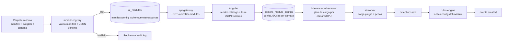
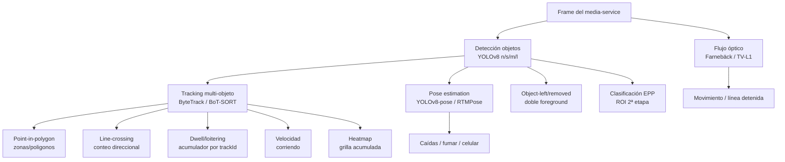
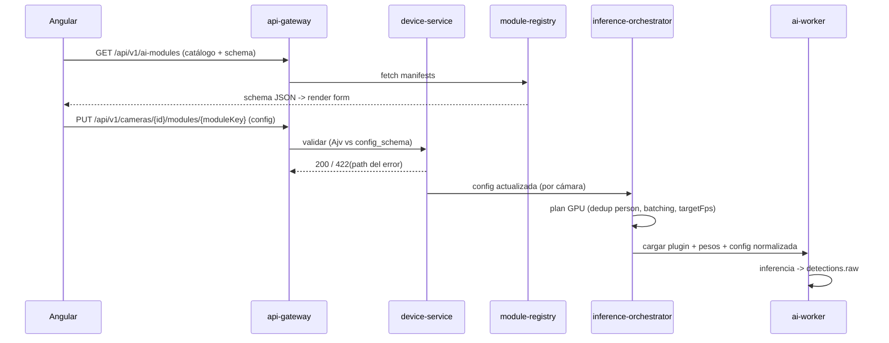

> Parte de la documentación de arquitectura de **Percepta** — Plataforma SaaS de Análisis Inteligente de Video con IA modular. Ver [índice](README.md).
> ⚠️ **Ante cualquier conflicto de contrato (nombres de columna, enums, firmas, esquemas), manda [CONTRACTS.md](CONTRACTS.md)** — este documento describe la arquitectura y el *porqué*; los detalles congelados para implementación viven allí.

## Catálogo de Módulos de IA y su Configuración

Esta sección concreta el catálogo completo de **módulos-plugin** que `module-registry` publica, cómo se declaran (manifest `module.json`), cómo se configuran por cámara (`camera_module_configs.config` JSONB validado contra el JSON Schema del módulo), qué técnicas de visión por computadora los sustentan y qué eventos emiten hacia `rules-engine` → `event-service`. Cada módulo es un **plugin instalable sin tocar el core**; el `ai-worker` lo carga por manifest y el frontend Angular renderiza su formulario de configuración a partir del JSON Schema.

> **Marco no negociable (HUMAN-IN-THE-LOOP + privacidad por diseño).** Todo módulo produce **alertas de asistencia** con un `confidence` del modelo, nunca decisiones automáticas sobre personas. Ningún módulo del catálogo base infiere intención, emoción, culpabilidad ni identidad. Los módulos describen **estados físicos y espaciales observables** (posición en una zona, presencia de un objeto de EPP, cruce de una línea, permanencia temporal), no comportamientos ni motivaciones. Cualquier evento entra al workflow `nuevo → reconocido → confirmado / descartado / falso-positivo` de `event-service` y exige revisión humana.

---

### 1. Modelo del catálogo: taxonomía, identidad y ciclo de vida

#### 1.1 Convenciones de identidad (consistentes con las decisiones compartidas)

| Concepto | Convención | Ejemplo |
|---|---|---|
| `moduleKey` (id de manifest) | `{categorySlug}.{moduleSlug}` en kebab-case | `security.restricted-zone` |
| Categoría (enum cerrado) | `security` \| `hr` \| `productivity` \| `logistics` \| `retail` \| `industry` | `hr` |
| `eventType` | `{moduleKey}.{eventSlug}` (dot-notation) | `security.restricted-zone.intrusion` |
| Versión del módulo | SemVer | `2.3.0` |
| Backend de modelo | `yolo` \| `yolo-pose` \| `yolo-seg` \| `anpr` \| `custom-cnn` \| `optical-flow` \| `heuristic` | `yolo` |

El `moduleKey` es único global en el catálogo; su fila en `ai_modules` (tabla del modelo núcleo) lleva `organization_id = NULL` para módulos del catálogo global y `organization_id` poblado para módulos privados de un tenant (marketplace privado on-prem). RLS filtra: un tenant ve los globales **más** los suyos.

#### 1.2 Anatomía del manifest `module.json`

El manifest es la **única fuente de verdad** que `module-registry` auto-descubre. Declara requisitos de entrada (ROI/zonas/líneas), esquema de configuración, eventos y recursos. Ejemplo canónico (módulo `security.restricted-zone`):

```json
{
  "moduleKey": "security.restricted-zone",
  "name": "Zona restringida",
  "category": "security",
  "version": "2.3.0",
  "description": "Alerta de asistencia cuando se detecta una persona dentro de un polígono restringido en franjas horarias configuradas.",
  "vendor": "percepta-core",
  "modelBackend": "yolo",
  "models": [
    { "name": "yolov8m", "task": "detect", "classes": ["person"], "framework": "pytorch", "weights": "yolov8m.pt" }
  ],
  "input": {
    "requiresZones": true,
    "requiresLines": false,
    "minZones": 1,
    "roiType": "polygon",
    "trackingRequired": true
  },
  "resources": {
    "device": "gpu",
    "vramMb": 1400,
    "targetFps": 12,
    "minFps": 5,
    "cpuFallback": true,
    "batchable": true
  },
  "emits": [
    { "eventType": "security.restricted-zone.intrusion", "defaultSeverity": "high" },
    { "eventType": "security.restricted-zone.dwell-exceeded", "defaultSeverity": "medium" }
  ],
  "configSchemaRef": "schemas/restricted-zone.schema.json",
  "humanInLoop": { "requiresReview": true, "autoAction": false },
  "privacy": { "storesBiometrics": false, "identifiesIndividuals": false, "blurByDefault": true }
}
```

`module-registry` persiste el manifest y el JSON Schema en `ai_modules.manifest` y `ai_modules.config_schema` (columnas JSONB). El `api-gateway` los expone en `GET /api/v1/ai-modules` para que Angular renderice el catálogo y, por módulo, el formulario dinámico.

#### 1.3 Descubrimiento y ciclo de vida



**Trade-off (auto-descubrimiento por manifest vs. registro imperativo):** el manifest declarativo permite instalar módulos sin desplegar el core, a costa de una validación estricta en `module-registry` (JSON Schema meta-validado con Ajv, verificación de firma del paquete y de compatibilidad de `resources.device` con el pool disponible). Se prefiere lo declarativo por el principio (1) del brief.

#### 1.4 Bloques de configuración reutilizables (`$defs` compartidos)

Para evitar divergencias entre módulos y habilitar un renderizador de formularios único en Angular, **todos** los schemas de config referencian un catálogo común de `$defs` (`schemas/_common.schema.json`). Esta composición es la decisión arquitectónica central de la configuración.

```json
{
  "$id": "percepta://schemas/_common.schema.json",
  "$defs": {
    "point": {
      "type": "array", "items": { "type": "number", "minimum": 0, "maximum": 1 },
      "minItems": 2, "maxItems": 2,
      "description": "Coordenada normalizada [x,y] relativa al frame (0..1) para independencia de resolución."
    },
    "polygon": {
      "type": "object",
      "required": ["id", "points"],
      "properties": {
        "id": { "type": "string", "format": "uuid" },
        "label": { "type": "string" },
        "points": { "type": "array", "minItems": 3, "items": { "$ref": "#/$defs/point" } }
      }
    },
    "line": {
      "type": "object",
      "required": ["id", "from", "to"],
      "properties": {
        "id": { "type": "string", "format": "uuid" },
        "label": { "type": "string" },
        "from": { "$ref": "#/$defs/point" },
        "to": { "$ref": "#/$defs/point" },
        "direction": { "enum": ["a_to_b", "b_to_a", "both"], "default": "both" }
      }
    },
    "schedule": {
      "type": "object",
      "description": "Ventanas activas. Fuera de ellas el módulo no genera eventos.",
      "properties": {
        "timezone": { "type": "string", "default": "UTC" },
        "days": { "type": "array", "items": { "enum": ["mon","tue","wed","thu","fri","sat","sun"] } },
        "windows": {
          "type": "array",
          "items": {
            "type": "object",
            "required": ["start", "end"],
            "properties": {
              "start": { "type": "string", "pattern": "^([01]\\d|2[0-3]):[0-5]\\d$" },
              "end":   { "type": "string", "pattern": "^([01]\\d|2[0-3]):[0-5]\\d$" }
            }
          }
        }
      }
    },
    "confidence": {
      "type": "number", "minimum": 0, "maximum": 1, "default": 0.5,
      "description": "Umbral mínimo de confianza del modelo para considerar la detección."
    },
    "cooldown": {
      "type": "object",
      "description": "Deduplicación/anti-spam evaluada en rules-engine (estado en Redis).",
      "properties": {
        "seconds": { "type": "integer", "minimum": 0, "default": 60 },
        "perTrackId": { "type": "boolean", "default": true }
      }
    },
    "privacyMask": {
      "type": "object",
      "properties": {
        "blurPersons": { "type": "boolean", "default": true },
        "excludeZones": { "type": "array", "items": { "$ref": "#/$defs/polygon" } }
      }
    }
  }
}
```

**Justificación de coordenadas normalizadas [0..1]:** desacopla la config de la resolución del stream; una misma zona sobrevive a cambios de perfil de `media-service` (720p ↔ 1080p) sin reeditar. El `ai-worker` desnormaliza contra el tamaño del frame recibido.

---

### 2. Catálogo por categorías

Notación de columnas: **Módulo** (`moduleKey`) · **Qué detecta (asistencia)** · **Técnica CV/IA** · **Modelo(s) sugerido(s)** · **Parámetros de config clave** · **Tipo(s) de evento** (`eventType`).

#### 2.1 Seguridad (`security`)

| Módulo | Qué detecta (asistencia) | Técnica CV/IA | Modelo(s) | Parámetros clave | Eventos |
|---|---|---|---|---|---|
| `security.intrusion` | Persona presente en escena/perímetro donde no debería haber presencia | Detección `person` + tracking; confirmación por N frames | YOLOv8m/l, ByteTrack | `zones`, `confidence`, `minFramesConfirm`, `schedule` | `security.intrusion.detected` |
| `security.restricted-zone` | Persona dentro de polígono restringido | Point-in-polygon del pie del bbox + tracking | YOLOv8m, ByteTrack | `zones`, `authorizedRoles`, `dwellSeconds`, `sensitivity`, `schedule` | `security.restricted-zone.intrusion`, `.dwell-exceeded` |
| `security.loitering` | Permanencia prolongada de una persona en un área (merodeo) | Tracking + acumulación de dwell time por `trackId` en zona | YOLOv8m, BoT-SORT | `zones`, `minDwellSeconds`, `maxCentroidDrift`, `minPersons` | `security.loitering.detected` |
| `security.excessive-stay` | Permanencia excesiva de una persona/objeto en punto sensible | Tracking + temporizador por `trackId` | YOLOv8m, ByteTrack | `zones`, `maxStaySeconds`, `targetClass` | `security.excessive-stay.exceeded` |
| `security.abandoned-object` | Objeto estático dejado sin persona asociada | Doble foreground (corto/largo plazo) o static-object tracking; asociación persona-objeto | YOLOv8m + MOG2/temporal | `zones`, `staticSeconds`, `minObjectArea`, `ownerAbsenceSeconds` | `security.abandoned-object.detected` |
| `security.removed-object` | Objeto de referencia retirado de su lugar | Diferencia contra plantilla de referencia (ROI de anclaje) + verificación temporal | YOLOv8m + template/anchor | `anchorZones`, `absenceSeconds`, `refConfidence` | `security.removed-object.detected` |
| `security.running` | Desplazamiento a velocidad anómalamente alta (correr) | Velocidad de centroides del tracking (px/s normalizada) + flujo óptico de respaldo | YOLOv8m, ByteTrack, Farnebäck | `zones`, `speedThresholdNormPerSec`, `minTrackFrames` | `security.running.detected` |
| `security.crowd-congestion` | Aglomeración: densidad de personas por zona sobre umbral | Conteo/densidad en zona (detección + density map) | YOLOv8m, CSRNet (opc. alta densidad) | `zones`, `maxCount`, `maxDensityPerM2`, `holdSeconds` | `security.crowd-congestion.threshold-exceeded` |
| `security.smoke` | Presencia de humo | Detección fine-tuned humo + textura/temporal (crecimiento de región) | YOLOv8 fine-tuned humo | `zones`, `confidence`, `minGrowthRate`, `holdSeconds` | `security.smoke.detected` |
| `security.fire` | Presencia de fuego/llama | Detección fine-tuned fuego + verificación color/flicker temporal | YOLOv8 fine-tuned fuego | `zones`, `confidence`, `flickerConfirm`, `holdSeconds` | `security.fire.detected` |
| `security.fall` | Persona en el suelo (caída), como asistencia médica/seguridad | Pose estimation (relación torso/altura, orientación) + persistencia temporal | YOLOv8-pose, RTMPose | `zones`, `aspectRatioThreshold`, `groundSeconds`, `confidence` | `security.fall.detected` |
| `security.unauthorized-vehicle` | Vehículo cuya patente no está en lista permitida en zona/horario | Detección vehículo + ANPR (OCR de matrícula) + verificación en lista | YOLOv8 (vehicle) + ANPR (LPRNet/PaddleOCR) | `zones`, `allowedPlates`, `schedule`, `plateConfidence` | `security.unauthorized-vehicle.detected` |
| `security.door-opening` | Apertura de puerta (estado abierto/cerrado del vano) | ROI de puerta + clasificación estado abierto/cerrado o diff temporal | YOLOv8-cls / diff ROI | `doorZones`, `openStateThreshold`, `schedule`, `debounceSeconds` | `security.door-opening.opened`, `.closed` |
| `security.after-hours-motion` | Movimiento significativo fuera de horario operativo | Detección movimiento (flujo óptico/fondo) + `person`/`vehicle`, gating por `schedule` | MOG2 + YOLOv8n | `zones`, `schedule`, `minMotionArea`, `targetClasses` | `security.after-hours-motion.detected` |
| `security.unusual-motion-pattern` | **Anomalía estadística de movimiento** en la escena (no intención) | Baseline de flujo óptico/densidad de trayectorias + z-score sobre patrón histórico | Optical-flow + modelo estadístico | `zones`, `sensitivity`, `learningWindowDays`, `minAnomalyScore` | `security.unusual-motion-pattern.anomaly` |

> **Nota sobre `security.unusual-motion-pattern`:** se modela explícitamente como **desviación estadística de patrones de movimiento agregados** frente a un baseline aprendido por cámara/zona; **no** clasifica actividades humanas ni infiere intención. El evento es de baja severidad por defecto (`low`) y su único propósito es dirigir la atención de un operador. Requiere ventana de aprendizaje (`learningWindowDays`) antes de emitir.

#### 2.2 Recursos Humanos (`hr`)

Framing estricto: presencia/ocupación de **puestos y zonas**, no vigilancia individual. Enmascarado de rostros activo por defecto (`privacyMask.blurPersons=true`).

| Módulo | Qué detecta (asistencia) | Técnica CV/IA | Modelo(s) | Parámetros clave | Eventos |
|---|---|---|---|---|---|
| `hr.presence` | Presencia de al menos una persona en una zona de puesto | Detección `person` en zona + persistencia | YOLOv8s/m | `zones`, `minPersons`, `confirmSeconds`, `schedule` | `hr.presence.present`, `.absent` |
| `hr.absence` | Ausencia de persona en zona esperada durante turno | Igual que presence, negado + `schedule` | YOLOv8s | `zones`, `maxAbsenceSeconds`, `schedule` | `hr.absence.detected` |
| `hr.dwell` | Permanencia (tiempo) en zona de trabajo | Tracking + acumulación de dwell por zona | YOLOv8m, ByteTrack | `zones`, `dwellBucketsSeconds`, `schedule` | `hr.dwell.sample` (a analytics) |
| `hr.flow` | Flujo de personas entre zonas (transiciones) | Multi-zona + tracking + matriz origen-destino | YOLOv8m, BoT-SORT | `zones`, `transitionsOfInterest` | `hr.flow.transition` |
| `hr.count` | Conteo de personas por zona/línea | Detección + line-crossing o conteo en zona | YOLOv8m, ByteTrack | `lines`/`zones`, `direction`, `schedule` | `hr.count.sample` |
| `hr.schedule-adherence` | Cobertura de puesto respecto a franjas horarias | `hr.presence` gated por `schedule` + agregación | YOLOv8s | `zones`, `schedule`, `graceSeconds` | `hr.schedule-adherence.uncovered` |
| `hr.ppe-helmet` | Persona **sin casco** en sector que lo exige | Detección persona + clasificación EPP casco (2 etapas) | YOLOv8 (person) + PPE-cls / YOLOv8-PPE | `zones`, `shifts`, `schedule`, `confidence`, `graceSeconds` | `hr.ppe-helmet.missing` |
| `hr.ppe-vest` | Persona sin chaleco reflectante | Detección multiclase EPP | YOLOv8-PPE fine-tuned | `zones`, `confidence`, `schedule` | `hr.ppe-vest.missing` |
| `hr.ppe-gloves` | Manos sin guantes en zona que lo requiere | Pose (muñecas) + clasificación de ROI de mano | YOLOv8-pose + cls | `zones`, `confidence`, `handRoiPadding` | `hr.ppe-gloves.missing` |
| `hr.ppe-glasses` | Rostro sin lentes de seguridad | Detección rostro/ROI cabeza + clasificación | YOLOv8 (head) + cls | `zones`, `confidence` | `hr.ppe-glasses.missing` |
| `hr.ppe-mask` | Rostro sin barbijo/mascarilla | Detección ROI facial + clasificación mask/no-mask | YOLOv8 + cls | `zones`, `confidence` | `hr.ppe-mask.missing` |
| `hr.phone-in-restricted` | Uso de teléfono en zona donde está prohibido | Detección objeto `cell phone` + pose (mano-oreja) + zona | YOLOv8 + pose | `zones`, `schedule`, `confidence`, `holdSeconds` | `hr.phone-in-restricted.detected` |
| `hr.smoking` | Acto de fumar (cigarrillo/vapor) en zona prohibida | Detección objeto cigarrillo + gesto mano-boca (pose) + humo local | YOLOv8 fine-tuned + pose | `zones`, `confidence`, `holdSeconds` | `hr.smoking.detected` |
| `hr.inactivity` | Zona de puesto sin movimiento significativo por tiempo | Persona presente + ausencia de flujo óptico local | YOLOv8s + optical-flow | `zones`, `maxInactivitySeconds`, `motionThreshold` | `hr.inactivity.detected` |

> **EPP — decisión de dos etapas.** Para casco/chaleco/lentes/barbijo se prefiere **detección de persona + clasificación de ROI** frente a un único detector multiclase, por dos razones: (a) permite reusar un solo modelo de `person` compartido entre módulos (ahorro de VRAM en el `ai-worker`) y encadenar clasificadores livianos por EPP; (b) reduce falsos negativos por oclusión al acotar el ROI (cabeza para casco/lentes, torso para chaleco, muñecas para guantes vía pose). Trade-off: mayor latencia por el segundo pase; se mitiga con batching del clasificador en `inference-orchestrator`.

#### 2.3 Productividad (`productivity`)

| Módulo | Qué detecta (asistencia) | Técnica CV/IA | Modelo(s) | Parámetros clave | Eventos |
|---|---|---|---|---|---|
| `productivity.workflow-stage` | Presencia/tránsito en etapas de un flujo (secuencia de zonas) | Multi-zona + tracking + máquina de estados de secuencia | YOLOv8m, BoT-SORT | `stageZones[]`, `expectedOrder`, `schedule` | `productivity.workflow-stage.entered`, `.out-of-order` |
| `productivity.occupancy` | Nivel de ocupación de un área (personas/objetos) | Conteo en zona + normalización por capacidad | YOLOv8m | `zones`, `capacity`, `warnRatio`, `sampleSeconds` | `productivity.occupancy.sample`, `.threshold-exceeded` |
| `productivity.bottleneck` | Acumulación/estancamiento en un punto del flujo | Densidad en zona + velocidad media de trayectorias baja | YOLOv8m + tracking | `zones`, `minCount`, `maxThroughput`, `holdSeconds` | `productivity.bottleneck.detected` |
| `productivity.people-working` | Presencia de personas en puestos productivos (conteo) | Detección `person` en zonas de puesto | YOLOv8s/m | `workstationZones`, `schedule` | `productivity.people-working.sample` |
| `productivity.wait-time` | Tiempo de espera en zona/fila | Tracking + dwell por `trackId` hasta salida | YOLOv8m, ByteTrack | `zones`/`lines`, `entryLine`, `exitLine` | `productivity.wait-time.sample`, `.exceeded` |
| `productivity.material-movement` | Movimiento de materiales/objetos entre zonas | Detección objeto + tracking + cruce de zonas | YOLOv8m + tracking | `objectClasses`, `zones`, `lines` | `productivity.material-movement.transition` |
| `productivity.equipment-utilization` | Equipo en uso vs. inactivo (proxy visual) | ROI de equipo + movimiento local / operador presente | YOLOv8 + optical-flow | `equipmentZones`, `motionThreshold`, `operatorZone` | `productivity.equipment-utilization.sample` |
| `productivity.idle-zone` | Zona sin actividad durante ventana operativa | Ausencia de detecciones/movimiento en zona + `schedule` | YOLOv8n + optical-flow | `zones`, `schedule`, `maxIdleSeconds` | `productivity.idle-zone.detected` |

#### 2.4 Logística (`logistics`)

| Módulo | Qué detecta (asistencia) | Técnica CV/IA | Modelo(s) | Parámetros clave | Eventos |
|---|---|---|---|---|---|
| `logistics.pallet-count` | Conteo de pallets en zona/estiba | Detección `pallet` en zona (o cruce de línea en montacargas) | YOLOv8m fine-tuned | `zones`, `lines`, `direction` | `logistics.pallet-count.sample` |
| `logistics.box-count` | Conteo de cajas/bultos | Detección `box` + tracking anti-doble-conteo | YOLOv8m fine-tuned, ByteTrack | `lines`, `direction`, `confidence` | `logistics.box-count.sample` |
| `logistics.truck-count` | Conteo de camiones (entrada/salida) | Detección `truck` + line-crossing | YOLOv8m | `lines`, `direction`, `schedule` | `logistics.truck-count.crossed` |
| `logistics.goods-movement` | Movimiento de mercadería entre zonas | Detección objeto + tracking + matriz de transición | YOLOv8m + tracking | `objectClasses`, `zones` | `logistics.goods-movement.transition` |
| `logistics.aisle-blocked` | Pasillo bloqueado por objeto/persona | Objeto estático en polígono de pasillo + persistencia | YOLOv8m + static-object | `aisleZones`, `blockSeconds`, `minArea` | `logistics.aisle-blocked.detected` |
| `logistics.loading-unloading` | Actividad de carga/descarga en dock (asistencia) | Presencia camión en dock + movimiento local + personas | YOLOv8m + optical-flow | `dockZones`, `truckZone`, `activitySeconds` | `logistics.loading-unloading.started`, `.ended` |
| `logistics.dock-occupancy` | Dock ocupado/libre | Detección vehículo en zona de dock + persistencia | YOLOv8m | `dockZones`, `occupiedSeconds` | `logistics.dock-occupancy.occupied`, `.free` |

#### 2.5 Comercio (`retail`)

| Módulo | Qué detecta (asistencia) | Técnica CV/IA | Modelo(s) | Parámetros clave | Eventos |
|---|---|---|---|---|---|
| `retail.customer-count` | Conteo de clientes por entrada/zona | Line-crossing + tracking (anti doble conteo) | YOLOv8m, ByteTrack | `lines`, `direction`, `schedule` | `retail.customer-count.in`, `.out` |
| `retail.queue` | Longitud/estado de fila en caja | Conteo en zona de fila + dwell | YOLOv8m + tracking | `queueZones`, `maxLength`, `warnLength` | `retail.queue.length-sample`, `.threshold-exceeded` |
| `retail.heatmap` | Mapa de calor de permanencia/tránsito | Acumulación de posiciones (pie de bbox) en grilla temporal | YOLOv8m, ByteTrack | `gridSize`, `sampleSeconds`, `retentionDays` | `retail.heatmap.sample` (→ analytics) |
| `retail.shelf-dwell` | Permanencia frente a góndola/sección | Dwell por zona de góndola + tracking | YOLOv8m, ByteTrack | `shelfZones`, `dwellBucketsSeconds` | `retail.shelf-dwell.sample` |
| `retail.flow` | Flujo/recorrido entre secciones | Multi-zona + tracking + transiciones | YOLOv8m, BoT-SORT | `zones`, `transitionsOfInterest` | `retail.flow.transition` |

> **Privacidad en retail.** `retail.heatmap` y `retail.flow` operan con **posiciones anónimas agregadas**; los `trackId` son efímeros (viven en Redis, no se persisten identidades). `analytics-service` sólo recibe agregados (grilla/transiciones), nunca recortes de rostro. Enmascarado activo por defecto.

#### 2.6 Industria (`industry`)

| Módulo | Qué detecta (asistencia) | Técnica CV/IA | Modelo(s) | Parámetros clave | Eventos |
|---|---|---|---|---|---|
| `industry.person-near-machinery` | Persona dentro de zona de proximidad a máquina | Detección `person` + zona peligro + distancia al ROI de máquina | YOLOv8m, ByteTrack | `dangerZones`, `machineryZones`, `dwellSeconds`, `schedule` | `industry.person-near-machinery.detected` |
| `industry.equipment-stopped` | Equipo detenido (sin movimiento esperado) | ROI de equipo + ausencia de flujo óptico local durante turno | YOLOv8 + optical-flow | `equipmentZones`, `expectedMotionThreshold`, `stoppedSeconds`, `schedule` | `industry.equipment-stopped.detected` |
| `industry.line-stopped` | Línea de producción detenida | Movimiento de producto en cinta (flujo óptico direccional) bajo umbral | Optical-flow direccional | `lineZones`, `minFlowMagnitude`, `stoppedSeconds` | `industry.line-stopped.detected` |
| `industry.hazard-zone` | Presencia en zona peligrosa delimitada | Point-in-polygon + tracking + persistencia | YOLOv8m, ByteTrack | `zones`, `dwellSeconds`, `schedule` | `industry.hazard-zone.entry`, `.dwell-exceeded` |
| `industry.equipment-no-operator` | Equipo en marcha sin operador en su puesto | Movimiento del equipo (ROI) + ausencia de `person` en zona operador | YOLOv8 + optical-flow | `equipmentZones`, `operatorZones`, `graceSeconds` | `industry.equipment-no-operator.detected` |

---

### 3. Técnicas de CV/IA transversales (mapa de decisiones)



**Decisiones y trade-offs clave**

- **Tamaño de YOLO por presupuesto de cómputo.** `inference-orchestrator` selecciona el peso (`n/s/m/l`) según `resources` del manifest y la GPU asignada. `n/s` para conteo/presencia de alto FPS y borde on-prem; `m/l` para EPP, humo/fuego y escenas densas donde la precisión manda. Se prefiere reuso de **un único modelo `person` compartido** entre módulos co-ubicados en la misma cámara para amortizar VRAM (el orquestador deduplica la inferencia de `person` y fan-out a los módulos que la consumen).
- **ByteTrack vs. BoT-SORT.** ByteTrack por defecto (rápido, sin re-ID pesado) para conteo/flujo; BoT-SORT donde el mantenimiento de identidad a través de oclusiones importa (loitering, workflow-stage). Nunca se usa re-ID para identificar personas entre cámaras: los `trackId` son locales y efímeros.
- **Fuego/humo con verificación temporal.** La detección por frame de humo/fuego es propensa a falsos positivos (reflejos, vapor, iluminación). Se exige confirmación temporal (`holdSeconds`, `flickerConfirm`, `minGrowthRate`) evaluada en `rules-engine`, no sólo el score del frame. Trade-off: +latencia de alerta (segundos) a cambio de menos ruido para el operador — aceptable porque es asistencia, no actuación.
- **Object-left/removed.** Se implementa con doble modelo de fondo (foreground de corto y largo plazo) para distinguir objeto abandonado (aparece y persiste) de retirado (desaparece de un anclaje), con asociación persona-objeto vía tracking para reducir falsos positivos por personas quietas.
- **Anomalía de movimiento.** Únicamente estadística sobre agregados (densidad/flujo por celda), con baseline por franja horaria; explícitamente sin clasificación de acciones humanas para respetar el marco de no-inferencia de intención.

---

### 4. Persistencia del catálogo y de la configuración (DDL de apoyo)

Consistente con el modelo núcleo (`ai_modules`, `camera_module_configs`), snake_case en DB, JSONB para lo flexible, RLS por `organization_id`.

```sql
-- Catálogo de módulos (global cuando organization_id IS NULL; privado por tenant si no).
CREATE TABLE ai_modules (
  id              UUID PRIMARY KEY DEFAULT gen_random_uuid(),
  organization_id UUID NULL REFERENCES organizations(id),   -- NULL = catálogo global
  module_key      TEXT NOT NULL,                             -- security.restricted-zone
  name            TEXT NOT NULL,
  category        TEXT NOT NULL CHECK (category IN
                    ('security','hr','productivity','logistics','retail','industry')),
  version         TEXT NOT NULL,                             -- SemVer
  model_backend   TEXT NOT NULL,
  manifest        JSONB NOT NULL,                            -- module.json completo
  config_schema   JSONB NOT NULL,                            -- JSON Schema de config
  event_types     JSONB NOT NULL,                            -- [{eventType, defaultSeverity}]
  resources       JSONB NOT NULL,                            -- device/vram/fps
  status          TEXT NOT NULL DEFAULT 'active'
                    CHECK (status IN ('active','deprecated','disabled')),
  created_at      TIMESTAMPTZ NOT NULL DEFAULT now(),
  updated_at      TIMESTAMPTZ NOT NULL DEFAULT now(),
  UNIQUE (module_key, version, COALESCE(organization_id, '00000000-0000-0000-0000-000000000000'))
);

-- Asignación módulo <-> cámara con config validada contra config_schema.
CREATE TABLE camera_module_configs (
  id              UUID PRIMARY KEY DEFAULT gen_random_uuid(),
  organization_id UUID NOT NULL REFERENCES organizations(id),
  camera_id       UUID NOT NULL REFERENCES cameras(id),
  ai_module_id    UUID NOT NULL REFERENCES ai_modules(id),
  enabled         BOOLEAN NOT NULL DEFAULT true,
  config          JSONB NOT NULL DEFAULT '{}'::jsonb,        -- instancia validada vs config_schema
  schedule        JSONB NULL,                                -- override de $defs.schedule
  priority        SMALLINT NOT NULL DEFAULT 100,             -- reparto GPU en orchestrator
  created_at      TIMESTAMPTZ NOT NULL DEFAULT now(),
  updated_at      TIMESTAMPTZ NOT NULL DEFAULT now(),
  UNIQUE (camera_id, ai_module_id)
);

ALTER TABLE camera_module_configs ENABLE ROW LEVEL SECURITY;
CREATE POLICY cmc_tenant_isolation ON camera_module_configs
  USING (organization_id = current_setting('app.current_org')::uuid);

CREATE INDEX idx_cmc_camera ON camera_module_configs (camera_id) WHERE enabled;
CREATE INDEX idx_ai_modules_category ON ai_modules (category, status);
```

**Validación en escritura.** `device-service`/`api-gateway` validan `config` contra `ai_modules.config_schema` con **Ajv** (mismo motor que Angular usa en cliente) antes de persistir; rechazo → `422` con la ruta del error del schema, y evento en `audit.log`. Esto garantiza que el `ai-worker` nunca reciba config inválida.

---

### 5. Esquemas de configuración (requeridos + adicionales)

Todos referencian `_common.schema.json`. Se muestran como JSON Schema **más** un ejemplo de instancia (`camera_module_configs.config`).

#### 5.1 Zona restringida — `security.restricted-zone`

```json
{
  "$id": "percepta://schemas/restricted-zone.schema.json",
  "type": "object",
  "required": ["zones"],
  "properties": {
    "zones": {
      "type": "array", "minItems": 1,
      "items": { "$ref": "_common.schema.json#/$defs/polygon" }
    },
    "authorizedRoles": {
      "type": "array", "items": { "type": "string" },
      "description": "Roles cuyo personal en la zona NO genera alerta (contexto, no identificación biométrica)."
    },
    "maxAllowedSeconds": {
      "type": "integer", "minimum": 0, "default": 0,
      "description": "Tiempo permitido dentro de la zona antes de alertar (0 = alerta inmediata)."
    },
    "sensitivity": {
      "type": "string", "enum": ["low","medium","high"], "default": "medium",
      "description": "Mapea a confidence + minFramesConfirm internos."
    },
    "confidence": { "$ref": "_common.schema.json#/$defs/confidence" },
    "minFramesConfirm": { "type": "integer", "minimum": 1, "default": 3 },
    "schedule": { "$ref": "_common.schema.json#/$defs/schedule" },
    "cooldown": { "$ref": "_common.schema.json#/$defs/cooldown" },
    "privacyMask": { "$ref": "_common.schema.json#/$defs/privacyMask" }
  }
}
```

Instancia (`config`):

```json
{
  "zones": [{
    "id": "b1f0e0a2-1111-4d0a-9c1a-000000000001",
    "label": "Sala de servidores",
    "points": [[0.32,0.20],[0.78,0.22],[0.80,0.75],[0.30,0.72]]
  }],
  "authorizedRoles": ["it-oncall"],
  "maxAllowedSeconds": 0,
  "sensitivity": "high",
  "confidence": 0.55,
  "minFramesConfirm": 4,
  "schedule": {
    "timezone": "America/Argentina/Buenos_Aires",
    "days": ["mon","tue","wed","thu","fri","sat","sun"],
    "windows": [{ "start": "20:00", "end": "06:00" }]
  },
  "cooldown": { "seconds": 90, "perTrackId": true },
  "privacyMask": { "blurPersons": true }
}
```

#### 5.2 Merodeo — `security.loitering`

```json
{
  "$id": "percepta://schemas/loitering.schema.json",
  "type": "object",
  "required": ["zones", "minDwellSeconds"],
  "properties": {
    "zones": { "type": "array", "minItems": 1,
      "items": { "$ref": "_common.schema.json#/$defs/polygon" } },
    "minDwellSeconds": {
      "type": "integer", "minimum": 5, "default": 60,
      "description": "Tiempo mínimo de permanencia continua para alertar."
    },
    "maxCentroidDriftNorm": {
      "type": "number", "minimum": 0, "maximum": 1, "default": 0.15,
      "description": "Desplazamiento máx. del centroide (normalizado) para considerarlo permanencia, no tránsito."
    },
    "minPersons": {
      "type": "integer", "minimum": 1, "default": 1,
      "description": "Cantidad mínima de personas presentes simultáneamente."
    },
    "confidence": { "$ref": "_common.schema.json#/$defs/confidence" },
    "schedule": { "$ref": "_common.schema.json#/$defs/schedule" },
    "cooldown": { "$ref": "_common.schema.json#/$defs/cooldown" }
  }
}
```

Instancia:

```json
{
  "zones": [{ "id": "a0...", "label": "Frente de cajero automático",
    "points": [[0.10,0.40],[0.45,0.40],[0.45,0.95],[0.10,0.95]] }],
  "minDwellSeconds": 120,
  "maxCentroidDriftNorm": 0.12,
  "minPersons": 1,
  "confidence": 0.5,
  "cooldown": { "seconds": 180, "perTrackId": true }
}
```

#### 5.3 Conteo — `hr.count` / `retail.customer-count` / `logistics.*-count`

Schema genérico de conteo por línea (reutilizado por módulos de conteo):

```json
{
  "$id": "percepta://schemas/counting.schema.json",
  "type": "object",
  "required": ["lines"],
  "properties": {
    "lines": { "type": "array", "minItems": 1,
      "items": { "$ref": "_common.schema.json#/$defs/line" } },
    "targetClass": {
      "type": "string", "default": "person",
      "description": "Clase a contar (person, truck, box, pallet, ...)."
    },
    "direction": { "type": "string", "enum": ["a_to_b","b_to_a","both"], "default": "both" },
    "limit": {
      "type": "integer", "minimum": 0, "default": 0,
      "description": "Umbral acumulado que dispara evento (0 = sólo muestreo, sin alerta de límite)."
    },
    "resetPolicy": {
      "type": "string", "enum": ["never","daily","per-schedule-window"], "default": "daily"
    },
    "confidence": { "$ref": "_common.schema.json#/$defs/confidence" },
    "schedule": { "$ref": "_common.schema.json#/$defs/schedule" },
    "antiDoubleCount": {
      "type": "object",
      "properties": {
        "trackingRequired": { "type": "boolean", "default": true },
        "minTrackFrames": { "type": "integer", "minimum": 1, "default": 3 }
      }
    }
  }
}
```

Instancia (conteo de clientes en puerta):

```json
{
  "lines": [{
    "id": "c3...", "label": "Ingreso principal",
    "from": [0.05,0.60], "to": [0.95,0.60], "direction": "a_to_b"
  }],
  "targetClass": "person",
  "direction": "both",
  "limit": 0,
  "resetPolicy": "daily",
  "confidence": 0.45,
  "schedule": { "timezone": "America/Argentina/Buenos_Aires",
    "days": ["mon","tue","wed","thu","fri","sat"],
    "windows": [{ "start": "09:00", "end": "21:00" }] },
  "antiDoubleCount": { "trackingRequired": true, "minTrackFrames": 4 }
}
```

#### 5.4 Uso de casco — `hr.ppe-helmet`

```json
{
  "$id": "percepta://schemas/ppe-helmet.schema.json",
  "type": "object",
  "required": ["zones"],
  "properties": {
    "zones": { "type": "array", "minItems": 1,
      "items": { "$ref": "_common.schema.json#/$defs/polygon" },
      "description": "Sectores donde el casco es obligatorio." },
    "shifts": {
      "type": "array",
      "description": "Turnos en que aplica la regla (además del schedule).",
      "items": {
        "type": "object",
        "required": ["name","start","end"],
        "properties": {
          "name": { "type": "string" },
          "start": { "type": "string", "pattern": "^([01]\\d|2[0-3]):[0-5]\\d$" },
          "end":   { "type": "string", "pattern": "^([01]\\d|2[0-3]):[0-5]\\d$" }
        }
      }
    },
    "confidence": { "$ref": "_common.schema.json#/$defs/confidence" },
    "graceSeconds": {
      "type": "integer", "minimum": 0, "default": 5,
      "description": "Tolerancia antes de alertar (evita disparos por tránsito momentáneo)."
    },
    "requireContinuousFrames": { "type": "integer", "minimum": 1, "default": 5 },
    "schedule": { "$ref": "_common.schema.json#/$defs/schedule" },
    "cooldown": { "$ref": "_common.schema.json#/$defs/cooldown" },
    "privacyMask": { "$ref": "_common.schema.json#/$defs/privacyMask" }
  }
}
```

Instancia:

```json
{
  "zones": [{ "id": "d4...", "label": "Playa de descarga",
    "points": [[0.0,0.30],[1.0,0.30],[1.0,1.0],[0.0,1.0]] }],
  "shifts": [
    { "name": "mañana", "start": "06:00", "end": "14:00" },
    { "name": "tarde",  "start": "14:00", "end": "22:00" }
  ],
  "confidence": 0.6,
  "graceSeconds": 5,
  "requireContinuousFrames": 6,
  "schedule": { "timezone": "America/Argentina/Buenos_Aires",
    "days": ["mon","tue","wed","thu","fri"], "windows": [{ "start": "06:00", "end": "22:00" }] },
  "cooldown": { "seconds": 120, "perTrackId": true },
  "privacyMask": { "blurPersons": true }
}
```

---

### 6. Del módulo al evento: contrato de salida

Cada detección viaja en `detections.raw`; `rules-engine` aplica la `config` (zonas, `schedule`, umbrales, `cooldown`, `graceSeconds`) y, si procede, publica en `events.created`. El evento que consume `event-service` lleva **siempre** `confidence` y entra en el workflow de revisión.

```json
{
  "eventId": "9c2b...-uuid",
  "eventType": "hr.ppe-helmet.missing",
  "organizationId": "org-uuid",
  "siteId": "site-uuid",
  "cameraId": "cam-uuid",
  "aiModuleId": "mod-uuid",
  "moduleKey": "hr.ppe-helmet",
  "severity": "medium",
  "confidence": 0.83,
  "status": "new",
  "detectedAt": "2026-07-30T13:42:11.512Z",
  "zoneId": "d4...",
  "trackId": "cam-uuid:track:5521",
  "bbox": [0.41,0.22,0.09,0.18],
  "evidenceRef": null,
  "humanReview": { "required": true, "reviewedBy": null, "decision": null },
  "meta": { "graceSecondsApplied": 5, "continuousFrames": 7 }
}
```

`evidence-service` (suscrito a `events.created`) arma el clip pre/post-evento (10 s antes / evento / 10 s después) desde el ring-buffer de `media-service`, lo guarda en MinIO/S3 y publica `evidence.ready`, que actualiza `evidenceRef`. `notification-service` despacha según `notification_channels` y reglas de envío. Nada de esto cierra el ciclo automáticamente sobre personas: el estado avanza sólo por acción humana.

**Severidades por defecto (overridable en `camera_module_configs`):**

| Rango | Módulos típicos |
|---|---|
| `critical` | `security.fire`, `security.fall`, `industry.person-near-machinery` |
| `high` | `security.intrusion`, `security.restricted-zone.intrusion`, `security.smoke`, `security.unauthorized-vehicle`, `industry.hazard-zone` |
| `medium` | `hr.ppe-*`, `security.loitering`, `security.abandoned-object`, `logistics.aisle-blocked`, `productivity.bottleneck` |
| `low` | `*-count.sample`, `*-heatmap.sample`, `hr.dwell.sample`, `security.unusual-motion-pattern` |

Los eventos `*.sample` son de telemetría de baja severidad orientados a `analytics-service`/TimescaleDB (agregaciones, KPIs, mapas de calor), no a la bandeja de alertas del operador; `rules-engine` los enruta con un `eventClass: "telemetry"` para que `event-service` no los ponga en el workflow de revisión.

---

### 7. Resolución de configuración y planificación de cómputo



**Reglas de planificación en `inference-orchestrator`:**
- **Presupuesto por cámara:** suma de `resources.targetFps × costo(modelo)` no debe exceder la GPU asignada; si excede, se degrada FPS hacia `minFps` por `priority` de `camera_module_configs`, y se avisa (evento operativo, no de negocio).
- **Deduplicación de `person`:** una sola inferencia de detección de personas por frame alimenta a todos los módulos co-ubicados que la requieren (EPP, presencia, loitering, conteo). Los clasificadores de 2ª etapa (EPP) se agrupan en batch.
- **`cpuFallback`:** módulos con `resources.cpuFallback=true` (conteo/presencia con YOLOv8n) pueden reubicarse a CPU en on-prem sin GPU, con FPS reducido, preservando la funcionalidad de asistencia.

---

### 8. Privacidad por diseño en el catálogo (resumen de decisiones)

- **Sin biometría de identidad por defecto.** Ningún módulo base identifica individuos; `trackId` son locales, efímeros (Redis) y no se cruzan entre cámaras. El manifest lo declara (`privacy.identifiesIndividuals=false`) y `module-registry` lo verifica.
- **Enmascarado por defecto.** `privacyMask.blurPersons=true` en módulos que manejan personas; la evidencia puede almacenarse con rostros difuminados según política del tenant (`billing-service`/plan puede habilitar retención con o sin enmascarado).
- **Minimización.** Los módulos de analítica (`heatmap`, `flow`, `dwell`, `count`) emiten agregados, no recortes personales, hacia `analytics-service`.
- **Sin inferencia de intención/comportamiento.** Los nombres y descripciones de eventos refieren a **estados espaciales/temporales observables** (`entry`, `dwell-exceeded`, `missing`, `crossed`), evitando etiquetas de conducta. `security.unusual-motion-pattern` se restringe a anomalía estadística agregada.
- **Trazabilidad.** Alta/baja/edición de `camera_module_configs` y de `ai_modules` emiten a `audit.log` (inmutable, vía `audit-service`), cumpliendo el requisito cross-cutting de auditoría.

Este catálogo cubre la totalidad de capacidades solicitadas, las expone como plugins declarativos configurables por cámara, y mantiene consistencia estricta con los servicios (`module-registry`, `inference-orchestrator`, `ai-worker`, `rules-engine`, `event-service`, `evidence-service`) y entidades (`ai_modules`, `camera_module_configs`, `events`, `evidences`) del diseño compartido.

---

⬅ [Anterior](05-modulos-ia-motor-de-reglas-y-eventos.md) · [Índice](README.md) · [Siguiente ➡](07-dashboard-frontend-y-estructura.md)
