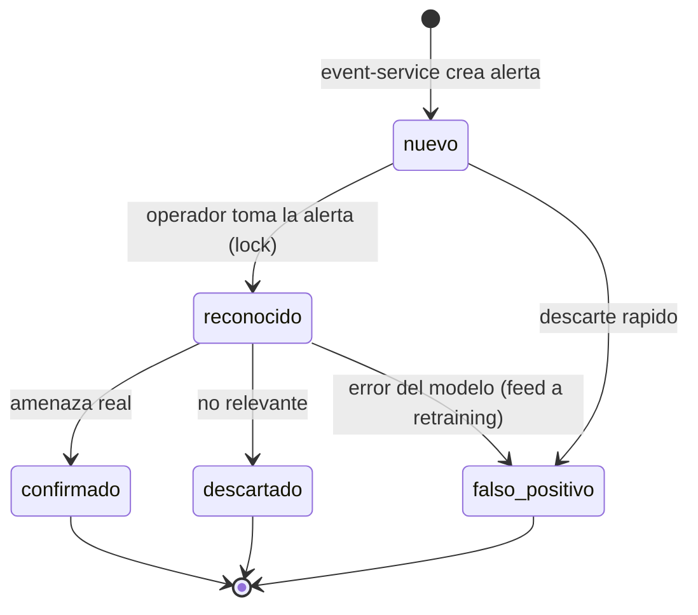
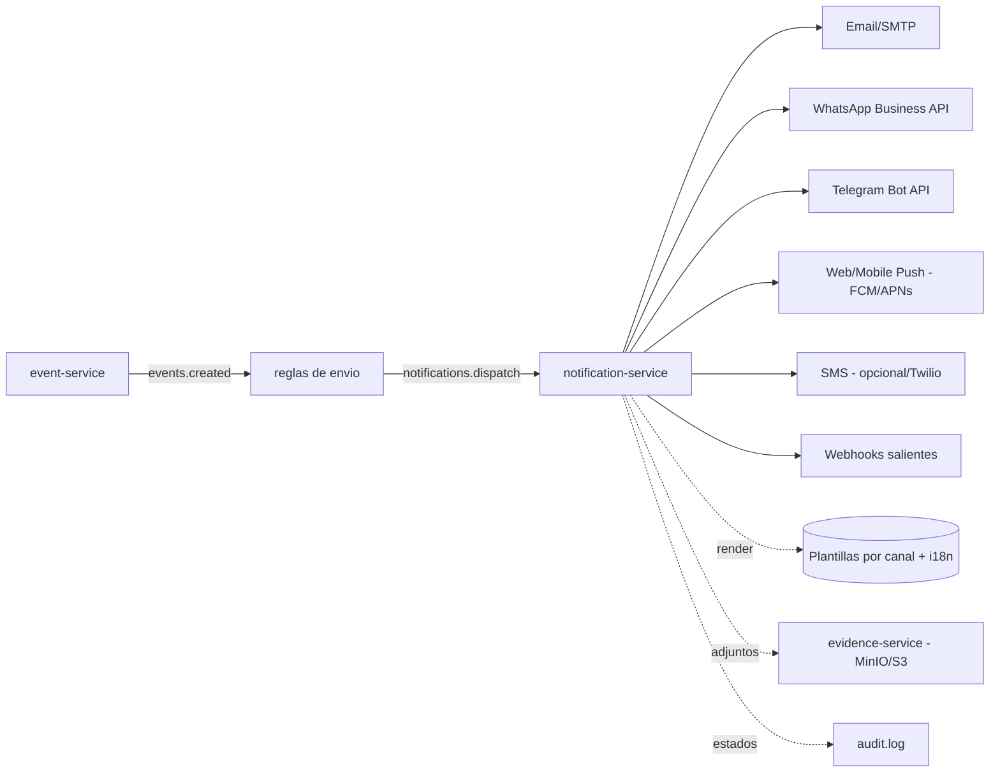

> Parte de la documentación de arquitectura de **Percepta** — Plataforma SaaS de Análisis Inteligente de Video con IA modular. Ver [índice](README.md).

## Dashboard, Frontend Angular, Canales de Notificación y Organización del Código

Esta sección define la capa de presentación de Percepta y su modelo de organización de código. Todo el frontend consume exclusivamente el `api-gateway` (BFF); nunca habla directo con microservicios internos. El principio rector de UX es **human-in-the-loop**: la interfaz jamás presenta una detección como una decisión, siempre como una **alerta con score de confianza** que un operador debe reconocer, confirmar, descartar o marcar como falso positivo.

---

### 1. Arquitectura del Frontend (Angular 15)

#### 1.1 Estrategia de módulos y lazy loading

Angular 15 con módulos por feature y carga perezosa por ruta. El bootstrap arranca solo con `CoreModule` + `AppRoutingModule`; cada feature se descarga bajo demanda para mantener el bundle inicial por debajo de ~250 KB gzip.

```
AppModule (bootstrap)
├── CoreModule            (singletons: providers, interceptores, guards, servicios de infraestructura)
├── SharedModule          (componentes/pipes/directivas presentacionales reutilizables, SIN estado)
└── Feature Modules (lazy, loadChildren)
    ├── auth              /auth            (login, MFA, refresh, recuperación)
    ├── live-monitoring   /live            (mosaico WebRTC, estado de cámaras en tiempo real)
    ├── events            /events          (feed en vivo, timeline, historial, detalle)
    ├── review-queue      /review          (cola de revisión humana — workflow de alertas)
    ├── analytics         /analytics       (mapas de calor, KPIs, series temporales)
    ├── module-config     /modules         (asignación y config dinámica de ai_modules por cámara)
    ├── system-health     /system          (estado de modelos, GPU, ai-workers, servicios)
    ├── admin             /admin           (organizations, sites, zones, cameras, users, roles)
    └── billing           /billing         (plans, subscriptions, licenses, metering, Stripe)
```

**Justificación / trade-off.** Un feature module por dominio de negocio (no por tipo técnico) maximiza cohesión y permite que equipos distintos evolucionen features sin colisiones. El coste es cierta duplicación de wiring de rutas, aceptable frente al beneficio de límites claros. `admin` se subdivide internamente con rutas hijas (organizations, sites, zones, cameras, users, roles) pero comparte un único chunk porque suele usarse en sesiones administrativas contiguas.

```typescript
// app-routing.module.ts
const routes: Routes = [
  { path: 'auth', loadChildren: () => import('./features/auth/auth.module').then(m => m.AuthModule) },
  {
    path: '',
    canActivate: [AuthGuard],
    component: ShellComponent,               // layout con toolbar + sidenav + <router-outlet>
    children: [
      { path: 'live',      loadChildren: () => import('./features/live-monitoring/live-monitoring.module').then(m => m.LiveMonitoringModule),
        canActivate: [PermissionGuard], data: { permission: 'live:view' } },
      { path: 'events',    loadChildren: () => import('./features/events/events.module').then(m => m.EventsModule),
        data: { permission: 'events:view' } },
      { path: 'review',    loadChildren: () => import('./features/review-queue/review-queue.module').then(m => m.ReviewQueueModule),
        canActivate: [PermissionGuard], data: { permission: 'events:review' } },
      { path: 'analytics', loadChildren: () => import('./features/analytics/analytics.module').then(m => m.AnalyticsModule) },
      { path: 'modules',   loadChildren: () => import('./features/module-config/module-config.module').then(m => m.ModuleConfigModule) },
      { path: 'system',    loadChildren: () => import('./features/system-health/system-health.module').then(m => m.SystemHealthModule) },
      { path: 'admin',     loadChildren: () => import('./features/admin/admin.module').then(m => m.AdminModule),
        canActivate: [PermissionGuard], data: { permission: 'admin:access' } },
      { path: 'billing',   loadChildren: () => import('./features/billing/billing.module').then(m => m.BillingModule),
        canActivate: [PermissionGuard], data: { permission: 'billing:manage' } },
      { path: '', redirectTo: 'live', pathMatch: 'full' },
    ],
  },
  { path: '**', component: NotFoundComponent },
];
```

#### 1.2 Estructura Core / Shared

```
src/app/
├── core/
│   ├── auth/                 auth.service.ts, token-storage.service.ts, current-user.store.ts
│   ├── http/                 interceptores (auth, refresh, tenant, error, retry, loading)
│   ├── guards/               auth.guard.ts, permission.guard.ts, unsaved-changes.guard.ts
│   ├── realtime/             realtime.service.ts (WS/SSE), realtime-reconnect.strategy.ts
│   ├── config/               app-config.service.ts (runtime config via APP_INITIALIZER)
│   ├── models/               tipos generados desde @percepta/contracts
│   └── core.module.ts        (throwIfAlreadyLoaded guard)
├── shared/
│   ├── components/           confidence-badge, event-card, camera-tile, status-dot,
│   │                         empty-state, data-table, page-header, evidence-viewer
│   ├── dynamic-form/         json-schema-form.component.ts + widgets (ver §1.5)
│   ├── directives/           has-permission.directive.ts, autofocus.directive.ts
│   ├── pipes/                relative-time.pipe.ts, confidence.pipe.ts, bytes.pipe.ts
│   └── shared.module.ts
├── features/                 (los feature modules lazy)
├── layout/                   shell.component.ts, sidenav, toolbar, tenant-switcher
└── styles/                   themes, tokens, mixins (ver §4)
```

`CoreModule` se importa una sola vez (protegido con `throwIfAlreadyLoaded`). `SharedModule` no contiene servicios con estado: solo componentes presentacionales, pipes y directivas, e importa/exporta `MatModule` agregado y `TranslateModule`.

#### 1.3 Gestión de estado: NgRx selectivo + servicios RxJS

**Decisión: híbrida y justificada por dominio.**

| Dominio | Estrategia | Razón |
|---|---|---|
| Sesión, usuario actual, permisos, tenant activo | **NgRx Store** (`auth`, `session`) | Estado global, atravesado por guards/interceptores/directivas; necesita selectores memoizados y time-travel para auditar bugs de permisos |
| Eventos en tiempo real + cola de revisión | **NgRx Store + Entity Adapter** (`events`) | Alto volumen, updates por WebSocket, dedup por `id`, ordenamiento, filtros derivados; el Entity Adapter evita re-render masivo |
| Estado de cámaras / salud de servicios | **NgRx** (`devices`, `system`) | Actualizaciones push frecuentes; múltiples pantallas consumen la misma verdad |
| Formularios de config de módulos, wizards admin | **Servicios RxJS locales** (`ComponentStore` o `BehaviorSubject`) | Estado efímero y acoplado a la vista; NgRx global sería sobreingeniería |
| Catálogos (roles, planes, zonas) | **Servicio RxJS con caché** (`shareReplay(1)` + invalidación) | Datos casi estáticos; no justifican reducers |

**Trade-off explícito.** NgRx en todo el árbol añade boilerplate y curva de aprendizaje; servicios RxJS en todo sacrifican trazabilidad y consistencia en estado compartido de alto volumen. La regla operativa: *NgRx cuando el estado es compartido por 3+ features o llega por push; servicio RxJS cuando es local a una vista.*

```typescript
// core/store/events/events.reducer.ts — Entity Adapter para el feed/cola
export const eventsAdapter = createEntityAdapter<EventDto>({
  selectId: (e) => e.id,
  sortComparer: (a, b) => b.occurredAt.localeCompare(a.occurredAt), // ISO-8601 UTC, desc
});

export interface EventsState extends EntityState<EventDto> {
  filter: EventFilter;
  reviewCounts: Record<EventStatus, number>; // nuevo|reconocido|confirmado|descartado|falso_positivo
  liveConnected: boolean;
}

export const eventsReducer = createReducer(
  eventsAdapter.getInitialState({ filter: defaultFilter, reviewCounts: emptyCounts, liveConnected: false }),
  on(EventsActions.liveEventReceived, (state, { event }) =>
    eventsAdapter.upsertOne(event, { ...state, reviewCounts: recount(state, event) })),
  on(EventsActions.statusChanged, (state, { id, status }) =>
    eventsAdapter.updateOne({ id, changes: { status } }, state)),
);
```

Los efectos (`@ngrx/effects`) encapsulan las llamadas HTTP al `api-gateway` y la suscripción al canal de tiempo real, manteniendo los componentes libres de I/O.

#### 1.4 Interceptores HTTP (orden importa)

El pipeline se registra en `CoreModule` con `multi: true`. El **orden de declaración = orden de ejecución en request** (y orden inverso en response):

```typescript
providers: [
  { provide: HTTP_INTERCEPTORS, useClass: TenantInterceptor,  multi: true }, // 1
  { provide: HTTP_INTERCEPTORS, useClass: AuthInterceptor,    multi: true }, // 2
  { provide: HTTP_INTERCEPTORS, useClass: RefreshInterceptor, multi: true }, // 3
  { provide: HTTP_INTERCEPTORS, useClass: RetryInterceptor,   multi: true }, // 4
  { provide: HTTP_INTERCEPTORS, useClass: ErrorInterceptor,   multi: true }, // 5
  { provide: HTTP_INTERCEPTORS, useClass: LoadingInterceptor, multi: true }, // 6
]
```

| Interceptor | Responsabilidad |
|---|---|
| `TenantInterceptor` | Inyecta `X-Organization-Id` (tenant activo) — el gateway lo valida contra el JWT antes de aplicar RLS |
| `AuthInterceptor` | Añade `Authorization: Bearer <access>` salvo rutas públicas (`/auth/login`, `/auth/refresh`) |
| `RefreshInterceptor` | Maneja 401: pausa, ejecuta refresh **single-flight**, reintenta la petición fallida |
| `RetryInterceptor` | Retry con backoff exponencial solo en idempotentes (GET) ante 502/503/504 |
| `ErrorInterceptor` | Normaliza errores del gateway a `AppError`, dispara snackbar/toast y `audit` client-side |
| `LoadingInterceptor` | Cuenta requests activos para spinner global (excluye polling silencioso) |

El detalle crítico es el **refresh single-flight**: múltiples requests que fallan con 401 concurrente comparten un único refresh en curso.

```typescript
@Injectable()
export class RefreshInterceptor implements HttpInterceptor {
  private refresh$: Observable<TokenPair> | null = null;

  constructor(private auth: AuthService, private store: Store) {}

  intercept(req: HttpRequest<unknown>, next: HttpHandler): Observable<HttpEvent<unknown>> {
    return next.handle(req).pipe(
      catchError((err: HttpErrorResponse) => {
        if (err.status !== 401 || req.url.includes('/auth/refresh')) return throwError(() => err);

        // Un solo refresh compartido entre todas las peticiones que caducaron a la vez.
        this.refresh$ ??= this.auth.refreshTokens().pipe(
          shareReplay(1),
          finalize(() => (this.refresh$ = null)),
        );

        return this.refresh$.pipe(
          switchMap(({ accessToken }) =>
            next.handle(req.clone({ setHeaders: { Authorization: `Bearer ${accessToken}` } }))),
          catchError(() => { this.auth.forceLogout('session_expired'); return throwError(() => err); }),
        );
      }),
    );
  }
}
```

#### 1.5 Generación DINÁMICA de formularios desde JSON Schema

Cada `ai_module` publica en su `module.json` un **JSON Schema** que describe su configuración. El `module-registry` lo expone vía `api-gateway`; el frontend renderiza el formulario **sin código específico por módulo**. Esta es la pieza que hace al frontend agnóstico del rubro y permite instalar plugins sin tocar el core (Principio 1).

**Arquitectura del renderer** (`shared/dynamic-form/`):

```
dynamic-form/
├── json-schema-form.component.ts       (raíz: schema + uiSchema + value -> FormGroup)
├── schema-to-form.factory.ts           (construye FormGroup/FormArray recursivo + validators)
├── widget-resolver.ts                  (mapea tipo/format/x-widget -> componente)
├── widgets/
│   ├── text.widget.ts   number.widget.ts   boolean.widget.ts   select.widget.ts
│   ├── slider.widget.ts (umbrales confianza 0..1)   time-range.widget.ts (horarios)
│   ├── roi-editor.widget.ts     (dibuja zonas/polígonos sobre snapshot de la cámara)
│   ├── line-editor.widget.ts    (líneas de conteo/cruce)
│   └── zone-picker.widget.ts    (selecciona zones existentes del tenant)
└── validators/ schema.validators.ts    (min/max/pattern/required/dependencies)
```

Los widgets `roi-editor` y `line-editor` son la clave de negocio: los módulos declaran en su manifest `requiresRoi`, `requiresLines` o `requiresZones`, y el frontend abre el editor geométrico sobre un snapshot en vivo (obtenido de `media-service` vía gateway), guardando coordenadas normalizadas `[0..1]` para independencia de resolución.

Ejemplo de fragmento de schema + UI hints que el frontend consume:

```json
{
  "$id": "percepta.module.intrusion-detection.config",
  "type": "object",
  "required": ["confidenceThreshold", "zones"],
  "properties": {
    "confidenceThreshold": {
      "type": "number", "minimum": 0, "maximum": 1, "default": 0.6,
      "x-widget": "slider", "x-step": 0.05,
      "title": "Umbral de confianza",
      "description": "Bajo este score la detección no genera evento."
    },
    "zones": {
      "type": "array", "minItems": 1,
      "x-widget": "roi-editor",
      "title": "Zonas de vigilancia",
      "items": { "$ref": "#/$defs/polygon" }
    },
    "schedule": {
      "type": "object", "x-widget": "time-range",
      "title": "Horario activo",
      "properties": {
        "days": { "type": "array", "items": { "enum": ["mon","tue","wed","thu","fri","sat","sun"] } },
        "from": { "type": "string", "format": "time" },
        "to":   { "type": "string", "format": "time" }
      }
    },
    "cooldownSeconds": {
      "type": "integer", "minimum": 0, "default": 30,
      "title": "Cooldown (deduplicación)",
      "description": "Ventana en la que rules-engine suprime alertas repetidas."
    }
  },
  "$defs": {
    "polygon": {
      "type": "array", "minItems": 3,
      "items": { "type": "array", "items": { "type": "number", "minimum": 0, "maximum": 1 }, "minItems": 2, "maxItems": 2 }
    }
  }
}
```

**Decisión de librería.** Se usa un renderer propio ligero (factory recursiva) en lugar de `@ngx-formly` o `ajv`-heavy, con `Ajv` únicamente para validación de coherencia. Trade-off: escribimos ~600 LOC de renderer, pero ganamos control total sobre los widgets geométricos (ROI/líneas) que ninguna librería genérica cubre, y evitamos acoplar el core a la evolución de una dependencia externa. La validación server-side final la hace `module-registry` con el mismo schema (defensa en profundidad).

```typescript
// schema-to-form.factory.ts (núcleo recursivo, resumido)
export function buildGroup(schema: JsonSchema): FormGroup {
  const controls: Record<string, AbstractControl> = {};
  for (const [key, prop] of Object.entries(schema.properties ?? {})) {
    const required = schema.required?.includes(key) ?? false;
    if (prop.type === 'object')      controls[key] = buildGroup(prop);
    else if (prop.type === 'array')  controls[key] = buildArray(prop, required);
    else                             controls[key] = new FormControl(prop.default ?? null, toValidators(prop, required));
  }
  return new FormGroup(controls);
}
```

#### 1.6 Internacionalización (i18n)

**Decisión: `@ngx-translate/core` (runtime) en vez de i18n nativo de Angular (compile-time).** Percepta es SaaS multiempresa; un mismo build debe servir es/en/pt y permitir que un tenant cambie idioma sin re-desplegar. El i18n nativo obligaría a un bundle por locale y no permite cambio en caliente. Trade-off: se pierde la extracción/typchecking nativo, mitigado con un script que valida claves faltantes en CI y tipos generados de las keys.

- Idioma resuelto por: preferencia de `users` > `organizations` default > `navigator.language` > `es`.
- Traducciones de las **etiquetas de módulos de IA** (títulos/descripciones de sus schemas) vienen del `module.json` con bloque `i18n` por locale, servido por `module-registry`; el frontend hace merge con sus catálogos base.
- Formato de fechas/números con `Intl` y locale activo; timestamps siempre almacenados/transmitidos en **UTC ISO-8601** y renderizados en la zona del `sites`/usuario.

---

### 2. Tiempo real: WebSocket / SSE

El backend expone tiempo real así (según decisión compartida): `event-service -> Redis pub/sub -> api-gateway -> cliente`. El frontend abstrae el transporte en un único `RealtimeService`.

**Decisión de transporte.**
- **WebSocket** para el canal de **eventos y comandos bidireccionales** (feed en vivo, cola de revisión, acuses/locks de alertas). Necesitamos enviar del cliente al servidor (p. ej. "estoy revisando este evento" → lock optimista).
- **SSE** como **fallback** para entornos on-premise con proxies que rompen WS, y para canales estrictamente unidireccionales (estado de cámaras, salud de `ai-worker`/GPU) donde no hace falta upstream.
- **WebRTC** (go2rtc/mediamtx) es un plano aparte, solo para el media del mosaico en vivo (§3.1); no viaja por este canal.

```typescript
@Injectable({ providedIn: 'root' })
export class RealtimeService {
  private socket$?: WebSocketSubject<RealtimeEnvelope>;
  private readonly connected$ = new BehaviorSubject(false);
  readonly messages$ = new Subject<RealtimeEnvelope>();

  connect(orgId: string, token: string): void {
    this.socket$ = webSocket<RealtimeEnvelope>({
      url: `${environment.wsUrl}/api/v1/stream?org=${orgId}`,
      protocol: token,                                  // JWT en subprotocol, no en query string (privacidad)
      openObserver:  { next: () => this.connected$.next(true) },
      closeObserver: { next: () => this.connected$.next(false) },
    });

    this.socket$.pipe(
      retry({ delay: (_e, n) => timer(this.backoff(n)) }),   // reconexión con backoff + jitter
      tap(env => this.messages$.next(env)),
    ).subscribe();
  }

  // Canales lógicos multiplexados sobre una sola conexión (evita N sockets por tenant)
  on<T>(channel: RealtimeChannel): Observable<T> {
    return this.messages$.pipe(filter(e => e.channel === channel), map(e => e.payload as T));
  }

  private backoff(attempt: number): number {
    return Math.min(1000 * 2 ** attempt, 30_000) + Math.random() * 1000; // cap 30s + jitter
  }
}
```

**Sobre-picos y resincronización.** Ante reconexión, el cliente pide un *catch-up* REST (`GET /api/v1/events?since=<lastCursor>`) para rellenar el gap antes de reanudar el stream — patrón *stream + snapshot reconciliation*. Los mensajes traen `cursor` monotónico para detectar huecos y descartar duplicados (idempotencia por `event.id` vía Entity Adapter).

**Envelope de tiempo real (contrato):**

```json
{
  "channel": "events.live",            // events.live | events.status | cameras.health | system.health | review.lock
  "cursor": "01J9Z8...ULID",
  "type": "event.created",
  "payload": {
    "id": "6f1c...uuid",
    "organizationId": "…", "siteId": "…", "cameraId": "…", "moduleId": "intrusion-detection",
    "status": "nuevo",
    "confidence": 0.87,
    "occurredAt": "2026-07-30T14:22:11.204Z",
    "thumbnailUrl": "https://…/evidence/thumb/…jpg"
  }
}
```

Backpressure en cliente: el feed en vivo aplica `bufferTime(250ms)` + coalescing para no re-renderizar por cada mensaje en cámaras muy activas; la cola de revisión prioriza `status = nuevo` y `confidence` alta.

---

### 3. Mapa de pantallas del Dashboard (Arquitectura de Información)

```mermaid
graph TD
    A[Login / MFA] --> SH[Shell: Toolbar + Sidenav + Tenant Switcher]

    SH --> LIVE[Live Monitoring]
    SH --> EV[Eventos]
    SH --> RV[Cola de Revision Humana]
    SH --> AN[Analitica]
    SH --> MC[Config de Modulos]
    SH --> SY[Salud del Sistema]
    SH --> AD[Administracion]
    SH --> BI[Facturacion]

    LIVE --> LIVE1[Mosaico WebRTC multi-camara]
    LIVE --> LIVE2[Vista individual + PTZ / snapshot]
    LIVE --> LIVE3[Estado en tiempo real por camara]

    EV --> EV1[Feed en vivo]
    EV --> EV2[Timeline por camara / sitio]
    EV --> EV3[Historial con filtros]
    EV --> EV4[Detalle de evento + evidencia img/clip]

    RV --> RV1["Bandeja: nuevo -> reconocido"]
    RV --> RV2["Accion: confirmado / descartado / falso_positivo"]
    RV --> RV3[Panel de evidencia + confianza + contexto]

    AN --> AN1[Mapas de calor]
    AN --> AN2[KPIs y series temporales]
    AN --> AN3[Dashboards: empresa / sucursal / camara / modulo]

    MC --> MC1[Asignar ai_modules a camara]
    MC --> MC2[Formulario dinamico JSON Schema]
    MC --> MC3[Editor ROI / lineas / zonas]

    SY --> SY1[Estado de modelos y versiones]
    SY --> SY2[GPU / ai-worker pool / colas]
    SY --> SY3[Salud de microservicios y bus]

    AD --> AD1[organizations]
    AD --> AD2[sites]
    AD --> AD3[zones / sectors]
    AD --> AD4[cameras / streams]
    AD --> AD5[users]
    AD --> AD6[roles / permissions]

    BI --> BI1[plans / subscriptions]
    BI --> BI2[metering / uso]
    BI --> BI3[licenses on-prem / Stripe]
```



#### 3.1 Live Monitoring (mosaico WebRTC)

- **Grid/mosaico configurable** (1×1, 2×2, 3×3, 4×4, custom) con drag-and-drop de cámaras y layouts guardados por usuario.
- Cada `camera-tile` establece **WebRTC** contra `media-service` (SDP/ICE negociado vía gateway). Política de recursos: solo las tiles **visibles** mantienen la sesión WebRTC; al hacer scroll/paginar se liberan (`IntersectionObserver`), evitando saturar GPU/ancho de banda con decenas de streams.
- Degradación: si WebRTC falla (NAT/firewall on-prem), fallback a **HLS/LL-HLS** o snapshot MJPEG cada N segundos.
- Overlay por tile: `status-dot` (online/offline/degraded desde canal `cameras.health`), badge de módulos activos, y **flash de alerta** cuando llega un `event.created` de esa cámara.

#### 3.2 Cola de Revisión Humana (workflow de alertas)

Pantalla central del principio human-in-the-loop. Máquina de estados de `events` alineada con `event-service`:



- **Lock optimista** por WebSocket (`review.lock`): al abrir una alerta se emite lock; otros operadores la ven "en revisión por X" para evitar doble trabajo. TTL de lock con auto-release si el operador se desconecta.
- Panel de evidencia: imagen del frame + **clip de 10 s antes / evento / 10 s después** (armado por `evidence-service`), `confidence-badge` prominente, metadatos (cámara, sitio, zona, módulo, hora local + UTC).
- Cada acción escribe en `audit.log` (quién, cuándo, transición, comentario). Los `falso_positivo` se marcan para el pipeline de reentrenamiento (dataset de negativos duros).
- SLA visual: tiempo desde `occurredAt`, color según umbral; ordenamiento por confianza y antigüedad.

#### 3.3 Analítica y dashboards jerárquicos

- **Mapas de calor**: sobre snapshot de cámara (zonas con más detecciones) y sobre plano/planta del sitio; datos agregados de `analytics-service` (TimescaleDB `continuous aggregates`).
- **Series temporales / KPIs**: eventos por hora/día, tasa de falsos positivos por módulo (indicador de salud del modelo), MTTA (mean time to acknowledge) de la cola de revisión.
- **Drill-down jerárquico**: empresa (`organizations`) → sucursal (`sites`) → zona (`zones`) → cámara (`cameras`) → módulo (`ai_modules`). Cada nivel reusa los mismos componentes de gráfico parametrizados por scope.
- Librería de charts: **ECharts** (vía `ngx-echarts`) por rendimiento con series temporales densas y soporte canvas/SVG y heatmaps nativos; trade-off frente a D3 (más control, más coste) — se elige productividad y consistencia visual.

#### 3.4 Salud del sistema (models & servers)

Consume canal `system.health`: versión y estado de cada modelo cargado en `ai-worker`, ocupación de GPU, profundidad de colas en `inference-orchestrator`, latencia p95 de inferencia, lag del bus (`detections.raw`, `events.created`), y estado de cada microservicio. Es la ventana de observabilidad operativa para SRE dentro del propio producto.

---

### 4. Diseño visual (Angular Material + temas)

**Sistema de tokens** con Material 3 (`mat.define-theme`) sobre CSS custom properties para permitir tema claro/oscuro y white-label por tenant (color primario configurable en `organizations`).

```scss
// styles/_theme.scss
@use '@angular/material' as mat;

$percepta-primary: mat.define-palette($percepta-blue, 600);
$percepta-accent:  mat.define-palette($percepta-teal, 400);
$percepta-warn:    mat.define-palette(mat.$red-palette, 500);

$light-theme: mat.define-light-theme((color: (primary: $percepta-primary, accent: $percepta-accent, warn: $percepta-warn), typography: $percepta-typography, density: -1));
$dark-theme:  mat.define-dark-theme((color: (primary: $percepta-primary, accent: $percepta-accent, warn: $percepta-warn)));

:root            { @include mat.all-component-themes($light-theme); }
:root[data-theme="dark"] { @include mat.all-component-colors($dark-theme); }

// Tokens semánticos (consumidos por componentes propios)
:root {
  --confidence-high: #{map-get($percepta-teal, 400)};   // >= 0.85
  --confidence-mid:  #f5a623;                            // 0.6..0.85
  --confidence-low:  #{map-get(mat.$red-palette, 400)};  // < 0.6
  --status-online: #22c55e; --status-degraded: #f59e0b; --status-offline: #6b7280;
  --alert-new: var(--confidence-high); --surface-elev-1: rgba(0,0,0,.04);
}
```

- **Tema por defecto oscuro** en salas de monitoreo (reduce fatiga visual en vigilancia 24/7); toggle claro/oscuro persistido por usuario y respeta `prefers-color-scheme`.
- **Densidad** `-1` (compacta) para tablas de eventos con muchas filas; `density 0` en formularios de admin.
- Componentes clave propios sobre Material: `confidence-badge` (color por umbral, siempre visible junto a cada detección — refuerza que es probabilística), `camera-tile`, `event-card`, `status-dot`, `evidence-viewer` (visor sincronizado imagen+clip con scrubber), `data-table` (virtual scroll `cdk-virtual-scroll` para historiales de miles de filas).
- **Accesibilidad**: contraste AA en ambos temas, focus visible, navegación por teclado en la cola de revisión (atajos: R=reconocer, C=confirmar, D=descartar, F=falso positivo), roles ARIA en alertas en vivo (`aria-live="polite"`).
- **Responsive**: layout con `@angular/cdk/layout` BreakpointObserver; el mosaico WebRTC colapsa a 1 columna en tablet; admin y analítica priorizan desktop.

---

### 5. Arquitectura de Notificaciones Multicanal (UX + backend contract)

El `notification-service` consume `notifications.dispatch` del bus y entrega por canal. El frontend administra **plantillas, preferencias y reglas de escalado**; el envío real es server-side.



#### 5.1 Modelo de preferencias y canales

Sobre las entidades `notification_channels` y `notifications`:

- **`notification_channels`**: configuración por tenant de cada canal (credenciales en vault, remitente, número WA verificado, bot token Telegram, endpoints de webhook con secret HMAC).
- **Preferencias por usuario y por rol**: matriz *(categoría de evento × severidad/confianza × canal)*. Un usuario elige recibir intrusión con confianza ≥0.8 por Push+WhatsApp, y resúmenes diarios por Email. Los roles definen defaults heredables (p. ej. rol "supervisor" recibe escalados).
- **Quiet hours** y **rate limiting** por usuario para evitar fatiga de alertas (respetando human-in-the-loop: nunca se suprime la alerta en el dashboard, solo la notificación push).

#### 5.2 Plantillas

Plantillas versionadas por canal e idioma (MJML→HTML para email, plantillas HSM aprobadas para WhatsApp Business API, Markdown para Telegram). Editor en el frontend con preview por canal y variables tipadas (`{{cameraName}}`, `{{confidence}}`, `{{siteName}}`, `{{dashboardUrl}}`). El renderizado real ocurre en `notification-service` con el mismo motor para consistencia.

#### 5.3 Reglas de escalado

Definidas en el frontend, ejecutadas por `notification-service` + `rules-engine`:

| Nivel | Condición | Acción |
|---|---|---|
| L1 | Alerta `nuevo`, confianza ≥ umbral | Notifica operadores de guardia del `sites` |
| L2 | Sin `reconocido` en N minutos (SLA) | Reenvía + escala a supervisor (rol) |
| L3 | Sin acción en 2N minutos | Notifica gerencia + canal Webhook a sistema externo (SOC/PSIM) |

Deduplicación y cooldown provienen de `rules-engine` (config por `camera_module_configs`); `notification-service` respeta `cooldownSeconds` para no reenviar la misma alerta.

#### 5.4 Payload de notificación (contrato en el bus `notifications.dispatch`)

```json
{
  "notificationId": "a3f9c7e2-1b4d-4e88-9f22-0c1a7d55e901",
  "organizationId": "5c2b9d10-7a44-4f31-8e0e-2b6f1c9a3d77",
  "eventId": "6f1c0a8e-4d2b-4c9a-b7f1-9e3c5a2d84bb",
  "createdAt": "2026-07-30T14:22:12.880Z",
  "priority": "high",
  "escalationLevel": 1,
  "channels": ["push", "whatsapp", "email"],
  "recipients": [
    { "userId": "9b1e…", "roles": ["operator"], "channelOverrides": ["push", "whatsapp"] }
  ],
  "context": {
    "moduleId": "intrusion-detection",
    "moduleName": "Detección de intrusión",
    "cameraId": "c7d2…", "cameraName": "Acceso Norte",
    "siteId": "s41a…", "siteName": "Planta Rosario",
    "zoneName": "Perímetro Este",
    "confidence": 0.87,
    "status": "nuevo",
    "occurredAt": "2026-07-30T14:22:11.204Z",
    "occurredAtLocal": "2026-07-30T11:22:11-03:00"
  },
  "attachments": [
    { "type": "image", "mime": "image/jpeg",
      "url": "https://s3.percepta.io/evidence/5c2b…/6f1c…/frame.jpg",
      "signedUrlExpiresAt": "2026-07-30T15:22:12.880Z", "width": 1920, "height": 1080 },
    { "type": "clip", "mime": "video/mp4",
      "url": "https://s3.percepta.io/evidence/5c2b…/6f1c…/clip_pre10_post10.mp4",
      "signedUrlExpiresAt": "2026-07-30T15:22:12.880Z", "durationSeconds": 20, "sizeBytes": 4823110 }
  ],
  "actions": {
    "dashboardUrl": "https://app.percepta.io/review?event=6f1c0a8e-4d2b-4c9a-b7f1-9e3c5a2d84bb",
    "acknowledgeUrl": "https://app.percepta.io/api/v1/events/6f1c…/acknowledge?token=<one-time>"
  },
  "template": { "id": "intrusion.alert", "version": 3, "locale": "es" },
  "meta": { "humanInLoop": true, "note": "Alerta de asistencia; requiere revisión y confirmación humana." }
}
```

Los `url` de adjuntos son **signed URLs** de MinIO/S3 con expiración; nunca se incrustan credenciales. El `acknowledgeUrl` lleva token de un solo uso para reconocer desde la notificación (WhatsApp/Push) sin abrir sesión completa, registrando la acción en `audit.log`.

---

### 6. Organización del Código (Monorepo)

**Decisión: monorepo con Nx** para orquestar Angular + NestJS + librerías TS compartidas, y **`uv`/Poetry workspaces** para los servicios Python de IA, unidos bajo el mismo repo con un `packages/contracts` como fuente de verdad de contratos (OpenAPI + JSON Schemas de eventos/módulos + Protobuf para gRPC entre `inference-orchestrator` y `ai-worker`).

**Justificación / trade-off.** Un monorepo da atomicidad de cambios cross-service, un único grafo de dependencias, y generación de tipos compartidos (frontend, NestJS y Python consumen el mismo contrato → cero drift de esquemas). Nx aporta *affected builds*, caché de tareas y boundaries entre libs. Coste: tooling más pesado y CI que debe entender dos ecosistemas (Node y Python); se mitiga con pipelines separados disparados por `nx affected` y por cambios en rutas `services/ai/**`.

#### 6.1 Árbol del repositorio

```
percepta/
├── apps/
│   └── web-dashboard/                  # Frontend Angular 15 (ver §1.2 para su interior)
│
├── services/                           # Backend
│   ├── api-gateway/                    # NestJS — BFF, REST /api/v1, WS/SSE, rate-limit
│   ├── identity-service/               # NestJS — usuarios, RBAC, JWT/refresh, MFA
│   ├── tenant-service/                 # NestJS — organizations, sites, zones
│   ├── device-service/                 # NestJS — cameras, streams, credenciales (vault), salud
│   ├── media-service/                  # NestJS + FFmpeg/go2rtc — ingest RTSP, WebRTC, ring-buffer
│   ├── inference-orchestrator/         # NestJS — reparto de frames, GPU, batching, escalado
│   ├── module-registry/                # NestJS — catálogo de módulos, manifests, JSON Schemas
│   ├── rules-engine/                   # NestJS — evalúa detections.raw -> eventos, dedup/cooldown
│   ├── event-service/                  # NestJS — eventos, workflow humano, Redis pub/sub -> gateway
│   ├── evidence-service/               # NestJS — arma imagen+clip, guarda en MinIO/S3
│   ├── notification-service/           # NestJS — Email/WhatsApp/Telegram/Push/SMS/Webhooks
│   ├── analytics-service/              # NestJS — agregaciones, heatmaps, KPIs (TimescaleDB)
│   ├── billing-service/                # NestJS — plans, subscriptions, licenses, Stripe, metering
│   └── audit-service/                  # NestJS — audit.log inmutable (consumer del bus)
│
├── services/ai/                        # Workers Python de IA
│   ├── ai-worker/                      # Runtime del pool (FastAPI health + gRPC server)
│   └── modules/                        # Módulos-plugin (uno por capacidad de IA)
│       ├── intrusion-detection/
│       ├── people-counting/
│       ├── ppe-detection/
│       └── loitering-detection/
│
├── packages/                           # Librerías compartidas (Nx libs)
│   ├── contracts/                      # FUENTE DE VERDAD de contratos
│   │   ├── openapi/                    # openapi.yaml por servicio
│   │   ├── events/                     # JSON Schemas de eventos del bus (detections.raw, events.created…)
│   │   ├── proto/                      # inference.proto (orchestrator <-> ai-worker)
│   │   └── module-manifest.schema.json # meta-schema de module.json
│   ├── ts-types/                       # Tipos TS generados desde contracts (front + NestJS)
│   ├── py-contracts/                   # Modelos Pydantic + stubs gRPC generados
│   ├── ui-kit/                         # (opcional) componentes Angular compartidos publicables
│   ├── nest-common/                    # NestJS: logging, tracing, RLS helper, RabbitMQ module,
│   │                                   #   auth guards, tenant-context, health, problem+json
│   └── config/                         # tsconfig base, eslint, prettier, jest presets
│
├── infra/
│   ├── docker/                         # Dockerfiles base (node, python-cuda, ffmpeg)
│   ├── compose/                        # docker-compose.*.yml (dev, on-prem)
│   ├── k8s/                            # Helm charts / manifests por servicio + overlays (cloud/hybrid)
│   ├── terraform/                      # IaC cloud (S3, RDS Postgres+Timescale, MSK/Rabbit, etc.)
│   └── migrations/                     # SQL versionado (RLS policies, TimescaleDB hypertables)
│
├── tools/                              # scripts: codegen contracts, seed, e2e harness
├── nx.json  package.json  pnpm-workspace.yaml
├── pyproject.toml                      # workspace Python (uv/Poetry) para services/ai/*
└── README.md  CODEOWNERS  .github/workflows/
```

#### 6.2 Árbol de un microservicio NestJS (ejemplo: `event-service`)

```
services/event-service/
├── src/
│   ├── main.ts                         # bootstrap (Nest + microservice transport RabbitMQ)
│   ├── app.module.ts
│   ├── config/                         # ConfigModule + validación (Joi/zod) de env
│   ├── common/
│   │   ├── filters/                    # problem+json exception filter
│   │   ├── interceptors/               # logging, tracing (OpenTelemetry), tenant-context
│   │   ├── guards/                     # JwtAuthGuard, PermissionsGuard (desde nest-common)
│   │   └── decorators/                 # @CurrentUser, @OrganizationId
│   ├── events/                         # Feature/domain module
│   │   ├── events.controller.ts        # REST /api/v1/events (versionado)
│   │   ├── events.service.ts           # lógica de dominio + workflow de estados
│   │   ├── events.repository.ts        # acceso a datos (Prisma/TypeORM) con RLS por organization_id
│   │   ├── dto/                        # create/update/query DTOs (camelCase, class-validator)
│   │   ├── entities/                   # mapeo a tablas events (snake_case)
│   │   ├── state-machine/              # nuevo->reconocido->confirmado/descartado/falso_positivo
│   │   └── events.mapper.ts            # DB snake_case <-> API camelCase
│   ├── messaging/
│   │   ├── consumers/                  # @EventPattern('events.created') etc.
│   │   ├── publishers/                 # publica a notifications.dispatch, audit.log
│   │   └── redis-pubsub.service.ts     # emite realtime a api-gateway
│   ├── health/                         # /health, /ready (Terminus)
│   └── database/
│       └── prisma/ (schema.prisma)     # o migrations/ si TypeORM
├── test/
│   ├── unit/                           # *.spec.ts
│   └── e2e/                            # events.e2e-spec.ts (Testcontainers: Postgres+Rabbit)
├── Dockerfile
├── project.json                        # targets Nx (build, test, lint, serve)
├── tsconfig.app.json  tsconfig.spec.json
└── .env.example
```

Todos los servicios NestJS comparten `packages/nest-common` (guards RBAC, `TenantContext` que setea `SET app.current_org = <uuid>` para RLS de Postgres, módulo RabbitMQ tipado, observabilidad). Esto garantiza la consistencia de multitenancy y auth sin duplicar código.

#### 6.3 Árbol de un módulo de IA Python (ejemplo: `intrusion-detection`)

```
services/ai/modules/intrusion-detection/
├── module.json                         # MANIFEST: id, nombre, categoria, version, backend,
│                                       #   requiresRoi/Lines/Zones, JSON Schema de config,
│                                       #   tipos de evento emitidos, recursos (gpu/cpu/fps), i18n
├── src/
│   └── intrusion_detection/
│       ├── __init__.py
│       ├── manifest.py                 # carga/valida module.json contra module-manifest.schema.json
│       ├── detector.py                 # implementa AIModule (interfaz común de py-contracts)
│       │                               #   load_model(), warmup(), infer(frame, config) -> Detection[]
│       ├── config_schema.json          # JSON Schema (fuente del formulario dinámico del frontend)
│       ├── model/
│       │   ├── weights.pt              # (o referencia a MinIO/registry, no en git — DVC/LFS)
│       │   └── labels.yaml
│       ├── postprocess/
│       │   ├── zones.py                # point-in-polygon sobre ROI normalizado [0..1]
│       │   ├── tracking.py             # tracker (ByteTrack) para dedup temporal
│       │   └── nms.py
│       ├── events.py                   # construye Detection -> payload detections.raw
│       └── telemetry.py                # métricas: latencia, fps, uso GPU (a system.health)
├── tests/
│   ├── test_detector.py
│   ├── test_zones.py
│   └── fixtures/                       # frames de prueba + configs de ejemplo
├── benchmarks/                         # perf por hardware (fps/gpu) declarado en manifest
├── Dockerfile                          # base python-cuda + weights
├── pyproject.toml                      # deps (ultralytics, opencv, torch) — parte del workspace
└── README.md
```

El contrato clave es la interfaz `AIModule` en `packages/py-contracts`: cada módulo la implementa, y `ai-worker` la descubre y ejecuta en su pool. El `module-registry` lee `module.json` (validado contra `packages/contracts/module-manifest.schema.json`) para publicar el catálogo; el `config_schema.json` viaja hasta el frontend, cerrando el círculo del **formulario dinámico** (§1.5). Añadir una nueva capacidad de IA = agregar una carpeta bajo `services/ai/modules/` con su `module.json` + `AIModule`, **sin tocar el core** (Principio 1).

**Ejemplo de `module.json` (contrato que conecta backend y frontend):**

```json
{
  "id": "intrusion-detection",
  "name": "Detección de intrusión",
  "category": "security",
  "version": "1.4.0",
  "modelBackend": "yolo",
  "input": { "requiresRoi": true, "requiresLines": false, "requiresZones": true },
  "configSchemaRef": "./config_schema.json",
  "emits": [{ "type": "intrusion.detected", "producesEvent": true }],
  "resources": { "gpu": true, "vramMb": 2048, "targetFps": 15, "cpuFallback": true },
  "i18n": {
    "es": { "name": "Detección de intrusión", "description": "Alerta cuando una persona entra en zonas restringidas." },
    "en": { "name": "Intrusion Detection", "description": "Alerts when a person enters restricted zones." }
  }
}
```

---

### Resumen de decisiones y trade-offs (frontend/código)

| Decisión | Alternativa descartada | Razón |
|---|---|---|
| Estado híbrido NgRx + RxJS | NgRx global / todo RxJS | NgRx solo donde hay push/alto volumen/estado compartido; evita boilerplate innecesario |
| Renderer JSON Schema propio con widgets ROI/líneas | `ngx-formly` genérico | Ningún framework cubre editores geométricos sobre snapshot; control total del core-agnóstico |
| WebSocket (eventos) + SSE (fallback/unidireccional) | Solo WS / solo polling | Bidireccionalidad para locks de revisión; SSE sobrevive proxies on-prem |
| `@ngx-translate` runtime | i18n nativo compile-time | Cambio de idioma en caliente y build único para SaaS multiempresa |
| WebRTC solo en tiles visibles | Todos los streams siempre activos | Ahorro de GPU/ancho de banda a escala de miles de cámaras |
| Monorepo Nx + workspace Python, `packages/contracts` único | Repos separados por servicio | Atomicidad cross-service y cero drift de esquemas (front/NestJS/Python comparten contrato) |
| Módulos de IA como plugins (`module.json` + `AIModule`) | Módulos hardcodeados en el core | Instalar capacidades sin tocar el core; frontend renderiza config dinámicamente |

Esta capa mantiene consistencia estricta con los nombres de servicios (`event-service`, `notification-service`, `evidence-service`, `module-registry`, `rules-engine`, `media-service`, `api-gateway`…), entidades (`events`, `cameras`, `camera_module_configs`, `ai_modules`, `notification_channels`, `notifications`, `audit_logs`…), estados del workflow humano (`nuevo → reconocido → confirmado/descartado/falso_positivo`) y convenciones (DB snake_case, API camelCase, REST `/api/v1`, UUID, UTC ISO-8601) definidas en el BRIEF.

---

⬅ [Anterior](06-catalogo-de-modulos-ia.md) · [Índice](README.md) · [Siguiente ➡](08-saas-roadmap-costos-y-etica.md)
