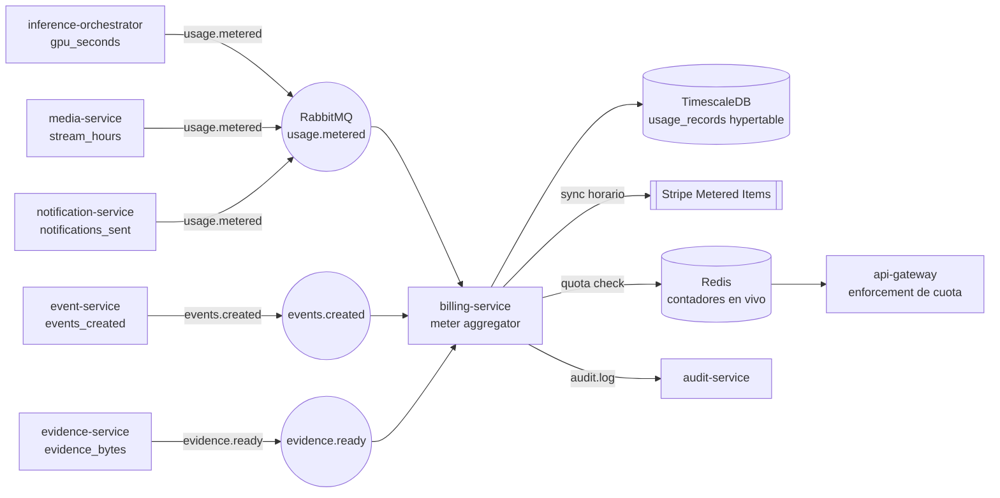
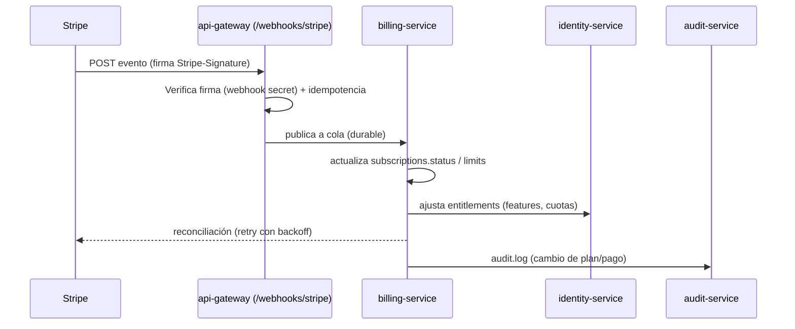
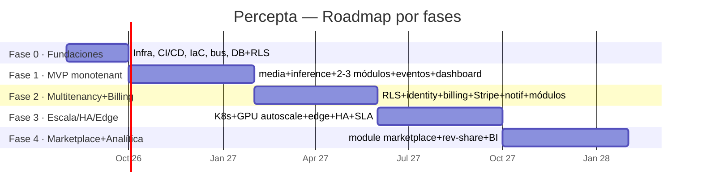
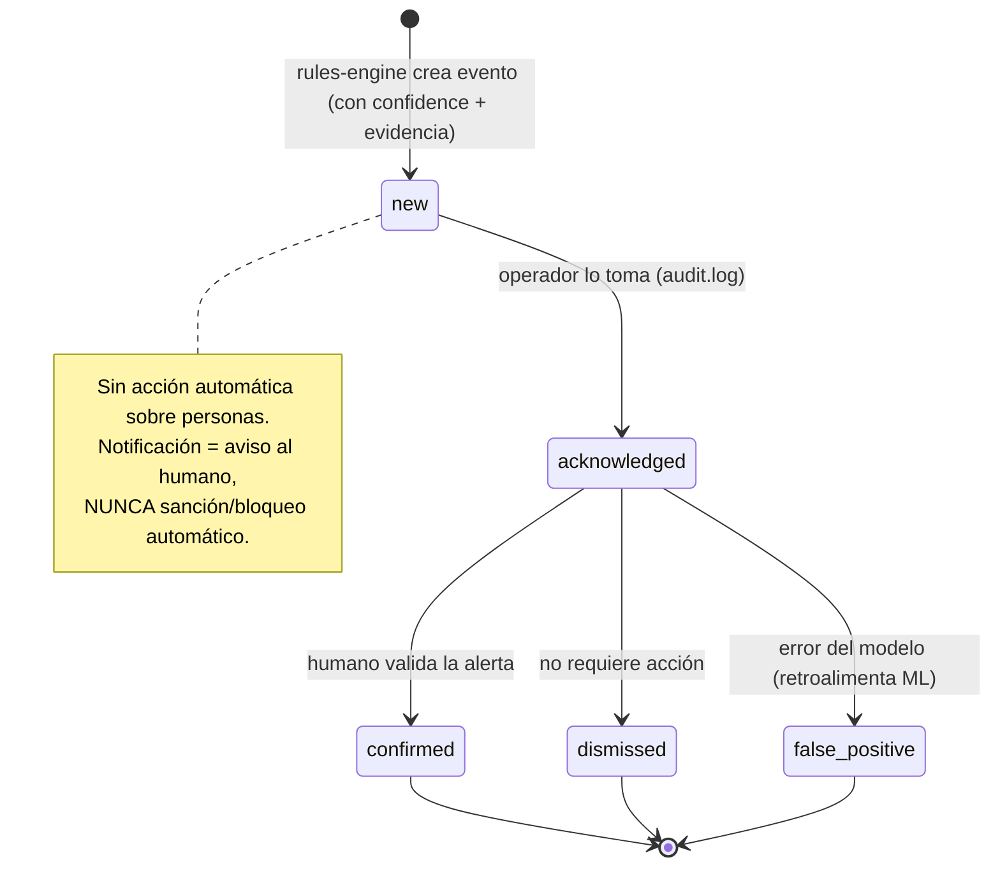

> Parte de la documentación de arquitectura de **Percepta** — Plataforma SaaS de Análisis Inteligente de Video con IA modular. Ver [índice](README.md).

## Modelo SaaS, Licenciamiento, Roadmap, Costos de Infraestructura y Marco Ético

> Esta sección define la capa de negocio de **Percepta** y su gobernanza. Todo el metering, licenciamiento y billing se apoya en `billing-service` como owner de las entidades `plans`, `subscriptions`, `licenses`, `notification_channels` (facturación) y en el bus RabbitMQ existente. El `audit-service` recibe todo cambio de estado comercial vía `audit.log`. Se respeta multitenancy por `organization_id` + RLS y las convenciones (DB snake_case / API camelCase / servicios kebab-case / REST `/api/v1` / IDs UUID / timestamps UTC ISO-8601).

---

### 1. Modelo de negocio SaaS

#### 1.1 Filosofía de precios y dimensiones

Percepta no vende "software de vigilancia": vende **capacidad de percepción supervisada por humanos**. El precio debe reflejar el coste real que domina la economía del sistema (GPU-tiempo e I/O de evidencias), no solo el número de cámaras. Por eso el modelo es **híbrido**: una **cuota base por suscripción** (predecible para el cliente) más **metering de consumo** sobre las palancas de coste variable (GPU y almacenamiento).

| Dimensión de precio | Unidad de medida | Por qué se cobra así | Riesgo si se ignora |
|---|---|---|---|
| **Cámara conectada** | `camera` activa/mes | Ancla comercial simple y entendible; correlaciona con valor percibido | No captura coste de GPU (una cámara con 5 módulos cuesta 5x) |
| **Capacidad de IA activa** | `camera_module_config` activo/mes | El coste real es GPU·FPS por módulo; un módulo de conteo pesa distinto que uno de PPE | Regalar módulos pesados destruye el margen |
| **Hora-stream analizada** | GPU-segundo o stream-hora | Cobra el consumo real de inferencia (edge apagado de noche = paga menos) | Cliente con 24/7 subsidia al de horario comercial |
| **Evento / retención de evidencia** | `events` generados + GB·mes en MinIO/S3 | I/O y almacenamiento de clips es coste marginal directo | Retención de 1 año a alto volumen quema el margen de storage |
| **Usuario / operador** | `users` con rol operativo/mes | Escala con el equipo humano de revisión (coherente con Human-in-the-loop) | Poco peso; se usa como palanca de upsell Enterprise |

**Decisión de diseño (trade-off):** el peso principal recae en **cámara + capacidad activa** (predecible, fácil de vender) y el consumo variable (GPU-hora, GB retención, eventos por encima de cuota) se factura como **overage medido**. Esto evita el rechazo comercial del pricing 100% por consumo (impredecible para el CFO del cliente) sin sacrificar la protección de márgenes en clientes intensivos.

#### 1.2 Tabla de planes

| Feature / Límite | **Starter** | **Business** | **Enterprise** | **On-Prem** |
|---|---|---|---|---|
| Precio base (ref.) | US$ 149/mo | US$ 690/mo | Desde US$ 2.500/mo | Licencia anual + soporte |
| Cámaras incluidas | 8 | 40 | 200 (soft-limit, negociable) | Según licencia |
| Capacidades IA activas (`camera_module_config`) | 12 | 120 | Ilimitadas (metered) | Según licencia |
| Módulos del catálogo | Core (hasta 4 tipos) | Core + Extendidos | Todos + beta + custom | Todos + custom |
| FPS de análisis por cámara | hasta 5 | hasta 10 | configurable | configurable |
| Retención de evidencias | 14 días | 60 días | 90 días (add-on hasta 365) | Ilimitada (storage propio) |
| Usuarios/operadores | 3 | 15 | Ilimitados | Ilimitados |
| Sites / Zones | 1 site / 5 zones | 10 sites / ilimitadas | Ilimitados | Ilimitados |
| Canales de notificación | Email + Telegram | + WhatsApp + Push + Webhook | Todos + SMS + Webhooks firmados | Todos |
| Tiempo real (WebSocket/SSE) | ✔ | ✔ | ✔ + SLA | ✔ |
| Analítica (`analytics-service`) | KPIs básicos | Heatmaps + series | Avanzada + export BI | Avanzada |
| RBAC | Roles predefinidos | Roles custom | Roles custom + SSO/SAML | + SSO/SAML |
| MFA | Opcional | Obligatorio configurable | Obligatorio + política | Obligatorio |
| Deployment | Cloud multitenant | Cloud multitenant | Cloud dedicado / híbrido | Air-gapped / on-prem |
| Soporte | Email 48h | 8x5 | 24x7 + TAM | 24x7 + on-site opcional |
| SLA uptime | Best-effort | 99.5% | 99.9% | N/A (infra cliente) |
| Trial | 14 días | 14 días | POC guiado | POC / licencia eval |

#### 1.3 Add-ons (facturables sobre cualquier plan)

| Add-on | Unidad | Cuándo aplica |
|---|---|---|
| Cámaras adicionales | US$/cámara/mes escalonado por volumen | Sobre cuota del plan |
| Pack de capacidad IA | US$/módulo-cámara/mes | Módulos extra activos |
| Retención extendida | US$/GB·mes o tier (90/180/365 d) | Evidencias más allá del plan |
| GPU dedicada / burst | US$/GPU-hora | Picos, eventos, edge insuficiente |
| Overage de eventos | US$/1.000 eventos sobre cuota | Cámaras muy activas |
| WhatsApp Business API | Costo por conversación (pass-through Meta + markup) | Notificaciones outbound |
| SMS | US$/mensaje (pass-through carrier) | Canal opcional |
| Módulos premium del marketplace (Fase 4) | Rev-share con partner | Plugins de terceros |
| SSO/SAML, SCIM | US$/mo fijo | Business (Enterprise incluido) |

#### 1.4 DDL de referencia (owner: `billing-service`)

```sql
-- Catálogo de planes (semilla del producto; versionable)
CREATE TABLE plans (
  id              UUID PRIMARY KEY DEFAULT gen_random_uuid(),
  code            TEXT NOT NULL UNIQUE,           -- 'starter' | 'business' | 'enterprise' | 'on_prem'
  name            TEXT NOT NULL,
  billing_period  TEXT NOT NULL DEFAULT 'monthly',-- 'monthly' | 'annual'
  base_price_cents INT  NOT NULL,
  currency        CHAR(3) NOT NULL DEFAULT 'USD',
  limits          JSONB NOT NULL,                 -- {cameras, activeModules, retentionDays, users, fpsMax, sites}
  features        JSONB NOT NULL,                 -- flags: {sso, customRoles, marketplace, webhookSigned...}
  stripe_product_id TEXT,
  is_active       BOOLEAN NOT NULL DEFAULT TRUE,
  created_at      TIMESTAMPTZ NOT NULL DEFAULT now()
);

CREATE TABLE subscriptions (
  id                UUID PRIMARY KEY DEFAULT gen_random_uuid(),
  organization_id   UUID NOT NULL REFERENCES organizations(id),
  plan_id           UUID NOT NULL REFERENCES plans(id),
  status            TEXT NOT NULL,                -- trialing|active|past_due|canceled|paused
  stripe_customer_id      TEXT,
  stripe_subscription_id  TEXT,
  current_period_start TIMESTAMPTZ NOT NULL,
  current_period_end   TIMESTAMPTZ NOT NULL,
  trial_end         TIMESTAMPTZ,
  cancel_at_period_end BOOLEAN NOT NULL DEFAULT FALSE,
  overrides         JSONB,                        -- límites negociados Enterprise
  created_at        TIMESTAMPTZ NOT NULL DEFAULT now()
);

-- RLS: toda tabla comercial multitenant filtra por organization_id
ALTER TABLE subscriptions ENABLE ROW LEVEL SECURITY;
CREATE POLICY tenant_isolation ON subscriptions
  USING (organization_id = current_setting('app.current_org')::uuid);
```

---

### 2. Medición / Metering

#### 2.1 Qué se mide y en qué unidad

| Métrica (`meter_code`) | Fuente del dato | Agregación | Uso |
|---|---|---|---|
| `active_cameras` | `device-service` (snapshot diario) | max/día | Cuota base |
| `active_module_configs` | `device-service` / `camera_module_configs` | max/día | Cuota + overage |
| `gpu_seconds` | `inference-orchestrator` (contabiliza GPU·s por worker/módulo) | sum | Overage GPU |
| `stream_hours` | `media-service` (ingest activo) | sum | Reporting / tiering |
| `events_created` | evento bus `events.created` | count | Overage eventos |
| `evidence_bytes_stored` | `evidence-service` (tamaño clip+imagen) | gauge acumulado | Overage retención |
| `notifications_sent` | `notification-service` por canal | count | Pass-through WhatsApp/SMS |
| `active_operators` | `identity-service` (usuarios con login activo) | max/mes | Plan Enterprise |

#### 2.2 Arquitectura de metering

Se introduce un exchange topic adicional **`usage.metered`** (coherente con el bus existente). Cada servicio emite eventos de uso ligeros; `billing-service` los consume, los agrega en TimescaleDB (hypertable) y los sincroniza a Stripe como **usage records** para los ítems metered.



**Evento de uso (JSON, camelCase en API/bus):**

```json
{
  "eventId": "b3f1...uuid",
  "organizationId": "6f2a...uuid",
  "meterCode": "gpu_seconds",
  "quantity": 42.5,
  "unit": "second",
  "source": "inference-orchestrator",
  "dimensions": { "cameraId": "c1..", "moduleId": "ppe-detector@1.4.0", "gpu": "L4" },
  "occurredAt": "2026-07-30T14:22:05Z",
  "idempotencyKey": "io:c1:2026-07-30T14:22"
}
```

**Hypertable de uso (TimescaleDB):**

```sql
CREATE TABLE usage_records (
  organization_id UUID NOT NULL,
  meter_code      TEXT NOT NULL,
  quantity        NUMERIC NOT NULL,
  unit            TEXT NOT NULL,
  dimensions      JSONB,
  idempotency_key TEXT NOT NULL,
  occurred_at     TIMESTAMPTZ NOT NULL,
  PRIMARY KEY (organization_id, meter_code, idempotency_key)
);
SELECT create_hypertable('usage_records', 'occurred_at', chunk_time_interval => INTERVAL '1 day');

-- Rollup horario continuo para sync a Stripe y para el dashboard de consumo
CREATE MATERIALIZED VIEW usage_hourly
WITH (timescaledb.continuous) AS
SELECT organization_id, meter_code,
       time_bucket('1 hour', occurred_at) AS bucket,
       sum(quantity) AS total, max(quantity) AS peak
FROM usage_records
GROUP BY organization_id, meter_code, bucket;
```

**Idempotencia:** `idempotency_key` en PK evita doble conteo ante reentregas de RabbitMQ (at-least-once). Los emisores derivan la clave de forma determinista (p. ej. `worker:camera:minuto`).

#### 2.3 Cuotas y enforcement

Modelo de tres niveles según severidad y reversibilidad:

| Nivel | Mecanismo | Ejemplo | Latencia |
|---|---|---|---|
| **Hard-block preventivo** | `api-gateway` consulta contador en Redis antes de la acción | Activar cámara nº 9 en Starter (límite 8) → 402 `quota_exceeded` | Síncrono, en el request |
| **Soft-limit + overage** | Se permite el consumo, se factura como add-on medido | Eventos por encima de cuota → overage US$/1.000 | Diferido a facturación |
| **Graceful degradation** | Reducción de servicio antes de cortar (protege Human-in-the-loop) | GPU agotada → baja FPS/prioriza módulos críticos, nunca apaga detección de seguridad | Continuo |

**Regla ética de enforcement (obligatoria):** el enforcement **nunca** desactiva silenciosamente módulos de seguridad de personas en producción. Ante impago o exceso, se degrada FPS, se limita retención y se notifica al admin, pero se preserva la capacidad de alerta y revisión humana durante un **periodo de gracia** configurable (default 7 días). El corte total requiere acción explícita y queda auditado en `audit.log`.

```typescript
// api-gateway — guard de cuota (NestJS)
@Injectable()
export class QuotaGuard implements CanActivate {
  async canActivate(ctx: ExecutionContext): Promise<boolean> {
    const { organizationId } = ctx.switchToHttp().getRequest().tenant;
    const { meter, delta } = this.reflector.get(QUOTA_META, ctx.getHandler());
    const usage = await this.redis.hincrbyfloat(`quota:${organizationId}:${meter}`, 'live', 0);
    const limit = await this.billing.getLimit(organizationId, meter); // cache 60s
    if (limit.mode === 'hard' && usage + delta > limit.value) {
      throw new PaymentRequiredException({ code: 'quota_exceeded', meter, limit: limit.value });
    }
    return true; // soft/overage: se permite, billing-service lo mide vía usage.metered
  }
}
```

---

### 3. Licenciamiento On-Premise / Híbrido

Los despliegues on-prem y air-gapped no pueden depender de Stripe en vivo. Se usa **licencia firmada offline** con criptografía asimétrica.

#### 3.1 Estructura de la licencia firmada

**Decisión:** licencia como **JWS con Ed25519** (firma pequeña, verificación rápida, clave pública embebida en el binario). El `billing-service` (rol de Licensing Authority) mantiene la clave privada en un KMS/HSM; nunca sale del cloud de Percepta.

```json
// Payload de la licencia (antes de firmar) — entidad `licenses`
{
  "licenseId": "lic_9f2c...uuid",
  "organizationId": "6f2a...uuid",
  "edition": "on_prem_enterprise",
  "issuedAt": "2026-07-30T00:00:00Z",
  "notBefore": "2026-08-01T00:00:00Z",
  "expiresAt": "2027-08-01T00:00:00Z",
  "gracePeriodDays": 30,
  "limits": {
    "maxCameras": 250,
    "maxActiveModuleConfigs": 500,
    "allowedModules": ["intrusion@*", "ppe-detector@1.x", "people-counter@2.x"],
    "maxSites": 20,
    "features": { "sso": true, "marketplace": false, "webhookSigned": true }
  },
  "hardwareBinding": {
    "mode": "soft",                       // 'soft' | 'strict'
    "fingerprints": ["sha256:ab12...node1", "sha256:cd34...node2"]
  },
  "telemetry": { "enabled": true, "endpoint": "https://telemetry.percepta.io", "optOut": true },
  "signatureAlg": "EdDSA"
}
```

La licencia entregada es el JWS compacto: `base64url(header).base64url(payload).base64url(signature)`.

#### 3.2 Activación offline (challenge–response)

Para instalaciones air-gapped que no toleran ni siquiera la descarga directa:

```mermaid
sequenceDiagram
  participant Admin as Admin On-Prem
  participant Node as Percepta Node (license-agent)
  participant Portal as Portal Percepta (billing-service)
  Node->>Node: Genera hardwareFingerprint (CPU/MB/MAC/diskUUID → SHA256)
  Node->>Admin: Muestra "Activation Request" (fingerprint + orgId + requested limits)
  Admin->>Portal: Pega Activation Request (o QR)
  Portal->>Portal: Valida entitlement + firma licencia (Ed25519, KMS)
  Portal->>Admin: Devuelve license.jws (archivo/QR)
  Admin->>Node: Carga license.jws
  Node->>Node: Verifica firma con pubkey embebida + binding fingerprint
  Node->>Node: Activa; cachea; arranca con límites de la licencia
```

#### 3.3 Verificación y enforcement de límites

```typescript
// license-agent (embebido en cada servicio con arranque licenciado)
import { verify } from '@noble/ed25519';

async function loadLicense(jws: string): Promise<License> {
  const [h, p, s] = jws.split('.');
  const ok = await verify(fromB64(s), utf8(`${h}.${p}`), PERCEPTA_PUBLIC_KEY);
  if (!ok) throw new LicenseError('INVALID_SIGNATURE');

  const lic = JSON.parse(b64json(p)) as License;
  const now = new Date();
  if (now < new Date(lic.notBefore)) throw new LicenseError('NOT_YET_VALID');

  const hardExpiry = addDays(new Date(lic.expiresAt), lic.gracePeriodDays);
  if (now > hardExpiry) throw new LicenseError('EXPIRED');           // corte tras gracia
  if (now > new Date(lic.expiresAt)) markDegraded('GRACE_PERIOD');   // sigue operando, alerta

  if (lic.hardwareBinding.mode === 'strict' &&
      !lic.hardwareBinding.fingerprints.includes(currentFingerprint())) {
    throw new LicenseError('HARDWARE_MISMATCH');
  }
  return lic;
}
```

| Aspecto | Decisión / Trade-off |
|---|---|
| Binding hardware | Default **soft** (permite VM/HA reschedule; alerta si cambia). **Strict** solo bajo pedido: rompe portabilidad y HA de Kubernetes on-prem |
| Expiración | **Gracia** antes de corte: nunca dejar a ciegas un sistema de seguridad por vencimiento administrativo |
| Reloj manipulado | Se persiste el "último timestamp visto" (monotónico anti-rollback) y se coteja con telemetría cuando hay red |
| Rotación de clave | Header `kid`; el nodo embebe un keyring con la clave activa y la N-1 para rotaciones sin reactivar |

#### 3.4 Telemetría opcional

Opt-out real y minimizada: solo **contadores agregados de licencia** (cámaras activas, uso de módulos, versión, salud), **nunca frames, eventos ni datos de personas**. Envío `POST` firmado (mTLS o HMAC) a `telemetry.percepta.io`; en air-gapped se exporta un reporte firmado que el admin sube manualmente para renovación/soporte.

---

### 4. Integración de pagos (Stripe)

#### 4.1 Mapeo de objetos

| Concepto Percepta | Objeto Stripe |
|---|---|
| `organizations` | `Customer` (`stripe_customer_id`) |
| `plans` (base) | `Product` + `Price` (recurring, licensed) |
| Add-ons metered | `Price` (recurring, `usage_type=metered`) |
| `subscriptions` | `Subscription` con múltiples `SubscriptionItem` (base + metered) |
| Overage por medición | `Usage Record` sobre el item metered |
| Factura | `Invoice` / `InvoicePDF` (`hosted_invoice_url`) |
| Trial | `Subscription.trial_end` |

#### 4.2 Suscripciones, prorrateo y trials

- **Trial:** `trial_period_days=14` sin tarjeta para Starter/Business (reduce fricción de registro). El acceso se controla por `subscriptions.status='trialing'`; al expirar sin método de pago → `past_due` + periodo de gracia + degradación (no borrado de datos).
- **Prorrateo:** upgrades inmediatos con `proration_behavior='create_prorations'` (el cliente paga la diferencia del ciclo al instante y gana límites al momento). Downgrades diferidos a fin de ciclo (`cancel_at_period_end` semántico) para evitar reembolsos y pérdida abrupta de capacidad operativa.
- **Metered sync:** `billing-service` empuja `usageRecords` con `action=increment` cada hora; al cierre de ciclo Stripe consolida el overage en la factura. Idempotencia con `idempotency_key` del `usage_records`.

```typescript
// billing-service — sync horario de consumo a Stripe
await stripe.subscriptionItems.createUsageRecord(
  item.gpuSecondsItemId,
  { quantity: Math.round(gpuSecondsThisHour), timestamp: hourEpoch, action: 'increment' },
  { idempotencyKey: `usage:${orgId}:gpu_seconds:${hourEpoch}` }
);
```

#### 4.3 Webhooks (fuente de verdad del estado comercial)

Stripe es autoridad del estado de pago; Percepta **reacciona a webhooks**, no asume éxito optimista.



Eventos manejados: `customer.subscription.created|updated|deleted`, `invoice.paid`, `invoice.payment_failed`, `customer.subscription.trial_will_end` (dispara notificación vía `notification-service`).

**Importante (política de seguridad):** el ingreso de datos de tarjeta se realiza **exclusivamente** en el checkout hospedado por Stripe (Stripe Checkout / Elements). Percepta **no** captura ni almacena PAN/CVV; el frontend Angular abre el `hosted_invoice_url` / Checkout Session. Esto mantiene el sistema fuera del alcance PCI-DSS más estricto y respeta la prohibición de manejar credenciales financieras.

#### 4.4 Facturas y dunning

Facturas generadas por Stripe (PDF + hosted). Ante `payment_failed`: reintentos configurados (`smart retries`) + emails de dunning vía `notification-service`. Tras agotar reintentos → `past_due` → periodo de gracia → degradación. **Nunca** hard-delete de evidencias por impago dentro del periodo legal/contractual de retención.

---

### 5. Roadmap de desarrollo



| Fase | Duración aprox. | Hitos / entregables | Equipo sugerido |
|---|---|---|---|
| **F0 – Fundaciones** | ~2 meses | Monorepo + IaC (Terraform), Docker Compose dev, esqueleto de microservicios NestJS, RabbitMQ (exchanges `detections.raw`, `events.created`…), PostgreSQL+TimescaleDB+RLS, Redis, MinIO, CI/CD, observabilidad (OpenTelemetry, Prometheus, Grafana, Loki), plantilla `module.json` + JSON Schema | 1 Arq., 2 Backend, 1 DevOps/SRE |
| **F1 – MVP (1 empresa, pocas cámaras)** | ~4 meses | `media-service` (RTSP ingest + ring-buffer + WebRTC), `inference-orchestrator` + `ai-worker` con **2-3 módulos** (p. ej. intrusion, people-counter, ppe-detector), `rules-engine` (zonas/horarios/umbrales + cooldown), `event-service` (workflow nuevo→reconocido→confirmado/descartado), `evidence-service` (clip 10s/evento/10s), dashboard Angular en tiempo real (WebSocket) con **revisión humana**. Sin billing aún | 1 Arq., 3 Backend, 2 Frontend, 2 ML/CV, 1 DevOps, 1 QA |
| **F2 – Multitenancy + Billing** | ~4 meses | `identity-service` (RBAC, JWT/refresh, MFA), `tenant-service`, RLS end-to-end, `billing-service` + Stripe + metering (`usage.metered`) + cuotas/enforcement, `module-registry` con auto-discovery, `notification-service` (Email/WhatsApp/Telegram/Push/Webhook), catálogo ampliado de módulos, portal de facturación | +1 Backend, +1 Frontend, +1 ML/CV, +1 Security/Privacy |
| **F3 – Escala, HA, Edge** | ~4 meses | Kubernetes (Helm), autoscaling de `ai-worker` con GPU (KEDA + node pools GPU), HA de RabbitMQ/Redis/Postgres, edge agent (inferencia local + sync), licenciamiento on-prem/híbrido firmado, SLA 99.9%, DR/backup, hardening de seguridad | +1 SRE, +1 Backend, Security |
| **F4 – Marketplace + Analítica avanzada** | ~4 meses | Marketplace de módulos-plugin (publicación por partners, sandbox, firma de plugin, rev-share billing), `analytics-service` avanzado (heatmaps, forecasting, export BI), explicabilidad de modelos, panel de auditoría de sesgos | +1 Backend, +1 Data/BI, +1 ML |

**Total aproximado:** ~18 meses a producción madura, con MVP demostrable al mes ~6. Equipo pico ~14–16 personas en F3/F4.

---

### 6. Costos de infraestructura (aproximados)

**Supuestos comunes (base de cálculo, ajustables):**

- **Densidad GPU:** ~**15–20 cámaras por GPU** de inferencia (NVIDIA L4/T4/A10) analizando a 5 FPS con 1–2 módulos ligeros por cámara. Módulos pesados (segmentación, multi-modelo) reducen a ~6–10 cámaras/GPU.
- **Clip de evidencia:** 20 s (10 pre + evento + 10 post) @ 1080p H.264 ≈ **6–10 MB** + snapshot ≈ 0,3 MB.
- **Volumen de eventos:** ~**100 eventos/cámara/día** (perfil mixto; ajustable por rubro y sensibilidad).
- **Retención evidencias:** 30 días (small), 90 días (medium/large), con lifecycle a almacenamiento frío (S3 IA/Glacier) tras 30 días.
- **Precios cloud de referencia** (on-demand orientativo, USD; reservas/spot reducen 30–60%).

#### 6.1 Escenario pequeño (~10–20 cámaras)

| Componente | Dimensionamiento | Rango USD/mes |
|---|---|---|
| Cómputo GPU inferencia | 1 GPU (g4dn.xlarge / L4) | 350 – 900 |
| Cómputo CPU (microservicios NestJS, media, gateway) | 2–3 nodos pequeños | 200 – 450 |
| Almacenamiento evidencias | ~15 cám × 100 ev × 8 MB ≈ 12 GB/día → ~360 GB @30d | 10 – 40 |
| Base de datos (PG+TimescaleDB gestionado) | instancia pequeña | 50 – 200 |
| Redis + RabbitMQ | gestionados básicos | 60 – 180 |
| Red / egress (WebRTC live, notif) | bajo | 40 – 150 |
| **Total cloud** | | **~700 – 1.900** |

#### 6.2 Escenario mediano (~100–200 cámaras)

| Componente | Dimensionamiento | Rango USD/mes |
|---|---|---|
| Cómputo GPU | 150 cám / ~18 = **8–12 GPUs** (g4dn.12xlarge / g5) | 3.000 – 9.000 |
| Cómputo CPU | cluster K8s mediano | 800 – 2.000 |
| Almacenamiento evidencias | ~120 GB/día → ~10 TB @90d (con tiering) | 200 – 500 |
| Base de datos (HA) | instancia mediana + réplica | 300 – 900 |
| Redis + RabbitMQ (HA) | cluster | 250 – 700 |
| Red / egress | live view + notificaciones | 200 – 900 |
| **Total cloud** | | **~4.800 – 14.000** |

#### 6.3 Escenario grande (~1.000+ cámaras)

| Componente | Dimensionamiento | Rango USD/mes |
|---|---|---|
| Cómputo GPU | 1.000 / ~16 = **50–70 GPUs** (reservas/spot obligatorias) | 25.000 – 70.000 |
| Cómputo CPU | cluster K8s grande multi-AZ | 4.000 – 10.000 |
| Almacenamiento evidencias | ~800 GB/día → ~72 TB @90d + Glacier | 1.500 – 4.500 |
| Base de datos (cluster HA + TimescaleDB) | multi-nodo | 2.000 – 6.000 |
| Redis + RabbitMQ (HA, particionado) | clusters dedicados | 1.500 – 4.000 |
| Red / egress | alto volumen live + evidencias | 2.000 – 8.000 |
| **Total cloud** | | **~36.000 – 105.000** |

#### 6.4 Cloud vs On-Prem (TCO)

| Factor | Cloud (OpEx) | On-Prem (CapEx + OpEx) |
|---|---|---|
| GPU | Pago por hora; elástico; caro en 24/7 sostenido | Servidor GPU ~US$8–15k/GPU capex; amortiza 3 años; barato en régimen sostenido |
| Break-even | Óptimo hasta escenario pequeño/mediano y cargas variables | **Favorable desde ~150–200 cámaras 24/7** |
| Almacenamiento | S3 elástico, egress caro | NAS/SAN propio; sin egress; coste eléctrico/mantenimiento |
| Escalado | Minutos (autoscaling) | Compra e instalación (semanas) |
| Latencia / privacidad | Frames salen del sitio (mitigable con edge) | Datos nunca salen del perímetro (mejor privacidad by design) |
| Disponibilidad | SLA del proveedor | Depende de redundancia propia |
| Modelo comercial | Suscripción metered | Licencia firmada + soporte |
| **Recomendación** | Small/medium, multitenant, POCs | **Large, 24/7, requisitos de soberanía/privacidad**; híbrido (edge inferencia + cloud gestión) como punto óptimo frecuente |

**Palanca de coste clave:** el análisis on-edge con **frame-sampling adaptativo** (analizar a 2–5 FPS y subir FPS solo ante actividad) y **batching** en `inference-orchestrator` es lo que más mueve el TCO: reduce GPUs necesarias 30–50% frente a inferencia a full frame-rate. El almacenamiento se controla con **tiering a frío + retención por plan**.

---

### 7. Marco ético y Human-in-the-Loop *(sección destacada)*

> **Principio rector no negociable:** en Percepta, una detección de IA es una **ALERTA de asistencia para un operador humano**, jamás una decisión automática sobre una persona. El sistema **percibe y sugiere**; el ser humano **decide y actúa**. Esta regla es arquitectónica, no solo política: está codificada en el `event-service` y su workflow.

#### 7.1 Workflow obligatorio de confirmación humana

Todo evento nace en estado `new` con su `confidence` y **no puede** desencadenar ninguna acción sobre personas sin pasar por revisión. El ciclo de vida está en `event-service`:



```sql
-- event-service: el estado y la revisión humana son parte del esquema, no un extra
CREATE TABLE events (
  id              UUID PRIMARY KEY DEFAULT gen_random_uuid(),
  organization_id UUID NOT NULL,
  camera_id       UUID NOT NULL,
  module_id       TEXT NOT NULL,
  event_type      TEXT NOT NULL,
  confidence      NUMERIC(4,3) NOT NULL CHECK (confidence BETWEEN 0 AND 1),
  status          TEXT NOT NULL DEFAULT 'new',   -- new|acknowledged|confirmed|dismissed|false_positive
  reviewed_by     UUID REFERENCES users(id),     -- NULL hasta revisión humana
  reviewed_at     TIMESTAMPTZ,
  review_notes    TEXT,
  occurred_at     TIMESTAMPTZ NOT NULL,
  CONSTRAINT human_review_required
    CHECK (status = 'new' OR (reviewed_by IS NOT NULL AND reviewed_at IS NOT NULL))
);
```

El `CHECK human_review_required` hace **imposible** a nivel de base de datos que un evento salga de `new` sin un humano identificado. Ninguna acción con impacto sobre personas se conecta a `events.created`; solo se conecta la **notificación al operador**.

#### 7.2 Confianza, explicabilidad y umbrales

- **Score obligatorio:** todo evento porta `confidence`. El dashboard muestra el score y **nunca** presenta la alerta como verdad absoluta ("posible EPP faltante — 0.82", no "infracción").
- **Umbrales configurables por `camera_module_config`:** por debajo del umbral no se genera evento; una banda "gris" puede marcarse para revisión de menor prioridad, nunca autoescalarse.
- **Explicabilidad:** cada evento guarda metadatos del modelo (versión, ROI/zona/línea que disparó, bounding boxes) para que el humano entienda *por qué* se alertó. Los módulos declaran en `module.json` sus limitaciones conocidas y condiciones de degradación (baja luz, oclusión).
- **Trazabilidad de confianza:** el `analytics-service` reporta distribución de `confidence` y tasa de `false_positive` por módulo/cámara, insumo para recalibrar umbrales y detectar drift.

#### 7.3 Privacidad por diseño

| Práctica | Implementación en Percepta |
|---|---|
| **Minimización de datos** | Solo se retienen clips de **eventos** (no grabación continua por defecto); el ring-buffer de `media-service` es efímero |
| **Retención limitada** | Retención por plan/licencia con borrado automático (lifecycle MinIO/S3); nunca indefinida sin base legal |
| **Anonimización opcional** | Módulo de **blur de rostros/matrículas** aplicable en `ai-worker`/`evidence-service` antes de persistir evidencia |
| **Cifrado** | En tránsito (TLS/mTLS, SRTP) y en reposo (S3/MinIO SSE, DB); credenciales de cámara en vault (`device-service`) |
| **Aislamiento tenant** | `organization_id` + RLS en toda entidad; evidencias segregadas por bucket/prefijo por tenant |
| **Control de acceso** | RBAC de `identity-service`; acceso a evidencia auditado; principio de mínimo privilegio |
| **Auditoría inmutable** | Toda visualización/exportación de evidencia y cambio de estado → `audit.log` → `audit-service` (append-only) |

#### 7.4 Anti-sesgo y anti-vigilancia intrusiva

- **Sin decisiones sobre personas:** prohibido acoplar salidas de IA a acciones automáticas que afecten a individuos (bloqueo de acceso, sanción, scoring de personas). Percepta emite alertas; el humano decide.
- **Casos de uso prohibidos (Política de Uso Aceptable):** identificación biométrica encubierta de individuos sin base legal, scoring social, inferencia de emociones/etnia/orientación como criterio de acción, vigilancia laboral individualizada intrusiva. El `module-registry` puede marcar módulos como *restringidos* y requerir aceptación explícita de la AUP + base legal declarada antes de activarlos en un `camera_module_config`.
- **Evaluación de sesgos:** los módulos publican métricas de desempeño por condiciones (iluminación, densidad) y, cuando aplique demografía, se mide **paridad de error**; el panel de auditoría (F4) expone disparidades para acción correctiva.
- **Diseño para no over-surveillance:** zonas y horarios acotan *dónde* y *cuándo* se analiza; nada de análisis fuera del ROI/horario configurado.

#### 7.5 Transparencia y base legal

- **Transparencia:** obligación contractual (AUP) del tenant de informar/señalizar la videovigilancia según jurisdicción; plantillas de aviso disponibles.
- **Base legal:** el tenant declara la base legal del tratamiento (interés legítimo, consentimiento, obligación legal) por site; se registra y audita. Percepta actúa como **encargado del tratamiento**, el tenant como **responsable**.
- **Derechos del interesado:** endpoints para atender acceso/supresión sobre evidencias identificables dentro de la ventana de retención, con verificación y auditoría.
- **Cumplimiento:** diseño alineado con GDPR/leyes locales de protección de datos y principios de IA responsable; alto riesgo (identificación biométrica) sujeto a controles reforzados y, donde la ley lo exija, evaluación de impacto (DPIA) previa a la activación.

#### 7.6 Compromiso de degradación segura

Coherente con el enforcement comercial (§2.3) y de licencia (§3.3): **ninguna palanca de negocio** (impago, exceso de cuota, expiración de licencia) puede desactivar silenciosamente la capacidad de **alertar y de revisión humana** de módulos de seguridad de personas dentro del periodo de gracia. Se degrada rendimiento (FPS, retención, canales) y se notifica al administrador, **nunca** se apaga la protección sin acción humana explícita y auditada. La seguridad de las personas no es un feature facturado que se pueda cortar por un error administrativo.

---

*Consistencia verificada:* nombres de servicios (`billing-service`, `event-service`, `inference-orchestrator`, `notification-service`, `audit-service`…), entidades (`plans`, `subscriptions`, `licenses`, `events`, `camera_module_configs`, `usage_records`), exchanges (`events.created`, `evidence.ready`, `audit.log` + `usage.metered` propuesto en esta sección) y convenciones (snake_case DB / camelCase API / UUID / UTC ISO-8601 / RLS por `organization_id`) alineados con el BRIEF compartido.

---

⬅ [Anterior](07-dashboard-frontend-y-estructura.md) · [Índice](README.md) · [Siguiente ➡](09-operacion-observabilidad-y-mlops.md)
