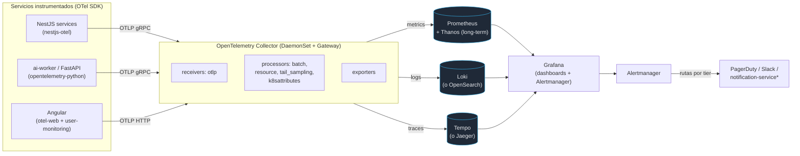
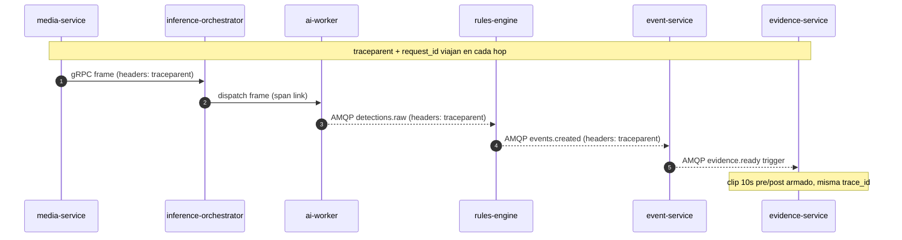
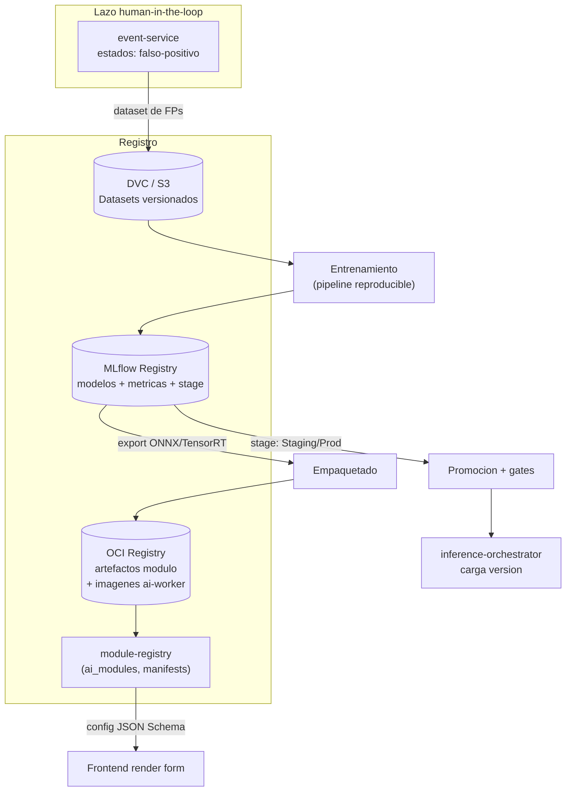

> Parte de la documentación de arquitectura de **Percepta** — Plataforma SaaS de Análisis Inteligente de Video con IA modular. Ver [índice](README.md).
> ⚠️ **Ante cualquier conflicto de contrato (nombres de columna, enums, firmas, esquemas), manda [CONTRACTS.md](CONTRACTS.md)** — este documento describe la arquitectura y el *porqué*; los detalles congelados para implementación viven allí.

## Operacion, Observabilidad, MLOps, CI/CD, Testing y Confiabilidad

Esta seccion define como Percepta se **opera, se observa, se prueba y se despliega** de forma confiable, y como el ciclo de vida de los modelos de IA (los plugins que corren en `ai-worker`) se gestiona con rigor de MLOps. Todo se apoya en las decisiones compartidas del brief y mantiene consistencia estricta de nombres de servicios (kebab-case), entidades (snake_case) y exchanges del bus.

Principio rector transversal: **el pipeline es asincrono y multi-hop** (media-service -> inference-orchestrator -> ai-worker -> `detections.raw` -> rules-engine -> event-service -> evidence-service -> notification-service). Por lo tanto, observabilidad y confiabilidad se disenan **para saltos asincronos con backpressure**, no para un request HTTP lineal. Y como toda deteccion es una **alerta human-in-the-loop**, la calidad del modelo (precision, tasa de falsos positivos) es una **metrica de operacion de primer nivel**, no solo un asunto de data science.

---

### 1. Marco de confiabilidad: SLO, SLI y presupuesto de error

Antes de instrumentar, definimos que significa "sano". Se establecen SLIs por tipo de carga y SLOs con **presupuesto de error** que gobiernan los despliegues (si se agota el budget, se congelan releases no urgentes via politica en Argo Rollouts).

| Dominio | SLI | SLO objetivo | Ventana |
|---|---|---|---|
| API sincrona (`api-gateway`) | p99 latencia REST | < 400 ms | 30 d |
| Realtime dashboard | Latencia evento->WebSocket (event-service -> Redis pub/sub -> `api-gateway`) | p95 < 1.5 s | 30 d |
| Pipeline de inferencia | Latencia frame->deteccion (`detections.raw`) | p95 < 700 ms (GPU), < 2 s (CPU) | 7 d |
| Pipeline de evento | Latencia deteccion->evento->evidencia (`evidence.ready`) | p95 < 8 s (clip 10s pre/post) | 7 d |
| Ingesta de camaras | % camaras con stream activo | > 99.0% flota | 30 d |
| Disponibilidad servicios core | Uptime (`identity-service`, `event-service`, `device-service`) | 99.9% | 30 d |
| Calidad de modelo (por modulo) | Tasa de falsos positivos confirmada por operadores | < umbral por modulo (declarado en `module.json`) | 30 d |

Los SLI de calidad de modelo se calculan directamente del **workflow de revision humana** de `event-service` (transiciones a `falso-positivo`), cerrando el lazo entre operacion y MLOps (seccion 3.4).

**Clasificacion de criticidad de servicios** (define prioridad de alertas, PDB y HPA):

- **Tier 0 (nunca cae):** `identity-service`, `api-gateway`, `event-service`, PostgreSQL, Redis, RabbitMQ.
- **Tier 1 (degradacion aceptable, no perdida):** `device-service`, `media-service`, `inference-orchestrator`, `rules-engine`, `evidence-service`.
- **Tier 2 (best-effort, reintentable):** `notification-service`, `analytics-service`, `billing-service`, `audit-service` (audit debe garantizar durabilidad aunque haya lag).

---

### 2. Observabilidad

Adoptamos los tres pilares (logs, metricas, trazas) unificados por un **contexto de correlacion** que sobrevive los saltos por RabbitMQ y Redis. Base tecnologica: **OpenTelemetry Collector** como punto unico de recepcion (OTLP), enrutando a los backends.



\* Alertas operativas del cluster NO reutilizan `notification-service` (evitamos dependencia circular: si el bus cae, las alertas seguirian saliendo por Alertmanager -> PagerDuty/Slack, canal independiente).

#### 2.1 Logging estructurado centralizado

Regla dura: **JSON estructurado, un evento por linea, a stdout** (Twelve-Factor); la recoleccion es responsabilidad de la plataforma (Collector/Promtail), nunca del codigo. **Prohibido** `console.log` / `print` libres.

Esquema de log canonico (identico en NestJS y Python para permitir queries cross-service en Loki):

```json
{
  "timestamp": "2026-07-30T14:22:05.123Z",
  "level": "info",
  "service": "rules-engine",
  "version": "1.8.2",
  "env": "prod",
  "trace_id": "4bf92f3577b34da6a3ce929d0e0e4736",
  "span_id": "00f067aa0ba902b7",
  "request_id": "req_7f3a...",
  "organization_id": "8c1e...-uuid",
  "site_id": "d2b0...-uuid",
  "camera_id": "a91f...-uuid",
  "module_id": "intrusion-detection",
  "event_type": "zone_intrusion",
  "message": "detection matched rule; event emitted",
  "detection_confidence": 0.87,
  "duration_ms": 12
}
```

Decisiones y trade-offs:

- **`organization_id` en TODO log** (multitenancy estricta). Permite aislar por tenant en soporte y auditoria. Se inyecta via un `AsyncLocalStorage` (NestJS) / `contextvars` (Python) poblado por el interceptor de contexto, no manualmente.
- **PII y privacidad por diseno:** los logs **nunca** contienen frames, crops de rostros/placas, ni bounding boxes con contenido de imagen. Se loguea el `evidence_id` (referencia a MinIO/S3), no el binario. Un processor de OTel Collector aplica **redaccion** (regex sobre campos sospechosos) como red de seguridad.
- **NestJS:** `nestjs-pino` con `pino-http` (rendimiento > winston para alto volumen). **Python:** `structlog` + `python-json-logger`.
- **Retencion diferenciada:** logs de Tier 0/1 30 dias en Loki (indices por `service`, `organization_id`, `level`); `audit-service` **no** usa Loki para su registro inmutable de negocio — ese vive en la tabla `audit_logs` (append-only, WORM en S3 Object Lock para copias), independiente de la observabilidad operativa.

Query de ejemplo (Loki/LogQL) para depurar un evento concreto extremo a extremo:

```logql
{env="prod"} | json | trace_id="4bf92f3577b34da6a3ce929d0e0e4736"
```

#### 2.2 Correlacion end-to-end a traves del pipeline asincrono

El reto central: un frame genera trabajo que atraviesa HTTP (gRPC), colas AMQP y pub/sub Redis. Usamos **W3C Trace Context** (`traceparent`) como identidad unica, propagada explicitamente en cada hop.

- **HTTP/gRPC (api-gateway, inference-orchestrator, ai-worker):** autoinstrumentacion OTel; el `traceparent` viaja en headers.
- **RabbitMQ:** el `traceparent` y `request_id` viajan en **AMQP message headers** (`properties.headers`). Cada consumidor extrae el contexto y crea un span hijo con **span links** (porque un batch de detecciones puede fan-in/fan-out).
- **Redis (tracking state + pub/sub realtime):** se serializa `trace_id` dentro del payload del mensaje pub/sub.

Publicacion instrumentada (NestJS, `rules-engine` publicando en `events.created`):

```typescript
// rules-engine: publish con contexto propagado
import { propagation, context, trace } from '@opentelemetry/api';

async publishEventCreated(evt: EventCreatedPayload) {
  const headers: Record<string, string> = {};
  propagation.inject(context.active(), headers); // inyecta traceparent
  headers['x-request-id'] = this.ctx.requestId;
  headers['x-organization-id'] = evt.organizationId;

  await this.amqp.publish('events.created', `event.${evt.eventType}`, evt, {
    persistent: true,          // durabilidad (quorum queues)
    messageId: evt.eventId,    // idempotencia downstream
    headers,
    timestamp: Date.now(),
  });
}
```

Consumo instrumentado (Python, `ai-worker` consumiendo del orchestrator o publicando `detections.raw`):

```python
from opentelemetry import trace, propagate, context
tracer = trace.get_tracer("ai-worker")

def on_frame(msg):
    ctx = propagate.extract(msg.headers)  # reconstruye traceparent
    link = trace.Link(trace.get_current_span(ctx).get_span_context())
    with tracer.start_as_current_span(
        "inference.run",
        context=context.Context(),
        links=[link],
        attributes={
            "percepta.camera_id": msg.headers["x-camera-id"],
            "percepta.module_id": msg.headers["x-module-id"],
            "percepta.organization_id": msg.headers["x-organization-id"],
        },
    ) as span:
        result = model.infer(frame)
        span.set_attribute("percepta.inference_ms", result.latency_ms)
        span.set_attribute("percepta.detections", len(result.boxes))
```

**Sampling:** `tail_sampling` en el Collector — 100% de trazas con error o con `event_type` (queremos toda traza que termino en evento), 1-5% del resto para controlar costo. La decision se toma cuando la traza completa termina, no al inicio.



#### 2.3 Metricas (Prometheus + Grafana)

Convencion de nombres: `percepta_<dominio>_<metrica>_<unidad>`, siempre con labels de bajo cardinalidad controlada. **Cuidado con cardinalidad:** `camera_id` y `module_id` son de alta cardinalidad (miles de camaras); se exponen en histogramas agregables y se limita su uso en series contadoras mediante **recording rules** de agregacion, no exponiendo por-camera todas las metricas crudas. Metricas por-camara de detalle fino van a **TimescaleDB via analytics-service** (series temporales de negocio), no a Prometheus (metricas de sistema).

**Convencion de labels estandar:** `service`, `env`, `organization_id` (solo donde el conteo por tenant es necesario y acotado), `module_id`, `gpu_uuid`, `node`.

Catalogo de metricas clave:

| Ambito | Metrica (Prometheus) | Tipo | Labels | Uso operativo |
|---|---|---|---|---|
| **Por servicio** | `percepta_http_request_duration_seconds` | Histogram | service, route, status | SLO latencia API |
| | `percepta_amqp_consumer_lag_messages` | Gauge | service, queue | Backlog / backpressure |
| | `percepta_amqp_processing_duration_seconds` | Histogram | service, exchange | Salud de cada hop |
| | `percepta_errors_total` | Counter | service, kind | Error rate / burn-rate |
| **Por camara** | `percepta_stream_up` | Gauge (0/1) | camera_id, site_id | Salud de stream (alerta) |
| | `percepta_ingest_fps` | Gauge | camera_id | FPS real vs configurado |
| | `percepta_frame_drop_ratio` | Gauge | camera_id | Perdida de frames |
| | `percepta_reconnect_total` | Counter | camera_id | Flapping RTSP |
| **Por GPU** | `percepta_gpu_utilization_ratio` | Gauge | gpu_uuid, node | Saturacion / escalado |
| | `percepta_gpu_memory_used_bytes` | Gauge | gpu_uuid | OOM prevencion |
| | `percepta_gpu_temperature_celsius` | Gauge | gpu_uuid | Throttling termico |
| | `percepta_gpu_encoder_utilization_ratio` | Gauge | gpu_uuid | NVENC (media-service) |
| **Por modulo** | `percepta_inference_latency_seconds` | Histogram | module_id, backend | Latencia inferencia |
| | `percepta_inference_fps` | Gauge | module_id, gpu_uuid | Throughput por modulo |
| | `percepta_inference_queue_depth` | Gauge | module_id | Profundidad de cola |
| | `percepta_detections_total` | Counter | module_id, event_type | Tasa de deteccion |
| | `percepta_events_total` | Counter | module_id, event_type | Tasa de eventos |
| | `percepta_false_positive_ratio` | Gauge | module_id | **Calidad (SLI clave)** |
| | `percepta_model_confidence` | Histogram | module_id | Deriva de scores (drift) |

`percepta_false_positive_ratio` se alimenta por **recording rule** que combina eventos totales con las transiciones a `falso-positivo` que `event-service` expone. Fuente de la fuente de verdad = tabla `events` (estado del workflow), reflejada a Prometheus por un exporter de `event-service`.

Exposicion GPU: **DCGM Exporter** (NVIDIA) como DaemonSet en nodos GPU -> labels `gpu_uuid`, `node`, correlacionables con `ai-worker` via el `pod`/`gpu_uuid` que el worker reporta al arrancar.

Ejemplo de instrumentacion Python (`ai-worker`) con `prometheus_client`:

```python
from prometheus_client import Histogram, Gauge, Counter

INFER_LATENCY = Histogram(
    "percepta_inference_latency_seconds",
    "Latencia de inferencia por modulo",
    ["module_id", "backend"],
    buckets=(0.01, 0.025, 0.05, 0.1, 0.2, 0.5, 1, 2, 5),
)
QUEUE_DEPTH = Gauge("percepta_inference_queue_depth", "Frames en cola", ["module_id"])
DETECTIONS = Counter("percepta_detections_total", "Detecciones", ["module_id", "event_type"])

with INFER_LATENCY.labels(module_id="ppe-detection", backend="tensorrt").time():
    result = model.infer(frame)
```

**Recording rules** (agregacion para dashboards, controla cardinalidad):

```yaml
groups:
  - name: percepta-inference.rules
    interval: 30s
    rules:
      - record: percepta:inference_latency_p95:module
        expr: histogram_quantile(0.95,
                sum(rate(percepta_inference_latency_seconds_bucket[5m]))
                by (le, module_id))
      - record: percepta:gpu_saturation:node
        expr: avg(percepta_gpu_utilization_ratio) by (node)
```

Dashboards de Grafana provisionados como codigo (JSON en Git, `grafana-operator`): (1) **Vista de flota** (mapa de calor de camaras `stream_up`), (2) **Pipeline** (latencia por hop, consumer lag por queue), (3) **GPU/Inferencia** (utilizacion, FPS, queue depth por modulo), (4) **Calidad de modelos** (`false_positive_ratio` por modulo y version), (5) **SLO/Error budget** (burn-rate).

#### 2.4 Alerting operativo (Alertmanager)

Estrategia **multi-window multi-burn-rate** para SLOs (evita ruido) y alertas de sintoma para infraestructura. Rutas por tier -> severidad -> canal (Tier 0 -> PagerDuty page; Tier 2 -> Slack). Ejemplos:

```yaml
groups:
  - name: percepta-camaras.alerts
    rules:
      - alert: CamaraStreamCaido
        expr: percepta_stream_up == 0
        for: 2m
        labels: { severity: warning, tier: "1" }
        annotations:
          summary: "Camara {{ $labels.camera_id }} sin stream >2m"
          runbook: "https://runbooks/percepta/stream-down"

      - alert: BacklogInferenciaCritico
        expr: percepta_amqp_consumer_lag_messages{queue="detections.raw"} > 5000
        for: 3m
        labels: { severity: critical, tier: "1", page: "true" }
        annotations:
          summary: "Backlog detections.raw creciente: posible caida de ai-worker o saturacion GPU"

      - alert: AiWorkerCaido
        expr: (sum(up{job="ai-worker"}) / count(up{job="ai-worker"})) < 0.7
        for: 2m
        labels: { severity: critical, tier: "1", page: "true" }

      - alert: ModeloFalsosPositivosAlto
        expr: percepta_false_positive_ratio > 0.25
        for: 30m
        labels: { severity: warning, tier: "1", team: "mlops" }
        annotations:
          summary: "Modulo {{ $labels.module_id }} FP>25%: candidato a rollback/reentrenamiento"

      - alert: GpuThrottlingTermico
        expr: percepta_gpu_temperature_celsius > 85
        for: 5m
        labels: { severity: warning, tier: "1" }
```

Alertas clave requeridas por el brief cubiertas: **salud de camaras/streams** (`CamaraStreamCaido`, `percepta_reconnect_total` para flapping), **caida de workers** (`AiWorkerCaido`), **backlog** (`BacklogInferenciaCritico` sobre consumer lag). Se anaden **inhibition rules** (si un `node` cae, se suprimen alertas por-camara de las camaras servidas por ese nodo para evitar tormentas).

---

### 3. MLOps: ciclo de vida de modelos y modulos

Un **modulo** (plugin, `module.json`) y un **modelo** (pesos entrenados) son artefactos distintos con versionado independiente pero acoplado. `module-registry` es la fuente de verdad del **catalogo de modulos** (entidad `ai_modules`); el **model registry** (MLflow) es la fuente de verdad de **pesos + metricas de entrenamiento**. El `module.json` referencia una version de modelo concreta.



#### 3.1 Versionado de modelos y de modulos

- **Modelo:** SemVer + hash de dataset. Registrado en MLflow con: metricas (mAP, precision/recall por clase, matriz de confusion), dataset hash (DVC), commit del codigo de entrenamiento, framework, y **stage** (`None`/`Staging`/`Production`/`Archived`).
- **Modulo:** SemVer en `module.json`. El manifest declara la version de modelo requerida y el **contrato de configuracion** (JSON Schema) que el frontend renderiza. Cambios de esquema de config o de tipos de evento => **major bump** (rompe compatibilidad con `camera_module_configs` existentes; requiere migracion de config).

Manifest ilustrativo (`module.json`) alineado a las entidades del brief:

```json
{
  "id": "intrusion-detection",
  "name": "Deteccion de intrusion en zona",
  "category": "security",
  "version": "2.3.0",
  "model": {
    "registry": "mlflow://models/intrusion-detection/Production",
    "version": "2.3.0",
    "backend": "tensorrt",
    "artifact": "oci://registry.percepta.io/models/intrusion-detection:2.3.0-trt"
  },
  "input": { "requires": ["zones"], "min_fps": 8, "roi": true },
  "resources": { "gpu": true, "vram_mb": 1200, "target_fps": 15 },
  "config_schema": {
    "$schema": "http://json-schema.org/draft-07/schema#",
    "type": "object",
    "properties": {
      "confidence_threshold": { "type": "number", "minimum": 0, "maximum": 1, "default": 0.6 },
      "cooldown_seconds": { "type": "integer", "minimum": 0, "default": 30 },
      "active_schedule": { "type": "array", "items": { "type": "string" } }
    },
    "required": ["confidence_threshold"]
  },
  "emits": ["zone_intrusion", "loitering"]
}
```

#### 3.2 Promocion dev -> staging -> prod

Promocion **gobernada por gates automaticos**, no por opinion. Transicion de stage en MLflow disparada por pipeline con evaluacion offline sobre **golden dataset** por modulo:

| Gate | Criterio (ejemplo, parametrizable por modulo) | Bloqueante |
|---|---|---|
| Precision | `precision >= baseline_prod - 1pp` y `recall >= baseline` | Si |
| Regresion FP | FP en golden set no supera baseline | Si |
| Latencia | p95 inferencia dentro de presupuesto de `module.json` (`target_fps`) | Si |
| Recursos | VRAM medida <= declarada en manifest | Si |
| Fairness/robustez | Rendimiento por segmento (dia/noche, resolucion) sin caida > umbral | Advertencia |
| Firma/procedencia | Artefacto firmado (cosign), dataset hash trazable | Si |

Aprobado el gate, un job promueve el stage a `Staging`, se ejecuta **shadow** en produccion (3.3), y solo con evidencia real se promueve a `Production`.

#### 3.3 Shadow y A/B de modelos

Como las detecciones son alertas human-in-the-loop, **preferimos shadow (evaluacion en la sombra) sobre A/B en vivo** para nuevas versiones: el modelo candidato procesa el **mismo stream de frames** que el productivo pero sus salidas **no generan eventos ni alertas**; solo se registran para comparacion. Cero riesgo para operadores, medicion con trafico real.

- `inference-orchestrator` soporta **doble ruteo**: primario (`Production`) que fluye a `detections.raw`, y shadow (`Staging`) que fluye a `detections.shadow` (exchange interno no productivo). `rules-engine` ignora `detections.shadow`; un `shadow-evaluator` compara distribuciones y concordancia.
- **A/B / canary de modelo** (cuando se quiere validar impacto en tasa de eventos) se hace por **porcentaje de camaras** dentro de un tenant piloto, controlado por feature flag (`model_canary_pct`), con rollback inmediato si `false_positive_ratio` supera umbral (misma alerta operativa de la seccion 2.4).

Trade-off: shadow duplica costo de inferencia durante la evaluacion; se acota a un subconjunto representativo de camaras y a ventanas de tiempo, no a la flota completa.

#### 3.4 Lazo de feedback de falsos positivos y reentrenamiento

Este es el diferencial de Percepta: el **workflow de revision humana** (`event-service`: `nuevo -> reconocido -> confirmado/descartado/falso-positivo`) es la **fuente de etiquetas de calidad**.

1. Operador marca un evento como `falso-positivo` (o `confirmado`) en el dashboard.
2. `event-service` publica en `events.created` con el nuevo estado; un `feedback-collector` consume estas transiciones.
3. La **evidencia** (imagen + clip en MinIO/S3, referida por `evidence_id`) + metadata (`module_id`, `model_version`, `detection_confidence`, `camera_id`) se agrega a un **dataset de correccion** versionado en DVC, particionado por modulo.
4. Cuando se acumula suficiente senal (o `false_positive_ratio` cruza umbral), se dispara un pipeline de **reentrenamiento/fine-tuning**, se registra nueva version en MLflow y entra al flujo de promocion (3.2) -> shadow (3.3).

**Privacidad por diseno:** el dataset de feedback respeta la multitenancy; datos de un tenant **no** se usan para entrenar modelos servidos a otros salvo consentimiento contractual explicito. Politica de retencion y minimizacion (blur de rostros/placas en el dataset cuando el modulo no las requiere).

#### 3.5 Versionado de datasets (DVC)

- **DVC** sobre backend S3/MinIO; cada dataset y split (`train/val/golden`) es un `.dvc` versionado en Git. El **hash del dataset** es un campo obligatorio del registro MLflow => reproducibilidad total (modelo <-> datos <-> codigo).
- **Golden dataset** por modulo, inmutable y curado, congelado para comparabilidad de metricas entre versiones (evita "moving target").

#### 3.6 Evaluacion de precision y deteccion de drift

- **Offline:** metricas por modulo en golden set en cada release (mAP, precision/recall por clase, matriz de confusion) versionadas en MLflow.
- **Online:** monitoreo continuo de drift sin ground-truth inmediato:
  - **Data drift:** distribucion de `percepta_model_confidence` (histograma) y de features de entrada (brillo/contraste/resolucion) comparada contra baseline de entrenamiento (PSI / KL divergence, job diario en `analytics-service`).
  - **Concept drift proxy:** tendencia de `percepta_false_positive_ratio` por modulo/version (senal humana real). Es el indicador mas fuerte porque proviene del human-in-the-loop.
- Alerta `ModeloFalsosPositivosAlto` y un panel de drift disparan revision MLOps.

#### 3.7 Empaquetado: ONNX / TensorRT

Pipeline de empaquetado estandariza el runtime del `ai-worker`:

- Entrenamiento en PyTorch/TF -> **export a ONNX** (opset fijo por modulo) como formato portable/intercambiable -> **compilacion a TensorRT** por arquitectura de GPU objetivo (FP16/INT8 con calibracion) para maximo throughput en nodos NVIDIA.
- CPU-only / edge on-premise sin GPU: se sirve el ONNX con **onnxruntime** (fallback declarado en `module.json` -> `backend: onnx`), aceptando menor FPS.
- **Trade-off clave:** el engine TensorRT es especifico de version de GPU/driver y **no portable**; por eso se compila en CI **por familia de GPU** y se publica como tag OCI distinto (`:2.3.0-trt-sm86`, `:2.3.0-onnx`). El `inference-orchestrator` selecciona el artefacto segun el hardware del nodo. Esto sostiene el requisito on-premise/cloud/hibrido: mismo modelo, empaquetado adecuado al target.

---

### 4. CI/CD

Tres perfiles de pipeline (frontend Angular, servicios NestJS, workers Python) convergen en **imagenes OCI firmadas** desplegadas a K8s via **GitOps con ArgoCD + Helm**. Estrategia: **CI en GitHub Actions/GitLab CI, CD declarativo en Git** (nada de `kubectl apply` manual).

```mermaid
flowchart LR
  DEV["Push / PR"] --> LINT["Lint + typecheck\n(eslint, ruff, mypy)"]
  LINT --> UT["Unit tests\n(Jest / pytest / Karma)"]
  UT --> CT["Contract tests\n(Pact verify)"]
  CT --> BUILD["Build imagen\n(multi-stage, distroless)"]
  BUILD --> SCAN["Escaneo seguridad\nTrivy + SCA + secret scan\n+ SBOM (syft)"]
  SCAN --> SIGN["Firma cosign\n+ atestacion SLSA"]
  SIGN --> PUSH["Push OCI Registry"]
  PUSH --> BUMP["Bump Helm values\n(image tag) en repo GitOps"]

  subgraph GitOps["Repo GitOps (Argo CD)"]
    BUMP --> ARGO["Argo CD sync"]
  end
  ARGO --> STG["Staging cluster\n(auto-sync)"]
  STG --> E2E["E2E + smoke +\npipeline-IA con videos ref"]
  E2E --> ROLL["Argo Rollouts\nCanary / Blue-Green"]
  ROLL --> PROD["Prod cluster\n(analisis metricas -> promote/abort)"]

  classDef gate fill:#0b3d2e,stroke:#22c55e,color:#e5e7eb;
  class SCAN,SIGN,E2E,ROLL gate;
```



#### 4.1 Frontend (Angular 15)

- `eslint` + `stylelint` + `tsc --noEmit`; unit con **Jest/Karma**; **componentes con Storybook** + tests visuales; e2e con **Playwright/Cypress**.
- Build de produccion (`ng build --configuration production`), servido por Nginx en imagen **distroless**; assets con hash y cache-busting.
- **Config runtime, no build-time:** el frontend lee endpoints/feature flags de un `config.json`/`/api/v1/config` inyectado por ConfigMap => una misma imagen sirve todos los entornos (evita rebuild por env).

#### 4.2 Servicios NestJS

- `eslint` + `tsc`; **Jest** unit + integracion (Testcontainers: Postgres, Redis, RabbitMQ efimeros); **Pact** consumer/provider (4.7); build **multi-stage** -> imagen **distroless node18**, non-root, read-only FS.
- **Migraciones de BD** (4.6) versionadas junto al servicio, ejecutadas como **Argo pre-sync hook (Job)**, no en el arranque del pod (evita carreras entre replicas).

#### 4.3 Workers Python (ai-worker + servicios IA)

- `ruff` + `mypy`; **pytest** unit; tests de contrato de gRPC (protobuf compatibility check con `buf`); **tests de pipeline de IA con videos de referencia** (4.7).
- Imagen base **CUDA** (nvidia/cuda runtime) para GPU y una variante slim CPU. Dependencias pineadas (`poetry.lock` / `pip-compile`) para reproducibilidad. **La imagen no incluye pesos**: los modelos se montan/descargan del OCI/MLflow por version -> desacopla ciclo de vida de codigo vs. modelo.
- Job de **compilacion TensorRT por familia de GPU** (3.7) como matriz de build.

#### 4.4 GitOps: ArgoCD + Helm

- **Un Helm chart parametrizado por servicio** (o umbrella chart) + `values-<env>.yaml`. **App-of-apps** en ArgoCD; **ApplicationSet** para generar apps por servicio/entorno.
- **Promocion entre entornos = PR que cambia el image tag** en el repo GitOps (auditable, revertible con `git revert`). Staging con `automated sync + selfHeal`; prod con sync **manual/aprobado** + Rollouts.
- **Secrets:** **External Secrets Operator** sincroniza desde **Vault** (nunca secrets en Git; ni siquiera Sealed Secrets para material sensible de camaras) — ver 6.

#### 4.5 Estrategia de releases: canary / blue-green

Con **Argo Rollouts**:

- **Servicios stateless de API (Tier 0/1: `api-gateway`, `event-service`, `identity-service`):** **canary** con analisis automatico de metricas Prometheus (error rate, p99 latencia) en cada step; abort automatico si degrada.
- **`ai-worker` / `inference-orchestrator`:** despliegue **por oleadas (surge)** con `maxSurge` controlado por presion de GPU; nunca drenar todos los workers a la vez (mantiene throughput del pipeline). Nueva **version de modelo** NO es un release de codigo: se activa via shadow/canary de modelo (3.3), independiente del rollout de imagen.
- **`media-service`:** **blue-green** por node-pool para minimizar cortes de streams WebRTC/RTSP; conexiones existentes se drenan (`terminationGracePeriodSeconds` alto) antes de matar el pod azul.

Ejemplo de canary con analisis:

```yaml
apiVersion: argoproj.io/v1alpha1
kind: Rollout
metadata: { name: event-service }
spec:
  strategy:
    canary:
      steps:
        - setWeight: 10
        - pause: { duration: 5m }
        - analysis:
            templates: [{ templateName: error-rate-and-latency }]
        - setWeight: 50
        - pause: { duration: 10m }
        - setWeight: 100
---
apiVersion: argoproj.io/v1alpha1
kind: AnalysisTemplate
metadata: { name: error-rate-and-latency }
spec:
  metrics:
    - name: error-ratio
      interval: 1m
      failureLimit: 1
      provider:
        prometheus:
          address: http://prometheus:9090
          query: |
            sum(rate(percepta_errors_total{service="event-service"}[2m]))
            / sum(rate(percepta_http_request_duration_seconds_count{service="event-service"}[2m]))
      # aborta el rollout si supera 2%
      successCondition: result < 0.02
```

#### 4.6 Migraciones de base de datos

- Herramienta por stack (**TypeORM/Prisma migrations** en NestJS; Alembic donde aplique en Python). **Regla:** migraciones **expand/contract** (backward-compatible), en dos releases, para permitir canary/blue-green sin downtime:
  1. *Expand:* agrega columnas/tablas nuevas (nullable), la app vieja y nueva conviven.
  2. Deploy del codigo que usa lo nuevo.
  3. *Contract:* elimina lo viejo en un release posterior.
- **RLS por `organization_id`:** cada migracion que crea tabla tenant-scoped debe incluir su `POLICY` de Row-Level Security. Test automatico verifica que **ninguna tabla con `organization_id` quede sin RLS habilitada** (bloquea el merge):

```sql
-- Migracion: nueva tabla tenant-scoped SIEMPRE con RLS
ALTER TABLE camera_module_configs ENABLE ROW LEVEL SECURITY;
CREATE POLICY tenant_isolation ON camera_module_configs
  USING (organization_id = current_setting('app.current_org')::uuid);
```

```sql
-- Guardrail en CI: falla si alguna tabla con organization_id no tiene RLS
SELECT c.relname
FROM pg_class c
JOIN pg_attribute a ON a.attrelid = c.oid AND a.attname = 'organization_id'
WHERE c.relkind = 'r' AND NOT c.relrowsecurity;
-- Debe devolver 0 filas
```

#### 4.7 Seguridad en el pipeline (DevSecOps)

- **SAST/SCA:** Trivy/Grype (imagen + deps), `npm audit`/`pip-audit`, `gitleaks` (secret scanning) — bloqueante en severidad alta.
- **SBOM** (`syft`) por imagen; **firma cosign** + atestacion (procedencia SLSA); ArgoCD verifica firma antes de desplegar (**politica Kyverno**: solo imagenes firmadas del registro Percepta corren en prod).
- Escaneo de **manifiestos de modulo (plugins)**: un modulo de terceros pasa por sandbox/escaneo antes de entrar a `module-registry` (superficie de plugin = superficie de ataque).

---

### 5. Testing y confiabilidad

Piramide de pruebas adaptada a un sistema de microservicios + pipeline de IA asincrono.

| Nivel | Alcance | Herramientas | Gate |
|---|---|---|---|
| **Unit** | Logica pura por servicio (rules-engine: evaluacion horarios/zonas/umbrales; cooldown/dedup) | Jest, pytest | PR |
| **Integracion** | Servicio + dependencias reales efimeras (Postgres+RLS, Redis, RabbitMQ) | **Testcontainers** | PR |
| **Contract (Pact)** | Compatibilidad productor/consumidor sin levantar todo | **Pact Broker** | PR + can-i-deploy |
| **E2E** | Flujos criticos UI->API->BD | Playwright | Staging |
| **Pipeline IA** | Videos de referencia -> deteccion esperada | pytest + fixtures de video | Staging |
| **Carga/estres** | Throughput e ingesta a escala | **k6** (API), simulador RTSP (media) | Nocturno / pre-release |
| **Caos** | Resiliencia ante fallos | LitmusChaos | Programado |

#### 5.1 Contract testing con Pact

Los servicios se comunican por REST (sincrono) y AMQP (asincrono). Pact cubre **ambos**:

- **HTTP:** p.ej. `api-gateway` (consumer) <-> `event-service` (provider).
- **Mensajeria:** contratos de **mensaje** para `events.created`, `evidence.ready`, `detections.raw` — el consumidor declara el shape del payload que espera; el productor lo verifica. Esto evita que un cambio en el payload de `rules-engine` rompa silenciosamente a `event-service`.
- **`can-i-deploy`** en el pipeline: un servicio **no** se despliega a prod si romperia el contrato de un consumidor ya desplegado (integra Pact Broker con la matriz de versiones desplegadas).

```javascript
// Pact (consumer) — mensaje events.created esperado por event-service
messagePact
  .expectsToReceive('un evento creado por rules-engine')
  .withContent({
    eventId: like('uuid'),
    organizationId: like('uuid'),
    cameraId: like('uuid'),
    moduleId: like('intrusion-detection'),
    eventType: like('zone_intrusion'),
    confidence: like(0.87),          // toda alerta lleva score
    detectedAt: like('2026-07-30T14:22:05.123Z'),
  })
  .withMetadata({ 'x-organization-id': like('uuid') });
```

#### 5.2 Pruebas del pipeline de IA con videos de referencia

Suite dedicada que trata a los modulos como cajas evaluables de forma reproducible:

- **Corpus de videos de referencia** versionado en DVC, con **anotaciones ground-truth** (frame -> evento esperado). Cubre casos: positivos, negativos, condiciones adversas (noche, lluvia, oclusion, baja resolucion).
- El test alimenta el video por `media-service` (o directo al `ai-worker` en modo test) y verifica: (a) se emitieron los `event_type` esperados dentro de una **tolerancia temporal**, (b) el `confidence` esta en rango, (c) **no** hay falsos positivos por encima del umbral del modulo.
- **Assertion de no-regresion:** metricas del corpus comparadas contra baseline; caida > umbral **bloquea** el release del modulo (une CI con los gates de promocion de 3.2).
- Determinismo: seeds fijos, versiones de modelo pineadas, GPU/CPU declarada — se acepta tolerancia numerica por backend (FP16/TensorRT vs FP32).

#### 5.3 Pruebas de carga

- **API/realtime (k6):** simula miles de conexiones WebSocket/SSE al `api-gateway` y ratios de eventos; valida SLO de latencia evento->dashboard.
- **Ingesta (media-service):** **simulador RTSP** que emula N camaras (p.ej. `mediamtx` + FFmpeg loop) para validar transcodificacion, ring-buffer y escalado de `inference-orchestrator`/`ai-worker` bajo carga real de frames.
- **Cola/backpressure:** se inyecta rafaga en `detections.raw` para verificar que HPA de `ai-worker` y las **quorum queues** de RabbitMQ absorben el pico sin perdida (mensajes `persistent`, dead-letter exchange para envenenados).

#### 5.4 Ingenieria de caos y resiliencia

Experimentos programados (LitmusChaos) que validan los principios de alta disponibilidad y tolerancia a fallos del brief: matar `ai-worker` (verifica reencolado y HPA), particion de RabbitMQ (verifica reconexion y no-perdida con quorum), latencia en PostgreSQL (verifica timeouts/circuit breakers), caida de un nodo GPU (verifica reprogramacion de camaras). Cada experimento tiene **hipotesis de estado estable** medida con las metricas de la seccion 2.

**Patrones de resiliencia obligatorios en codigo:** timeouts explicitos, **retries con backoff exponencial + jitter e idempotencia** (todos los consumidores AMQP idempotentes por `messageId`/`eventId`), **circuit breakers** hacia dependencias externas (WhatsApp/Telegram/Stripe en `notification-service`/`billing-service`), **dead-letter queues** con reproceso, **PodDisruptionBudgets** por tier, y **outbox pattern** en `event-service` para publicar a `events.created` de forma transaccional (evita perder eventos si el broker esta caido tras el commit en BD).

---

### 6. Gestion de configuracion, secretos, feature flags, zonas horarias y NTP

#### 6.1 Configuracion y secretos

- **Config no sensible:** ConfigMaps por entorno, versionados en el repo GitOps. Jerarquia: defaults del chart < `values-<env>` < override por tenant (para limites/plan, desde `billing-service`).
- **Secretos:** **HashiCorp Vault** como fuente unica; **External Secrets Operator** materializa Kubernetes Secrets. Nada de secretos en Git ni en imagenes.
- **Credenciales de camara (caso critico de `device-service`):** el brief exige **vault de credenciales de camara**. Se almacenan cifradas en Vault (transit engine), **nunca** en la tabla `cameras` en claro; la BD guarda solo una referencia (`vault_path`) y metadatos. `media-service` obtiene la credencial en runtime con un token de corta vida (Vault dynamic/leased). Rotacion soportada sin redeploy.
- **Aislamiento multitenant de secretos:** paths de Vault namespaced por `organization_id`; politicas Vault impiden cross-tenant.

#### 6.2 Feature flags

- Servicio de flags (**Unleash** self-hosted, on-prem friendly) con SDK en NestJS/Python/Angular. Usos: activar **modulos beta**, **canary de modelo por porcentaje de camaras/tenant** (`model_canary_pct`, seccion 3.3), habilitar canales de `notification-service`, y **kill-switches** operativos (p.ej. desactivar un modulo que dispara FP masivos sin redeploy).
- Flags evaluados con contexto (`organization_id`, `site_id`, `plan`) => rollout segmentado y consistente con billing/planes.

#### 6.3 Zonas horarias por sucursal y sincronizacion de tiempo (NTP)

Requisito de integridad forense de la evidencia: los timestamps deben ser **correctos y comparables** aunque sitios esten en husos distintos.

- **Almacenamiento en UTC ISO-8601 siempre** (convencion del brief). `sites` tiene `timezone` (IANA, p.ej. `America/Argentina/Buenos_Aires`). La conversion a hora local ocurre **solo en presentacion** (frontend / plantillas de `notification-service` / reportes de `analytics-service`), usando el `timezone` del `site` al que pertenece la `camera`, no el del navegador del operador.
- **Sincronizacion de reloj:** todos los nodos (incluidos edge on-premise) corren **chrony/NTP** contra fuentes confiables; las **camaras IP** deben sincronizarse por NTP y `device-service` **monitorea la deriva** entre el timestamp de la camara y el del `media-service` en el momento del ingest.
- **Sello de tiempo autoritativo de la evidencia:** el `captured_at` de una `evidence` lo fija **`media-service`/`evidence-service`** (reloj de plataforma sincronizado), **no** el reloj de la camara (potencialmente desajustado). Se guarda tambien el `camera_reported_at` y el **clock skew** medido, para trazabilidad. Si el skew supera un umbral, se marca la evidencia con un flag de advertencia y se emite alerta operativa (`CamaraClockSkew`), porque una evidencia con hora dudosa degrada su valor para la revision humana.

```sql
-- device-service: control de deriva de reloj por camara
ALTER TABLE cameras
  ADD COLUMN last_clock_skew_ms integer,        -- delta camara vs plataforma
  ADD COLUMN clock_synced boolean DEFAULT false; -- NTP OK reportado

-- evidences: sello autoritativo + trazabilidad de reloj de camara
ALTER TABLE evidences
  ADD COLUMN captured_at timestamptz NOT NULL,       -- reloj plataforma (autoritativo, UTC)
  ADD COLUMN camera_reported_at timestamptz,          -- reloj camara (informativo)
  ADD COLUMN clock_skew_ms integer,                   -- diferencia medida
  ADD COLUMN timestamp_trusted boolean DEFAULT true;  -- false si skew > umbral
```

---

### 7. Resumen de decisiones y trade-offs

| Decision | Alternativa descartada | Justificacion |
|---|---|---|
| OTel Collector unico + Prometheus/Loki/Tempo | Instrumentar por-vendor | Neutralidad, un solo formato de contexto, portable on-prem/cloud/hibrido |
| `traceparent` en headers AMQP + span links | Correlar por logs a mano | Trazabilidad real del pipeline asincrono con fan-in/fan-out |
| Metricas de sistema en Prometheus; series de negocio por-camara en TimescaleDB | Todo en Prometheus | Controla explosion de cardinalidad (miles de camaras) |
| **Shadow** de modelos por defecto | A/B en vivo | Cero riesgo para human-in-the-loop; evalua con trafico real |
| FP ratio (senal humana) como SLI y disparador de reentrenamiento | Solo metricas offline | El lazo human-in-the-loop es la mejor senal de calidad disponible |
| GitOps (ArgoCD) + Rollouts (canary/blue-green) | `kubectl` imperativo | Auditable, revertible, aborta por metricas automaticamente |
| Migraciones expand/contract + guardrail RLS en CI | Migracion directa | Cero-downtime + garantiza multitenancy por diseno |
| Credenciales de camara y secretos en Vault (ref en BD) | Secretos en tabla/Git | Seguridad y rotacion; requisito explicito de `device-service` |
| Timestamp de evidencia autoritativo de plataforma + control de skew | Confiar en reloj de camara | Integridad forense de la evidencia para la revision humana |
| Empaquetado ONNX portable + TensorRT por familia GPU | Un solo binario | Sostiene on-prem sin GPU y maxima performance en GPU |

Esta seccion garantiza que Percepta sea **operable a escala (1 a miles de camaras), observable de punta a punta en un pipeline asincrono, desplegable sin downtime, y con un ciclo de vida de modelos disciplinado** que retroalimenta la calidad desde el propio trabajo de los operadores humanos — consistente con los principios de nucleo estable + plugins, multitenancy estricta, alta disponibilidad y human-in-the-loop.

---

⬅ [Anterior](08-saas-roadmap-costos-y-etica.md) · [Índice](README.md)
