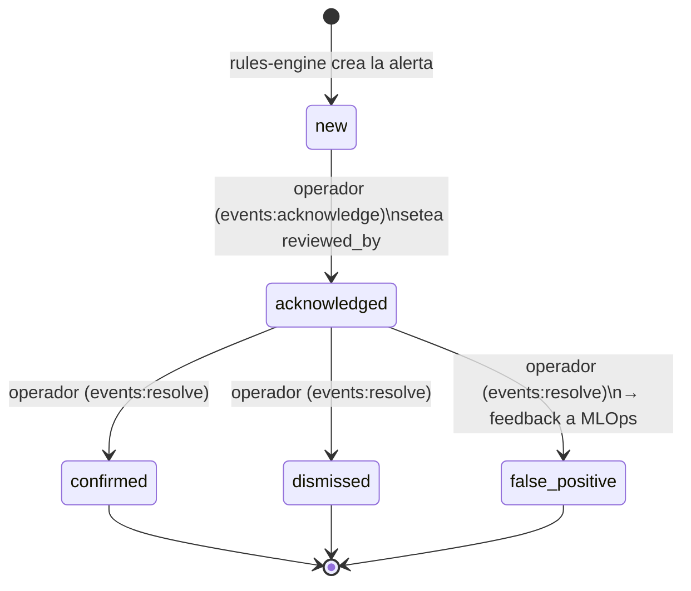
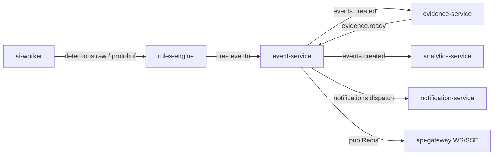

# Percepta — Contratos Canónicos (Single Source of Truth)

> **Este documento gana.** Ante cualquier discrepancia de *contrato de detalle* (nombre de columna, enum, firma de manifest, ruta de endpoint, serialización) entre este archivo y las secciones `00`–`09`, **prevalece lo definido aquí**. Las secciones describen la arquitectura y el *porqué*; este archivo congela el *cómo exacto* que el código debe respetar. Todo lo aquí definido vive físicamente en `packages/contracts` y `packages/py-contracts` del monorepo y se genera/valida en CI.

**Versión del contrato:** `v1.0.2` · **Fecha:** 2026-07-30 · **Estado:** congelado para Fase 1 (MVP) — **esquema verificado contra PostgreSQL 15 + TimescaleDB real**.
**Regla de cambio:** cualquier modificación a este archivo es un cambio de contrato → bump semver + entrada en el changelog al final + regeneración de tipos (`proto`, `ts`, `py`) + migración de BD si aplica.

Resuelve las 4 inconsistencias **bloqueantes** y las 11 **importantes/menores** listadas en [`00-vision-general-y-decisiones.md`](00-vision-general-y-decisiones.md#inconsistencias-detectadas).

---

## Índice

1. [Convenciones globales](#1-convenciones-globales)
2. [Serialización de `detections.raw` → Protobuf](#2-serialización-de-detectionsraw--protobuf-bloqueante-3)
3. [Contrato del plugin de IA (Python) → `PerceptaModule`](#3-contrato-del-plugin-de-ia-python--perceptamodule-bloqueante-2)
4. [Manifest `module.json` → meta-schema canónico](#4-manifest-modulejson--meta-schema-canónico-bloqueante-2)
5. [Tabla `events` → definición canónica](#5-tabla-events--definición-canónica-bloqueante-1)
6. [Tabla `evidences` → FK compuesta](#6-tabla-evidences--fk-compuesta-bloqueante-1)
7. [Tabla `camera_module_configs` → definición canónica](#7-tabla-camera_module_configs--definición-canónica)
8. [Tabla `ai_modules` → definición canónica](#8-tabla-ai_modules--definición-canónica)
9. [Catálogo canónico de permisos RBAC](#9-catálogo-canónico-de-permisos-rbac)
10. [Máquina de estados del evento (EN en DB / i18n en UI)](#10-máquina-de-estados-del-evento)
11. [Endpoint canónico de vista en vivo (WHEP)](#11-endpoint-canónico-de-vista-en-vivo-whep)
12. [Topología canónica de colas y quién publica qué](#12-topología-canónica-de-colas)
13. [Registro de nombres canónicos](#13-registro-de-nombres-canónicos)
14. [Decisiones de producto abiertas (no bloqueantes)](#14-decisiones-de-producto-abiertas)
15. [Checklist de aplicación por documento](#15-checklist-de-aplicación-por-documento)
16. [Changelog](#16-changelog)

---

## 1. Convenciones globales

| Ámbito | Convención |
|--------|------------|
| Base de datos | `snake_case`; IDs `UUID` v7 (ordenables por tiempo); timestamps `timestamptz` en UTC |
| API JSON | `camelCase`; fechas ISO-8601 con offset `Z` |
| Servicios | `kebab-case`; REST versionado `/api/v1` |
| Enums de dominio en DB | **inglés** canónico (ver §10) |
| Textos hacia el usuario | localizados en frontend vía i18n (nunca se persiste el texto localizado) |
| Confianza del modelo | campo `confidence`, tipo **`numeric(5,4)`** (rango `0.0000`–`1.0000`) |
| Versionado de contratos | SemVer; `pluginApiVersion` y `configSchemaVersion` independientes |

> **UUID v7** (time-ordered) es canónico para todas las PK. Beneficio: localidad de índice B-tree y buena distribución en hypertables sin perder ordenamiento temporal aproximado.

---

## 2. Serialización de `detections.raw` → Protobuf (bloqueante #3)

**Decisión:** el hot-path usa **Protocol Buffers v3**, no Avro. Razón: ya existe el contrato `.proto` en el pipeline; codegen nativo para los tres lenguajes (Python worker, TypeScript rules-engine/NestJS, y validación en Go/edge si aplica); wire-format compacto para el mensaje de <2 KB que viaja por gRPC (worker→orchestrator) y como *body* AMQP en el exchange `detections.raw`. Avro/Schema-Registry queda descartado para este canal.

**Ubicación canónica:** `packages/contracts/proto/percepta/detections/v1/detections.proto`

```proto
syntax = "proto3";
package percepta.detections.v1;

import "google/protobuf/timestamp.proto";

// Un lote de detecciones producidas por UN módulo sobre UN frame de UNA cámara.
// Es el ÚNICO payload del exchange RabbitMQ "detections.raw" y del stream gRPC worker->orchestrator.
message DetectionBatch {
  string schema_version   = 1;  // "1.0.0" (SemVer del .proto)
  string organization_id  = 2;  // UUID (multitenancy: routing key = org.<id>.<camera_id>)
  string site_id          = 3;  // UUID
  string camera_id        = 4;  // UUID
  string ai_module_id     = 5;  // UUID del módulo del catálogo
  string module_key       = 6;  // ej. "helmet-detection" (clave estable del manifest)
  string module_version   = 7;  // SemVer del módulo que produjo esto
  uint64 frame_seq        = 8;  // secuencia monotónica del frame en el stream
  google.protobuf.Timestamp captured_at = 9;  // instante de captura del frame (UTC)
  double inference_ms     = 10; // latencia de inferencia de este módulo
  repeated Detection detections = 11;
  FrameRef frame_ref      = 12; // puntero al frame en el ring-buffer (para evidencias)
}

message Detection {
  string class_label      = 1;  // ej. "person", "no_helmet", "forklift"
  int32  class_id         = 2;  // id de clase del modelo
  float  confidence       = 3;  // 0.0..1.0 CRUDO, SIN umbralizar (rules-engine decide)
  BoundingBox bbox        = 4;  // en coordenadas normalizadas 0..1
  int64  track_id         = 5;  // -1 si el módulo no hace tracking
  repeated Keypoint keypoints = 6;      // vacío salvo pose/caídas
  repeated string in_zones = 7;         // ids de zonas/polígonos donde cae el bbox
  map<string, string> attributes = 8;   // atributos libres del módulo (ej. "ppe":"missing")
}

message BoundingBox { float x = 1; float y = 2; float w = 3; float h = 4; } // normalizado 0..1
message Keypoint    { string name = 1; float x = 2; float y = 3; float score = 4; }

message FrameRef {
  string ring_buffer_key = 1;  // clave del frame en el ring-buffer del media-service
  int32  width           = 2;
  int32  height          = 3;
}
```

**Reglas de evolución:** solo se añaden campos con números nuevos; nunca se reusa ni se renumera un tag; los campos eliminados se marcan `reserved`. `schema_version` acompaña siempre para que consumidores viejos degraden con gracia.

**AMQP:** exchange `detections.raw` (tipo `topic`), routing key `org.<organization_id>.cam.<camera_id>.<module_key>`, `content-type: application/x-protobuf`, header `x-schema-version`.

---

## 3. Contrato del plugin de IA (Python) → `PerceptaModule` (bloqueante #2)

**Decisión:** el nombre canónico de la clase base es **`PerceptaModule`** (no `AIModule`). Vive en `packages/py-contracts` y es la ÚNICA frontera entre el core y cualquier módulo de IA. `AIModule` queda deprecado como alias temporal.

**Ubicación canónica:** `packages/py-contracts/percepta_contracts/module.py`

```python
from __future__ import annotations
from abc import ABC, abstractmethod
from dataclasses import dataclass, field
from typing import Any

PLUGIN_API_VERSION = "1.0.0"  # el core carga módulos con pluginApiVersion compatible (mismo major)

@dataclass(frozen=True)
class Frame:
    camera_id: str
    frame_seq: int
    captured_at: float          # epoch segundos UTC
    image: "np.ndarray"         # BGR HxWx3 (referencia zero-copy; NO copiar)
    width: int
    height: int
    ring_buffer_key: str

@dataclass(frozen=True)
class Detection:
    class_label: str
    class_id: int
    confidence: float           # 0..1 CRUDO, sin umbralizar
    bbox: tuple[float, float, float, float]   # x,y,w,h normalizado 0..1
    track_id: int = -1
    keypoints: list[tuple[str, float, float, float]] = field(default_factory=list)
    in_zones: list[str] = field(default_factory=list)
    attributes: dict[str, str] = field(default_factory=dict)

@dataclass(frozen=True)
class InferenceResult:
    detections: list[Detection]
    inference_ms: float

@dataclass
class ModuleContext:
    ai_module_id: str
    module_key: str
    module_version: str
    device: str                 # "cuda:0" | "cpu"
    config: dict[str, Any]      # config VALIDADA por el JSON Schema del manifest
    zones: dict[str, list[tuple[float, float]]]   # polígonos normalizados por zona

class PerceptaModule(ABC):
    """Contrato ÚNICO que todo módulo de IA implementa. El core solo conoce esta interfaz."""
    plugin_api_version: str = PLUGIN_API_VERSION

    @abstractmethod
    def load(self, ctx: ModuleContext) -> None:
        """Carga pesos/engine (ONNX/TensorRT/PyTorch) en el device. Idempotente."""

    @abstractmethod
    def warmup(self) -> None:
        """Corre inferencias dummy para estabilizar latencia (kernels CUDA, allocs)."""

    @abstractmethod
    def infer(self, frame: Frame) -> InferenceResult:
        """Detección CRUDA sobre un frame. NO aplica horarios/zonas/umbrales de negocio:
        eso es responsabilidad de rules-engine a partir de camera_module_configs.config."""

    @abstractmethod
    def health(self) -> dict[str, Any]:
        """Estado para readiness/liveness: {'ok': bool, 'device': str, 'model_sha': str, ...}"""

    @abstractmethod
    def release(self) -> None:
        """Libera memoria GPU/CPU. Llamado al descargar el módulo o reescalar."""
```

**Contrato de comportamiento (invariantes):**
- `infer()` devuelve confianza **cruda**; **prohibido** filtrar por umbral, horario, zona o autorización dentro del módulo (esa lógica es de `rules-engine`, data-driven).
- Un módulo **no puede** tener efectos secundarios sobre personas: solo produce `Detection`. No hay actuadores (principio human-in-the-loop, §10).
- `load/warmup/health/release` deben ser seguros de llamar en cualquier orden razonable del ciclo de vida del worker.
- Compatibilidad: el core carga un módulo solo si `manifest.pluginApiVersion` tiene **el mismo major** que `PLUGIN_API_VERSION`.

---

## 4. Manifest `module.json` → meta-schema canónico (bloqueante #2)

**Decisión:** existe **un único meta-schema** que valida todo `module.json`. Las claves canónicas se fijan aquí (unificando las 4 variantes divergentes). `module-registry` **rechaza** cualquier módulo cuyo manifest no valide contra este meta-schema.

**Ubicación canónica:** `packages/contracts/schemas/module-manifest.schema.json`

```json
{
  "$schema": "https://json-schema.org/draft/2020-12/schema",
  "$id": "https://percepta.io/schemas/module-manifest/v1.json",
  "title": "PerceptaModuleManifest",
  "type": "object",
  "additionalProperties": false,
  "required": ["schemaVersion", "moduleKey", "name", "version", "pluginApiVersion",
               "category", "model", "input", "configSchemaRef", "eventTypes", "resources"],
  "properties": {
    "schemaVersion":   { "const": "1.0.0" },
    "moduleKey":       { "type": "string", "pattern": "^[a-z][a-z0-9-]{2,48}$",
                         "description": "clave estable global, ej. 'helmet-detection'" },
    "name":            { "type": "string" },
    "description":     { "type": "string" },
    "version":         { "type": "string", "pattern": "^\\d+\\.\\d+\\.\\d+$" },
    "pluginApiVersion":{ "type": "string", "pattern": "^\\d+\\.\\d+\\.\\d+$" },
    "category":        { "enum": ["security", "hr", "productivity", "logistics", "retail", "industry"] },
    "vendor":          { "type": "string" },
    "signature":       { "type": "string", "description": "firma Ed25519/JWS del bundle (opcional en dev)" },
    "model": {
      "type": "object", "additionalProperties": false,
      "required": ["backend", "artifactRef"],
      "properties": {
        "backend":     { "enum": ["yolo", "pytorch", "tensorflow", "onnx", "tensorrt"] },
        "artifactRef": { "type": "string", "description": "URI en model registry (MLflow/OCI)" },
        "sha256":      { "type": "string" },
        "classes":     { "type": "array", "items": { "type": "string" } }
      }
    },
    "input": {
      "type": "object", "additionalProperties": false,
      "properties": {
        "requiresRoi":   { "type": "boolean", "default": false },
        "requiresZones": { "type": "boolean", "default": false },
        "requiresLines": { "type": "boolean", "default": false },
        "minFps":        { "type": "number", "default": 1 },
        "maxFps":        { "type": "number", "default": 15 },
        "colorSpace":    { "enum": ["bgr", "rgb", "gray"], "default": "bgr" }
      }
    },
    "configSchemaRef": { "type": "string",
                         "description": "ruta al JSON Schema de configuración del módulo (formulario dinámico)" },
    "configSchemaVersion": { "type": "string", "pattern": "^\\d+\\.\\d+\\.\\d+$", "default": "1.0.0" },
    "eventTypes": {
      "type": "array", "minItems": 1,
      "items": {
        "type": "object", "additionalProperties": false,
        "required": ["type", "defaultSeverity"],
        "properties": {
          "type":            { "type": "string", "pattern": "^[a-z][a-z0-9_.]+$" },
          "defaultSeverity": { "enum": ["info", "low", "medium", "high", "critical"] },
          "eventClass":      { "enum": ["alert", "telemetry"], "default": "alert" }
        }
      }
    },
    "resources": {
      "type": "object", "additionalProperties": false,
      "required": ["gpu"],
      "properties": {
        "gpu":       { "type": "boolean" },
        "vramMb":    { "type": "integer" },
        "targetFps": { "type": "number" }
      }
    }
  }
}
```

**Ejemplo canónico** — `modules/helmet-detection/module.json`:

```json
{
  "schemaVersion": "1.0.0",
  "moduleKey": "helmet-detection",
  "name": "Uso de casco (EPP)",
  "description": "Asistencia: señala personas cuyo casco de seguridad no es visible, para revisión humana.",
  "version": "1.2.0",
  "pluginApiVersion": "1.0.0",
  "category": "hr",
  "vendor": "percepta-core",
  "model": {
    "backend": "yolo",
    "artifactRef": "models://ppe/helmet-yolov8m@1.2.0",
    "sha256": "b1e5…",
    "classes": ["person", "helmet", "no_helmet"]
  },
  "input": { "requiresZones": true, "minFps": 2, "maxFps": 8, "colorSpace": "bgr" },
  "configSchemaRef": "./config.schema.json",
  "configSchemaVersion": "1.0.0",
  "eventTypes": [
    { "type": "ppe.helmet_missing", "defaultSeverity": "high", "eventClass": "alert" }
  ],
  "resources": { "gpu": true, "vramMb": 1400, "targetFps": 6 }
}
```

**Registro:** `module-registry` valida `module.json` contra el meta-schema, verifica `signature` (si el sitio lo exige), comprueba compatibilidad `pluginApiVersion`, publica el registro en `ai_modules` con `status='available'`, y expone `config.schema.json` al frontend para renderizar el formulario dinámico.

---

## 5. Tabla `events` → definición canónica (bloqueante #1)

**Decisión unificada** (reemplaza las 3 definiciones divergentes):
- Columna de tiempo: **`occurred_at timestamptz`** (no `ts`).
- PK: **`(id, occurred_at)`** (compuesta, obligada por hypertable).
- **Hypertable** de TimescaleDB particionada por `occurred_at` (v1.0.1: **sin** dimensión de espacio — sería incompatible con la PK e índices únicos declarados; el aislamiento lo dan RLS + índices por `organization_id`).
- `confidence numeric(5,4)`.
- **`CHECK` de human-in-the-loop**: un evento de clase `alert` no puede abandonar el estado inicial `new` sin `reviewed_by` (revisor humano).
- Deduplicación por `(dedup_key, occurred_at)`.

```sql
CREATE TABLE events (
    id                 uuid          NOT NULL DEFAULT uuidv7(),
    occurred_at        timestamptz   NOT NULL,                 -- columna de particionado
    organization_id    uuid          NOT NULL,
    site_id            uuid          NOT NULL,
    camera_id          uuid          NOT NULL,
    ai_module_id       uuid          NOT NULL,
    module_key         text          NOT NULL,
    module_version     text          NOT NULL,
    event_type         text          NOT NULL,                 -- ej. 'ppe.helmet_missing'
    event_class        text          NOT NULL DEFAULT 'alert', -- 'alert' | 'telemetry'
    severity           text          NOT NULL DEFAULT 'medium',-- info|low|medium|high|critical
    confidence         numeric(5,4)  NOT NULL CHECK (confidence >= 0 AND confidence <= 1),
    status             text          NOT NULL DEFAULT 'new',   -- ver §10 (enum EN)
    dedup_key          text          NOT NULL,                 -- hash(camera,module,type,track,ventana)
    zone_ids           uuid[]        NOT NULL DEFAULT '{}',
    track_id           bigint,
    detection          jsonb         NOT NULL DEFAULT '{}',    -- snapshot de la detección disparadora
    metadata           jsonb         NOT NULL DEFAULT '{}',
    reviewed_by        uuid,                                   -- usuario que transicionó (human-in-the-loop)
    reviewed_at        timestamptz,
    review_note        text,
    created_at         timestamptz   NOT NULL DEFAULT now(),

    CONSTRAINT events_pkey PRIMARY KEY (id, occurred_at),
    CONSTRAINT events_status_chk CHECK (status IN
        ('new','acknowledged','confirmed','dismissed','false_positive')),
    CONSTRAINT events_severity_chk CHECK (severity IN
        ('info','low','medium','high','critical')),
    CONSTRAINT events_class_chk CHECK (event_class IN ('alert','telemetry')),
    -- HUMAN-IN-THE-LOOP: una alerta no sale de 'new' sin revisor humano identificado
    CONSTRAINT events_human_review_chk CHECK (
        event_class = 'telemetry'
        OR status = 'new'
        OR reviewed_by IS NOT NULL
    ),
    CONSTRAINT events_dedup_uq UNIQUE (dedup_key, occurred_at)
);

-- v1.0.1: SIN dimensión de espacio por organization_id. TimescaleDB exige que todo
-- índice único contenga todas las columnas de particionado, lo que obligaría a meter
-- organization_id en la PK y en events_dedup_uq, rompiendo el contrato de PK (id, occurred_at).
-- El aislamiento por tenant ya lo garantizan RLS + events_org_time_idx.
SELECT create_hypertable('events', 'occurred_at', chunk_time_interval => INTERVAL '1 day');

CREATE INDEX events_org_time_idx  ON events (organization_id, occurred_at DESC);
CREATE INDEX events_camera_idx    ON events (camera_id, occurred_at DESC);
CREATE INDEX events_status_idx    ON events (organization_id, status, occurred_at DESC);
CREATE INDEX events_type_idx      ON events (organization_id, event_type, occurred_at DESC);
CREATE INDEX events_detection_gin ON events USING gin (detection jsonb_path_ops);

ALTER TABLE events ENABLE ROW LEVEL SECURITY;
ALTER TABLE events FORCE ROW LEVEL SECURITY;
CREATE POLICY events_tenant_isolation ON events
    USING (organization_id = current_setting('app.current_org', true)::uuid);
```

> Nota de compresión/retención (TimescaleDB) — **v1.0.2**: la compresión columnar (columnstore) es **incompatible con Row-Level Security** sobre la misma tabla (error verificado contra TimescaleDB pg15: `columnstore cannot be used on table with row security`). Como RLS es innegociable, `events`/`audit_logs` **no llevan compresión nativa**; la palanca de costo es la **retención por `drop_chunks`** (compatible con RLS) según plan contratado. Revisitar si TimescaleDB levanta la restricción. Detalle operativo en [`02-modelo-de-datos.md`](02-modelo-de-datos.md).

---

## 6. Tabla `evidences` → referencia compuesta (bloqueante #1)

Como la PK de `events` es compuesta `(id, occurred_at)`, **toda** referencia debe serlo. Se elimina la variante `evidences.event_id UUID` a secas.

> **v1.0.1 — referencia lógica, no FK física:** TimescaleDB **no soporta** foreign keys desde tablas planas *hacia* hypertables. Por lo tanto `(event_id, event_occurred_at)` es una **referencia lógica**: la integridad la garantiza `event-service` (único escritor de ambas tablas) y la limpieza se alinea con la retención de `events` (el job que hace `drop_chunks` borra las evidencias del rango). El par de columnas y el índice compuesto se mantienen exactamente como estaban.

```sql
CREATE TABLE evidences (
    id                 uuid          NOT NULL DEFAULT uuidv7(),
    organization_id    uuid          NOT NULL,
    event_id           uuid          NOT NULL,
    event_occurred_at  timestamptz   NOT NULL,          -- necesaria para la FK compuesta
    kind               text          NOT NULL,          -- 'image' | 'clip'
    storage_key        text          NOT NULL,          -- clave en MinIO/S3 (content-addressed)
    content_type       text          NOT NULL,
    bytes              bigint        NOT NULL,
    duration_ms        integer,                         -- clips: ~20s (10 pre + evento + 10 post)
    pre_roll_ms        integer,
    post_roll_ms       integer,
    sha256             text          NOT NULL,
    status             text          NOT NULL DEFAULT 'pending', -- pending|ready|failed|expired
    created_at         timestamptz   NOT NULL DEFAULT now(),

    CONSTRAINT evidences_pkey PRIMARY KEY (id),
    -- (event_id, event_occurred_at): referencia LÓGICA a events(id, occurred_at) — v1.0.1
    CONSTRAINT evidences_kind_chk CHECK (kind IN ('image','clip')),
    CONSTRAINT evidences_status_chk CHECK (status IN ('pending','ready','failed','expired'))
);

CREATE INDEX evidences_event_idx ON evidences (event_id, event_occurred_at);
CREATE INDEX evidences_org_idx   ON evidences (organization_id, created_at DESC);
```

---

## 7. Tabla `camera_module_configs` → definición canónica

**Decisión:** unión de columnas de las 3 variantes. Config flexible en `JSONB` validada contra el `config.schema.json` del módulo en la versión `config_schema_version`.

```sql
CREATE TABLE camera_module_configs (
    id                    uuid        NOT NULL DEFAULT uuidv7(),
    organization_id       uuid        NOT NULL,
    camera_id             uuid        NOT NULL REFERENCES cameras(id) ON DELETE CASCADE,
    ai_module_id          uuid        NOT NULL REFERENCES ai_modules(id),
    module_version        text        NOT NULL,          -- pin de versión del módulo asignado
    config_schema_version text        NOT NULL,          -- versión del schema con que se validó 'config'
    config                jsonb       NOT NULL DEFAULT '{}',
    priority              smallint    NOT NULL DEFAULT 100,  -- orden de scheduling en GPU
    enabled               boolean     NOT NULL DEFAULT true,
    schedule              jsonb       NOT NULL DEFAULT '{}',  -- ventanas horarias/días (opcional)
    migration_status      text        NOT NULL DEFAULT 'current', -- current|pending_review|migrating
    updated_by            uuid,
    created_at            timestamptz NOT NULL DEFAULT now(),
    updated_at            timestamptz NOT NULL DEFAULT now(),

    CONSTRAINT cmc_pkey PRIMARY KEY (id),
    CONSTRAINT cmc_unique UNIQUE (camera_id, ai_module_id),
    CONSTRAINT cmc_migration_chk CHECK (migration_status IN ('current','pending_review','migrating'))
);

CREATE INDEX cmc_camera_idx ON camera_module_configs (camera_id) WHERE enabled;
CREATE INDEX cmc_config_gin ON camera_module_configs USING gin (config jsonb_path_ops);
```

**Ejemplo — zona restringida:**
```json
{ "schedule": { "days": ["mon","tue","wed","thu","fri"], "windows": [["20:00","06:00"]], "tz": "America/Argentina/Mendoza" },
  "config": { "zones": ["zone-dock-2"], "authorizedRoleIds": ["role-seguridad"],
              "sensitivity": 0.7, "minDwellSeconds": 3, "minConfidence": 0.6 } }
```
**Ejemplo — conteo por línea:**
```json
{ "config": { "line": { "a": [0.1,0.5], "b": [0.9,0.5] }, "direction": "in",
              "dailyLimit": 400, "resetTime": "00:00", "minConfidence": 0.5 } }
```
**Ejemplo — merodeo:**
```json
{ "config": { "zones": ["zone-lobby"], "minDwellSeconds": 45, "minTrackDistanceM": 2.0,
              "minPersons": 1, "cooldownSeconds": 120, "minConfidence": 0.55 } }
```

---

## 8. Tabla `ai_modules` → definición canónica

**Decisión:** catálogo **global por defecto** con soporte forward-compatible para **módulos privados por tenant** (marketplace on-prem, Fase 4). `organization_id NULL` = módulo global del catálogo; no-NULL = privado de esa organización. Ver decisión de producto abierta en §14.

```sql
CREATE TABLE ai_modules (
    id                    uuid        NOT NULL DEFAULT uuidv7(),
    organization_id       uuid,                              -- NULL = global; set = privado por tenant
    module_key            text        NOT NULL,
    name                  text        NOT NULL,
    description           text,
    category              text        NOT NULL,              -- security|hr|productivity|logistics|retail|industry
    version               text        NOT NULL,
    plugin_api_version    text        NOT NULL,
    manifest              jsonb       NOT NULL,              -- module.json validado
    config_schema         jsonb       NOT NULL,              -- config.schema.json del módulo
    config_schema_version text        NOT NULL,
    min_core_version      text,
    signature             text,
    status                text        NOT NULL DEFAULT 'pending', -- ver enum abajo
    created_at            timestamptz NOT NULL DEFAULT now(),
    updated_at            timestamptz NOT NULL DEFAULT now(),

    CONSTRAINT ai_modules_pkey PRIMARY KEY (id),
    CONSTRAINT ai_modules_category_chk CHECK (category IN
        ('security','hr','productivity','logistics','retail','industry')),
    CONSTRAINT ai_modules_status_chk CHECK (status IN
        ('pending','available','deprecated','revoked'))
);

-- Unicidad de (module_key, version) por ámbito (global o por tenant), tratando NULL como global:
CREATE UNIQUE INDEX ai_modules_key_ver_uq
    ON ai_modules (COALESCE(organization_id, '00000000-0000-0000-0000-000000000000'::uuid),
                   module_key, version);
```

**Enum canónico `status`** (lifecycle del catálogo): `pending` → `available` → `deprecated` → `revoked`.
La **habilitación por tenant/cámara** NO se modela aquí: es `camera_module_configs.enabled`. (Se descartan los enums divergentes `active/disabled`.)

---

## 9. Catálogo canónico de permisos RBAC

**Decisión:** un único catálogo `recurso:acción`. Se descartan `events:view` (→ `events:read`) y la dualidad `acknowledge/resolve` vs `review`: el workflow de evento usa acciones explícitas.

| Permiso | Descripción |
|---------|-------------|
| `organizations:read` / `:write` | Ver / administrar organizaciones (SuperAdmin) |
| `sites:read` / `:write` | Sucursales |
| `zones:read` / `:write` | Sectores/zonas |
| `cameras:read` / `:write` | Cámaras y streams |
| `cameras:live` | Ver video en vivo (WHEP) |
| `modules:read` | Ver catálogo de módulos |
| `modules:install` | Publicar/instalar módulos (module-registry) |
| `camera-module-configs:read` / `:write` | Asignar y configurar módulos por cámara |
| `events:read` | Listar/ver eventos |
| `events:acknowledge` | Transición `new → acknowledged` |
| `events:resolve` | Transición `acknowledged → confirmed \| dismissed \| false_positive` |
| `evidences:read` | Ver/descargar evidencias (enlaces firmados) |
| `notifications:read` / `:write` | Canales, plantillas, preferencias |
| `users:read` / `:write` | Usuarios |
| `roles:read` / `:write` | Roles y permisos |
| `billing:read` / `:write` | Planes, suscripciones, uso |
| `audit:read` | Auditoría |

**Roles del sistema (semilla):**

| Rol | Scope | Permisos (resumen) |
|-----|-------|--------------------|
| `platform_superadmin` | plataforma | todo, incl. `modules:install`, cross-org |
| `org_admin` | organización | todo dentro de su `organization_id` (sin cross-org) |
| `site_admin` | sucursal | gestión de cámaras/config/eventos de sus `site_id` |
| `operator` | sucursal | `events:read/acknowledge/resolve`, `cameras:live`, `evidences:read` |
| `auditor` | organización | `*:read` + `audit:read` (solo lectura) |

---

## 10. Máquina de estados del evento

**Decisión:** la DB persiste el enum **en inglés** (canónico); la UI muestra etiquetas localizadas. El texto localizado **nunca** se persiste.



**Mapa DB (EN) → UI (ES):**

| DB (canónico) | UI español | Significado |
|---------------|-----------|-------------|
| `new` | Nuevo | Alerta recién generada, sin revisar |
| `acknowledged` | Reconocido | Un humano la tomó (setea `reviewed_by`) |
| `confirmed` | Confirmado | Revisión humana: es real |
| `dismissed` | Descartado | Revisión humana: no requiere acción |
| `false_positive` | Falso positivo | Error del modelo → alimenta reentrenamiento |

**Invariante:** ninguna transición fuera de `new` ocurre sin `reviewed_by` (garantizado por `events_human_review_chk`, §5). Los eventos `telemetry` (métricas) no entran a este workflow.

---

## 11. Endpoint canónico de vista en vivo (WHEP)

**Decisión:** una sola ruta, estándar **WHEP** (WebRTC-HTTP Egress Protocol). Se descartan las 4 variantes previas.

```
POST /api/v1/cameras/{cameraId}/live/whep     (permiso: cameras:live)
  Content-Type: application/sdp        body = SDP offer
  → 201 Created
    Content-Type: application/sdp      body = SDP answer
    Location: /api/v1/cameras/{cameraId}/live/whep/{sessionId}
DELETE /api/v1/cameras/{cameraId}/live/whep/{sessionId}   (cierra la sesión)
```

El `api-gateway` autentica/autoriza y hace de proxy de señalización hacia `media-service` (go2rtc/mediamtx). El media plane entrega SRTP directamente al navegador.

---

## 12. Topología canónica de colas

**Decisión (aclara productores/consumidores):**

| Exchange (topic) | Publica | Consume | Payload |
|------------------|---------|---------|---------|
| `detections.raw` | `ai-worker` | `rules-engine` | Protobuf `DetectionBatch` (§2) |
| `events.created` | `event-service` | `evidence-service`, `notification-service`, `analytics-service` | JSON evento |
| `evidence.ready` | `evidence-service` | `event-service`, `notification-service` | JSON evidencia |
| `notifications.dispatch` | **`event-service`** (enriquecido con `evidence.ready`) | `notification-service` | JSON notificación |
| `usage.metered` | servicios de negocio | `billing-service` | JSON uso (idempotente) |
| `audit.log` | todos | `audit-service` | JSON auditoría |

**Aclaraciones canónicas de las inconsistencias menores:**
- **`evidence-service` es event-driven**: consume `events.created` (no hay llamada síncrona `event-service → evidence-service`).
- **Productor de `notifications.dispatch` = `event-service`**: al recibir `evidence.ready` decide y publica la notificación con los adjuntos. `notification-service` solo despacha a los canales.



---

## 13. Registro de nombres canónicos

| Concepto | Canónico | Descartado |
|----------|----------|-----------|
| Columna de tiempo de evento | `occurred_at` | `ts` |
| PK de `events` | `(id, occurred_at)` | `(id)`, `(id, ts)` |
| Confianza | `confidence numeric(5,4)` | `confidence_score`, `numeric(4,3)` |
| Clase base del plugin | `PerceptaModule` | `AIModule` |
| Serialización hot-path | Protobuf | Avro |
| Enum estado evento | EN: `new/acknowledged/confirmed/dismissed/false_positive` | ES en DB |
| Permiso ver eventos | `events:read` | `events:view` |
| Acciones de workflow | `events:acknowledge`, `events:resolve` | `events:review` |
| Estado de módulo | `pending/available/deprecated/revoked` | `active/disabled` |
| Live view | `POST /cameras/{id}/live/whep` (WHEP) | `/offer`, `/live-session`, `/live` |
| Trigger de evidencias | consume `events.created` | llamada síncrona |
| Productor `notifications.dispatch` | `event-service` | `notification-service` |
| ID | `UUID v7` | UUID v4 |

---

## 14. Decisiones de producto abiertas

Estas **no bloquean** Fase 1 pero deben decidirse por producto (el esquema ya es forward-compatible):

1. **Marketplace de módulos privados por tenant** (§8, `ai_modules.organization_id`): ¿un cliente podrá subir módulos propios en on-prem? El esquema lo soporta; la RLS y el rev-share de Fase 4 dependen de esto. **Recomendación:** habilitar solo módulos globales en Fase 1–3; abrir privados en Fase 4.
2. **`camera_module_configs.schedule`** como columna dedicada vs dentro de `config`: se dejó como columna dedicada para poder indexar/consultar ventanas activas. Confirmar.
3. **Conteo total en paginación** (`totalApprox` vía `reltuples`): es una estimación a nivel de tabla que **no** respeta RLS. Canónico: usar `count` exacto por-tenant en listados pequeños; para grandes, estimación con filtro por `organization_id` vía `EXPLAIN` o materialización, nunca `reltuples` crudo.

---

## 15. Checklist de aplicación por documento

Al implementar, alinear cada sección a este contrato:

- [ ] **02-modelo-de-datos**: adoptar `events` §5 y `evidences` §6 (FK compuesta); `confidence numeric(5,4)`; `ai_modules` §8; `camera_module_configs` §7.
- [ ] **05-modulos-reglas-eventos**: renombrar el DDL de `events` (de `ts`→`occurred_at`, PK compuesta); ABC `PerceptaModule` §3; manifest §4; `evidences` FK compuesta.
- [ ] **06-catalogo-modulos**: `ai_modules.status` §8 (quitar `active/disabled`); manifest §4 (`moduleKey/model.backend/eventTypes`).
- [ ] **07-dashboard-frontend**: renombrar `AIModule`→`PerceptaModule` en `py-contracts`; consumir enum EN + i18n §10; permisos §9; live view WHEP §11.
- [ ] **03-apis-seguridad**: endpoints de workflow `acknowledge`/`resolve` §9; live view WHEP §11; documentar `totalApprox` §14.3.
- [ ] **04-pipeline-video-ia**: `.proto` §2 como fuente única de `detections.raw`.
- [ ] **08-saas**: `events` PK/hypertable §5 (quitar PK simple).
- [ ] **09-operacion**: manifest §4 (`model.registry`→`model.artifactRef`); canal telemetry §12.

---

## 16. Changelog

| Versión | Fecha | Cambio |
|---------|-------|--------|
| v1.0.2 | 2026-07-30 | Verificado contra TimescaleDB pg15 real: (a) compresión columnar **eliminada** de `events`/`audit_logs` — incompatible con RLS (`columnstore cannot be used on table with row security`); la palanca de costo pasa a ser la retención por `drop_chunks`; (b) rol de conexión de aplicación **`percepta_app`** (`LOGIN NOBYPASSRLS`, no superuser) añadido a la migración canónica — los servicios se conectan con él para que `FORCE ROW LEVEL SECURITY` sea inevitable; el superusuario queda solo para migraciones/operación; (c) fix de overflow en el shim `uuidv7()` (máscara en bigint antes del cast a int4). Invariantes probadas en vivo: RLS bloquea lecturas y escrituras cross-tenant; `events_human_review_chk` impide transiciones sin revisor humano. |
| v1.0.1 | 2026-07-30 | Correcciones por límites reales de TimescaleDB: (a) `events` sin dimensión de espacio por `organization_id` (incompatible con la PK/índices únicos declarados); (b) `evidences`/`notifications` → `events` pasa de FK física a **referencia lógica compuesta** (TimescaleDB no soporta FKs hacia hypertables); integridad a cargo de `event-service` y de los jobs de retención. |
| v1.0.0 | 2026-07-30 | Contrato inicial. Resuelve las 4 bloqueantes (events, PerceptaModule, module.json, Protobuf) y unifica enums de estado/status, catálogo de permisos, endpoint WHEP, referencia de evidencias, `confidence`, topología de colas y multitenancy de `ai_modules`. |

---

[Índice](README.md) · [Visión general ➡](00-vision-general-y-decisiones.md)
